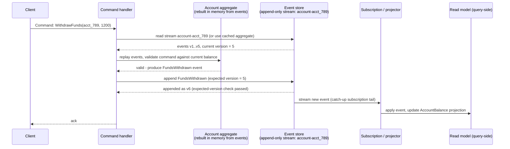
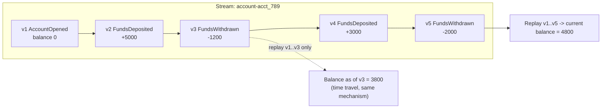
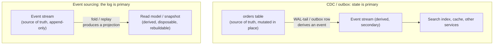

# Event Sourcing

_[Change data capture and the outbox pattern](08-cdc-and-outbox.md) closed on a pointer here: an event-sourced system, it said, "makes the event log the *actual* source of truth rather than a derived side effect of a row-oriented write... once every state change is already captured as an ordered, durable event, CDC/outbox machinery becomes optional rather than necessary, because the outbox and the primary store converge into the same thing." This topic is that promise redeemed - not "CDC, but bigger," a genuinely different storage discipline, one this level has been building toward since [data modeling and denormalization](06-data-modeling-and-denormalization.md#materialized-views-and-precomputed-aggregates) first showed a precomputed `Conversation_Summary` being kept in sync with a source of truth, and since [quorums](07-quorums.md#quorum-consistency-vs-strong-consistency) closed by naming "a single agreed order for operations" as the missing ingredient bare replication never supplies for free. Event sourcing is what happens when a system stops storing *state* at all and starts storing only the ordered *facts* that produce it._

## Contents

- [What event sourcing is](#what-event-sourcing-is)
- [Core mechanics: the event store](#core-mechanics-the-event-store)
- [Rebuilding state: replaying events](#rebuilding-state-replaying-events)
- [Worked example: a bank account as an event stream](#worked-example-a-bank-account-as-an-event-stream)
- [Event schema evolution and upcasting](#event-schema-evolution-and-upcasting)
- [Snapshots: why and when](#snapshots-why-and-when)
- [Idempotent event application](#idempotent-event-application)
- [Event sourcing and CQRS: related, not the same thing](#event-sourcing-and-cqrs-related-not-the-same-thing)
- [Event sourcing vs CDC/outbox: the crisp distinction](#event-sourcing-vs-cdcoutbox-the-crisp-distinction)
- [Trade-offs](#trade-offs)
- [The GDPR problem: deleting from an immutable log](#the-gdpr-problem-deleting-from-an-immutable-log)
- [Interview weight](#interview-weight)
- [How this connects](#how-this-connects)
- [Real-world & sources](#real-world--sources)
- [Check yourself](#check-yourself)

## What event sourcing is

**Event sourcing is a storage strategy in which the durable, authoritative record of an entity's state is an immutable, strictly ordered sequence of events describing every change that has ever happened to it - never the current state itself.** Current state is not stored anywhere as the source of truth; it is a *derived value*, computed on demand (or cached as an optimization, never as the record of truth) by replaying every event for that entity, in order, from the beginning.

This is a fundamentally different relationship between storage and state than every other topic in this level has assumed so far. [Data modeling and denormalization](06-data-modeling-and-denormalization.md#the-inversion-query-first-vs-normalize-first) and everything before it in L2 treats a table's row as *the* fact - `UPDATE accounts SET balance = 4800 WHERE id = 'acct_789'` overwrites whatever the balance used to be, and the moment that `UPDATE` commits, the prior value is simply gone unless something else (a separate audit table, [temporal/bitemporal tables](../L2/02-normalization-forms.md), a CDC stream tailing the WAL) deliberately captured it on the way out. Event sourcing inverts this at the storage layer itself:

| | State-oriented storage (CRUD, every prior L2/L4 topic) | Event-sourced storage |
| --- | --- | --- |
| **What is durably stored** | Current state only - a row, overwritten in place | Every change, as an immutable, ordered event; current state is never stored as the record of truth |
| **A write operation** | `INSERT`/`UPDATE`/`DELETE` mutates a row in place | Append a new event; existing events are never updated or deleted |
| **How you get current state** | Read the row directly - O(1) against however the storage engine indexes it | Replay every event for that entity, in order, folding each one into an accumulator that starts empty and ends at current state |
| **"What was the state as of last Tuesday"** | Not answerable unless a separate, deliberately-engineered history mechanism exists | Answered directly and for free: replay events only up to that point |
| **History of how state got here** | Not retained by the storage model itself | *Is* the storage model - nothing extra has to be built to keep it |
| **Storage growth** | Bounded by the number of current entities | Grows with the number of changes ever made, unboundedly, by design |

The vocabulary this topic needs, precisely: an **event** is an immutable fact about something that already happened, named in the past tense (`FundsDeposited`, `OrderCancelled`, never `DepositFunds` - a command, covered next, is a *request* that something happen and can be rejected; an event is a *record* that it did happen and, once appended, cannot be un-happened). An **aggregate** (the term comes from Domain-Driven Design) is the consistency boundary the events belong to - one bank account, one order, one shopping cart - and each aggregate instance owns its own **stream**: the strictly ordered sequence of every event that has ever happened to that one specific instance. A **command** is the input that triggers this: a client (or another service) sends a command (`WithdrawFunds`, `PlaceOrder`); the aggregate validates it against its current, replayed state and, if valid, produces one or more new events to append; if invalid (insufficient funds, an already-cancelled order), the command is rejected and *no* event is ever appended for it - only things that actually happened become events, never rejected attempts.

## Core mechanics: the event store

**The event store is the append-only log an event-sourced system persists every event into**, playing the exact role a normal table plays in a CRUD system, but with a fundamentally narrower API: appends and ordered reads of a stream, never in-place updates. Two broad ways teams build one:

- **A purpose-built event-store database** - **EventStoreDB** (the most widely cited example, created by Greg Young - also the person who coined the term CQRS, covered below - and built specifically around this storage model) natively models a "stream" as its core primitive: every event is appended to a named stream (`account-acct_789`), each append can optionally assert an **expected version** (an optimistic-concurrency check, below), and the database exposes both point reads of a stream and **subscriptions** - a live, ordered tail of new events, either "catch-up" (start from any position, including the very beginning) or "persistent" (server-tracked, competing-consumer-style, comparable to a Kafka consumer group) - that downstream projections consume to build read models.
- **A repurposed general-purpose log or a plain relational table** - Apache Kafka, with **log compaction** enabled on a topic (retaining only the latest event per key forever, rather than expiring by time/size), is commonly used as an event store directly: the topic partition *is* the ordered stream, keyed by aggregate ID, and a consumer group's offset tracking plays the same role EventStoreDB's subscription position does. Alternatively, the humblest possible event store is a plain relational table - `events(stream_id, version, event_type, payload, occurred_at)` with a unique constraint on `(stream_id, version)` - which is exactly the same shape as the **outbox table** [the prior topic built](08-cdc-and-outbox.md#the-transactional-outbox-pattern), except the row is never deleted once published; it is retained forever as the permanent record, not a transient relay buffer.

**Appending is guarded by optimistic concurrency, not a lock.** Because two commands for the *same* aggregate can race (two requests to withdraw from the same account, concurrently), an append specifies the version it expects the stream to currently be at (`append event as version 7, only if the stream's current version is 6`) - a compare-and-swap at the storage layer, rejecting the append outright if another event was appended first and the expected version no longer matches. This is the identical [optimistic-concurrency-control idea already covered for row-level writes](../L2/07-locking.md) - a version/counter column checked at write time rather than a row lock held for the write's duration - applied here to an entire ordered stream instead of a single row, and it is what prevents two concurrent commands from silently producing two events at the same logical version, which would otherwise corrupt the stream's own ordering guarantee.

## Rebuilding state: replaying events

**Current state is a fold (a left-to-right reduce) over a stream.** Given a stream of events `e1, e2, ..., en` in order, and a per-event-type "apply" function that takes the current state plus one event and returns the next state, current state is simply `apply(apply(apply(initial_state, e1), e2), ..., en)`. This is the entire read-side mechanic of event sourcing at the aggregate level - there is no other way to get current state than to run this fold, whether it is run fresh on every command (fine for a low-traffic aggregate with a short stream), cached in memory between commands for a live aggregate (the common case - an in-memory "aggregate root" object that stays resident and only needs to apply *new* events as they arrive, rather than replaying from event 1 every time), or bootstrapped from a snapshot plus only the events since that snapshot (below, once replay-from-the-beginning stops being affordable).

## Worked example: a bank account as an event stream

A bank account, `acct_789`, modeled as nothing but its own event stream (amounts in cents, matching this level's own monetary convention):

| v | Event | Payload |
| --- | --- | --- |
| 1 | `AccountOpened` | `{owner: "ava", opening_balance: 0}` |
| 2 | `FundsDeposited` | `{amount: 5000}` |
| 3 | `FundsWithdrawn` | `{amount: 1200}` |
| 4 | `FundsDeposited` | `{amount: 3000}` |
| 5 | `FundsWithdrawn` | `{amount: 2000}` |

**Current balance** is the fold: `0 + 5000 - 1200 + 3000 - 2000 = 4800` cents ($48.00) - computed by replaying every event and applying each one's effect on a running total, never read off a stored "balance" field anywhere, because no such field exists as the source of truth.

**"What was the balance right after the withdrawal at v3" - time travel, for free.** Replay only `v1..v3`: `0 + 5000 - 1200 = 3800` cents. No separate history table, no bitemporal schema, no extra engineering - the exact same replay mechanism used for current state answers "state as of any point in the past" simply by stopping the fold early, which is precisely the audit-trail/temporal-query benefit this topic's trade-offs return to below.

**A withdrawal that would overdraw is rejected before it ever becomes an event.** A command `WithdrawFunds(acct_789, 10000)` arriving after v5 is validated against the replayed balance (4800), found invalid, and rejected outright - no `FundsWithdrawn` event for it is ever appended, and no `FundsWithdrawalRejected` event either, unless the domain explicitly wants rejected attempts recorded as their own fact (a reasonable choice for a fraud/compliance system, an explicit modeling decision rather than a default).

## Event schema evolution and upcasting

Because an appended event is permanent - it can never be edited or deleted, only ever added to - but the *application's* understanding of what an event should contain inevitably changes over time (a field gets added, renamed, or a unit changes), event sourcing has to solve schema evolution without ever touching history.

**The standard technique: upcasting.** Every event carries an explicit type and version (`FundsDeposited.v1`, `FundsDeposited.v2`), and a small **upcaster** function is registered per (type, version) pair that transforms an old-shaped event into the shape current code expects, applied transparently at read/replay time - so application code that folds a stream only ever has to understand the *current* event shape, never every historical variant directly. Concretely: `FundsDeposited.v1 = {amount: 5000}` gets a `channel` field added in v2 (`{amount: 5000, currency: "USD", channel: "ach"}`); an upcaster for v1-to-v2 backfills `currency: "USD"` (the only currency the system supported when v1 events were written) and `channel: "legacy"` for every old event, so a v3-aware fold function never has to special-case "if this event lacks a `channel` field." This is additive by convention - new optional fields with sensible defaults are cheap; renaming or narrowing a field's meaning (changing what "amount" *means*, not just adding to it) is the genuinely hard case, usually requiring the upcaster to reason about the event's own `occurred_at` timestamp or a business-logic-specific migration rule, and is exactly the schema-evolution cost this topic's trade-offs name as a real, ongoing tax event sourcing pays that a normal table migration (`ALTER TABLE ... ADD COLUMN`, backfill once, done) does not.

## Snapshots: why and when

**Replaying from event 1 stops being affordable once a stream gets long.** An active bank account with ten years of activity, or a high-frequency trading aggregate, can accumulate tens of thousands (or more) of events; folding all of them on every single command - or every time a service restarts and has to rebuild an in-memory aggregate cache - is real, avoidable latency and CPU cost that grows without bound as the stream grows, unlike a state-oriented table where a read is always O(1) regardless of how many updates preceded it.

**The fix: periodically persist a snapshot** - the fully-folded aggregate state as of a specific stream version (`{version: 500, balance: 812340, ...}`) - stored alongside (never instead of) the event stream itself. Rebuilding an aggregate then means: load the latest snapshot (version 500), replay only the events *after* that version (501 onward), and fold those onto the snapshot's state, instead of replaying from version 1. The snapshot is purely a performance optimization, never the source of truth - it is disposable and always reconstructible by replaying from the beginning, and a corrupted or lost snapshot costs only a slower rebuild, never data loss, which is the exact property that distinguishes it from a state-oriented row (losing the *only* copy of a mutated-in-place row loses the fact itself, permanently). The trade this buys: bounded replay cost at the price of snapshot storage and a cadence decision (every N events, every fixed time interval, or on-demand before a service restart) - too infrequent and replay cost creeps back up; too frequent and snapshot storage/write cost dominates for little benefit.

## Idempotent event application

Projectors (the components that fold events into read models) and any downstream consumer of an event stream face the exact same delivery-semantics reality [the prior topic established for CDC/outbox](08-cdc-and-outbox.md#at-least-once-delivery-and-idempotent-consumers): a subscription can redeliver an event it already delivered (a projector crashes after applying an event but before recording that it did, and on restart resumes from its last confirmed position, re-processing that event), so **every event handler that updates a read model must be idempotent** - safe to apply the same event twice with no different final result than applying it once. The mechanism is identical to the one already established: key the projection's own bookkeeping on the event's own `(stream_id, version)` (or a global monotonic position, for a compacted-log-style store), and either check-and-skip an already-applied version explicitly, or make the projection update itself naturally idempotent (an `UPSERT balance = base_snapshot + running_delta WHERE last_applied_version < incoming_version`, rather than a blind `balance += amount` that would double-apply on redelivery). This is not a new idea event sourcing introduces - it is the same idempotent-consumer discipline the outbox/CDC topic derived, now applied to the read side of an event-sourced system's own subscriptions instead of to an externally-published CDC stream.

## Event sourcing and CQRS: related, not the same thing

**CQRS (Command Query Responsibility Segregation)** is an architectural pattern that splits an application's write path (commands, validated against current state, producing a result) from its read path (queries, served from one or more independently-shaped, denormalized read models) into two separate models, each optimized for what it actually needs to do, kept in sync asynchronously. It is a distinct idea from event sourcing and does not require it: a perfectly ordinary CRUD system can already be "CQRS-lite" without a single event in sight - a normal, mutable `orders` table on the write side, and a separately-maintained, denormalized `OrderSummary` read table kept up to date via [CDC](08-cdc-and-outbox.md#change-data-capture-cdc) - which is exactly, and explicitly, what [data modeling and denormalization's `Conversation_Summary` worked example](06-data-modeling-and-denormalization.md#worked-example-a-messages-table-revisited-with-two-more-access-patterns) already was, informally, without ever naming CQRS.

**Event sourcing and CQRS are frequently paired, for a concrete, mechanical reason, not just convention.** An event-sourced write side already produces exactly the raw ingredient CQRS's read side needs - an ordered stream of immutable facts to fold into any number of independently-shaped projections - so adding CQRS on top costs only the projector logic itself, with no extra plumbing to derive the event stream in the first place (contrast the CRUD+CDC version above, which has to *build* an event stream out of row mutations via WAL-tailing before a read model can be derived from it at all). The pairing also solves a real problem event sourcing creates on its own: without any read-side projections, the *only* way to answer "which accounts have a balance over $10,000" is to replay every aggregate's entire stream and check - a scan cost event sourcing's own write-side design does nothing to prevent - so a serious event-sourced system in practice almost always adopts CQRS's separate, queryable read models rather than trying to answer arbitrary queries by replaying streams on demand.

**The precise relationship, stated once, plainly:** event sourcing is a decision about *how the write side persists state* (a log of facts, not a mutated row). CQRS is a decision about *whether the read path is served by a separate model from the write path at all* (yes, asynchronously, vs. no, read the same store you wrote). You can have either without the other, but each makes the other cheaper - which is why, in practice, they show up together far more often than either shows up alone, and why this level's own roadmap places CQRS as event sourcing's immediate next topic rather than folding the two into one.

## Event sourcing vs CDC/outbox: the crisp distinction

This is the single most common point of confusion this topic has to resolve directly, because on the surface both produce "a stream of events a downstream consumer can subscribe to." The difference is about **where the source of truth actually lives**, not about whether an event stream exists:

- **CDC/outbox: the state-oriented store is the source of truth; the event stream is *derived* from it, as a side effect.** [The prior topic's](08-cdc-and-outbox.md) entire mechanism - the outbox table, the WAL-tailing connector - exists specifically to synthesize an event *out of* a row mutation that has already happened in a normal, mutable table. If every CDC consumer and every Kafka topic disappeared tonight, the underlying facts would not be lost - the `orders` table (or its own WAL) still holds the current, authoritative state; only the *downstream freshness* of anything that consumed the stream would suffer, and a fresh CDC pipeline could be stood up tomorrow and simply resume from current state onward, or a full initial snapshot.
- **Event sourcing: the event log itself is the source of truth, full stop - there is no other copy of the facts anywhere.** The "current state" table, if one is even materialized at all (a snapshot, a read model), is a disposable, always-rebuildable *projection* of the log, never the other way around. If the event store were lost, the system would not be able to "fall back to the current-state table" the way a CDC pipeline can fall back to the source database - there is no more-authoritative copy to fall back to; losing the log loses everything, because the log was never a copy of anything else in the first place.

**Where they meet - and why they are not mutually exclusive.** An event-sourced system still needs a way to get events *out* of its own store and into other services, and that mechanism looks exactly like a CDC subscription (EventStoreDB's catch-up subscriptions, or a Kafka consumer reading the topic that is itself the event store) - the difference is that the thing being tailed is already the primary store, not a side channel bolted onto one. This is precisely the convergence [the prior topic's forward pointer named](08-cdc-and-outbox.md#how-this-connects): "the outbox and the primary store converge into the same thing." A team can also deliberately use Kafka (with compaction/infinite retention) as *both* the event store and the mechanism other services subscribe to, collapsing outbox-relay and event-store-subscription into one identical artifact - at which point the distinction is no longer "different tools" but "different roles the same log is playing," which is exactly the conceptual endpoint this topic represents relative to the prior one.

## Trade-offs

✅ **What event sourcing buys:**

- **A complete, immutable audit trail, for free.** Every fact that ever happened is permanently retained - not bolted on as a separate audit table with its own consistency discipline to maintain, but structurally guaranteed by the storage model itself. This is a genuine, first-class answer to compliance regimes (financial transaction logs, healthcare record histories) that demand proof of *every* change, not just the current value.
- **Temporal queries ("time travel") without bitemporal schema engineering.** "What was this account's balance last Tuesday" or "what did this order look like before the refund" is answered by replaying events up to that point - the same mechanism used for current state, just stopped early - rather than requiring deliberately-designed system-versioned/bitemporal tables bolted onto an otherwise ordinary schema.
- **A natural fit for event-driven architectures.** Every fact is already an event, ready to publish to other services with no extra derivation step - contrast CDC's need to tail a WAL specifically to synthesize an event out of a row mutation that was never "about" being an event in the first place.
- **Debuggability and retroactive read-model correction.** "How did this order end up cancelled" is answered by literally reading its history. A bug in a projector can be fixed by correcting the projector's logic and **replaying the entire log from scratch** to rebuild a correct read model - a genuine replay, not the best-effort backfill migration [data modeling and denormalization's own forward pointer already named](06-data-modeling-and-denormalization.md#how-this-connects) as the alternative a purely state-oriented, CDC-derived system is stuck with.
- **New read models, added retroactively, over history that already happened.** Because the full history is already durable, adding a brand-new query shape - one nobody anticipated when the events were first written - means writing a new projector and replaying the existing log, not a schema migration against data that was never captured in the first place.

❌ **What it costs:**

- **Query-side complexity.** There is no `SELECT * FROM accounts WHERE balance > 1000000` against an event log - every useful query needs its own maintained projection, real ongoing engineering work per access pattern, an even stricter version of [the access-pattern-first discipline data modeling already established](06-data-modeling-and-denormalization.md#the-inversion-query-first-vs-normalize-first), now with an extra fold/replay step standing between the source of truth and any answerable query.
- **Eventual consistency of read models.** Projections update asynchronously off the event stream, so a client that writes and then immediately reads against a projection can see stale data until the projector catches up - the same read-your-writes concern [CDC/outbox's at-least-once delivery already raised](08-cdc-and-outbox.md#at-least-once-delivery-and-idempotent-consumers), now unavoidable on the *primary* read path rather than an optional downstream one, typically mitigated by routing an immediate post-write read back to the aggregate itself (which always reflects its own latest event, having just produced it) rather than to the projection, or by having the client pass along the version it just wrote and having the read wait until the projection has caught up to at least that version.
- **Schema evolution is a permanent, growing tax.** Once appended, an event is forever; every future version of the code that ever reads history must still be able to interpret every historical event version that was ever written, solved by upcasting (above) but never eliminated - unlike a state-oriented table, where a migration is a one-time cost paid once and then forgotten.
- **Unbounded storage growth, by design.** Every state change is retained forever - the entire point of the audit-trail benefit - so a busy aggregate's stream only grows, needing snapshots to bound replay cost (above) and a genuine retention/archival strategy (cold storage tiers for old segments, compaction where semantics allow it) to bound raw storage cost, in direct contrast to a state-oriented table whose storage is bounded by the number of *current* entities, never by how many times they changed.
- **Correcting a mistake means appending a correction, never editing history.** A bug that wrote a wrong event cannot be fixed by editing that event in place - the append-only guarantee forbids it by construction - so the fix is always a compensating event ("this entry was wrong, here is the reversal, and here is the corrected fact"), the exact discipline double-entry bookkeeping has used for centuries to fix a ledger mistake with a reversing entry rather than erasing the original line. This is a real modeling discipline every event-sourced team has to adopt deliberately, not an automatic property of the pattern.

## The GDPR problem: deleting from an immutable log

**The direct conflict, stated plainly.** GDPR's (and CCPA's) "right to erasure" requires a data controller to be able to genuinely delete a specific individual's personal data on request. Event sourcing's entire value proposition is an immutable, permanent, append-only log. These are in direct tension: you cannot selectively edit or delete one customer's events out of a stream without violating the append-only guarantee the whole pattern depends on for its audit-trail and replay correctness - and deleting the *whole* stream (rather than just the personal fields within it) would destroy facts (an account's transaction history, an order's fulfillment record) that often have to be retained for other, unrelated legal/financial-record-keeping reasons that outlast the individual's own erasure right.

**The standard mitigation: crypto-shredding.** Rather than deleting or editing event bytes, personally-identifying fields within an event's payload (or an entire per-subject slice of a stream) are encrypted at write time with a **per-subject data encryption key**, stored in a separate key-management system, not co-located with the event log itself. To "erase" that individual's data, the system deletes only that one small key from the key store - the encrypted event payload bytes remain physically present in the immutable log (satisfying the append-only guarantee and preserving the log's structural/positional integrity), but without the key they are permanently, cryptographically unrecoverable, which is treated as satisfying an erasure obligation in effect, even though nothing was literally deleted from the log. This is documented as the standard mitigation for exactly this conflict in event-sourced and log-based systems (`verify` - a specific, citable primary source describing crypto-shredding applied to event sourcing or to Kafka-based logs specifically was not fetch-verified in this pass; this section should be run through a live web-verification sweep before being treated as fully sourced). **The cost, named plainly:** a real key-management system that must reliably outlive (or at least outlast the retention period of) the event store, be queried on every read that needs to decrypt a payload, and be backed up and made highly available independently of the event log itself - real, ongoing infrastructure, not a one-time fix.

## Interview weight

This is a moderately common but genuinely deep topic in senior-level system design interviews - flagged here as a priority signal, per this repo's convention. It surfaces reliably whenever a prompt has an inherent audit/compliance angle or a domain where "what happened, and in what order" matters as much as "what is true right now": **design an order-management or payment system**, **design a banking ledger**, **design an audit-log-heavy compliance system**, or **design a fraud-detection pipeline** are all classic prompts where event sourcing (often paired with CQRS) is the textbook senior-level answer, and interviewers commonly probe past the surface pitch with follow-ups this topic directly equips a candidate to answer without hand-waving: *how do you bound replay cost as a stream grows* (snapshots), *how do you keep two different aggregates consistent without a distributed transaction spanning both* (a saga - the L5 topic this level's CDC/outbox topic already deferred forward, since two aggregates each with their own stream cannot be updated inside one atomic append the way two rows in one database can be updated inside one local transaction), and *how do you reconcile "never delete" with a legal deletion requirement* (crypto-shredding, above). A candidate who can only describe "store events instead of rows" without being able to reason through these three follow-ups is demonstrating surface familiarity, not the depth this topic is meant to establish.

## How this connects

- **Back to L4/08 (CDC and outbox)** - [that topic's own forward pointer](08-cdc-and-outbox.md#how-this-connects) named event sourcing as its natural conceptual endpoint; this topic made that relationship precise - CDC/outbox derives an event stream from a state-oriented source of truth, event sourcing makes the event stream itself the source of truth, and the two converge exactly when a team uses the same durable log (Kafka with compaction, EventStoreDB's own subscriptions) as both.
- **Back to L4/07 (quorums)** - quorums closed by naming "a single agreed order for operations" as what a bare quorum store does not supply for free, and what consensus adds on top of it. An event stream's own strict per-aggregate ordering is exactly that single agreed order, scoped to one aggregate's stream - which is why a distributed event store needs either a single leader per stream/partition or a consensus-replicated log underneath it, not a leaderless quorum store with no single agreed append order to begin with.
- **Back to L4/06 (data modeling and denormalization)** - that topic's `Conversation_Summary` and other precomputed read models were, informally, exactly what a CQRS projection is; this topic and the next (CQRS) name and formalize what that topic already built by instinct.
- **Back to L2 (write-ahead log, ACID, locking/MVCC)** - an event store's append-only log is [the same durability discipline the WAL already established](../L2/09-write-ahead-log.md), specialized so the log itself is the entire durable record rather than a recovery mechanism behind a mutable table; a stream's expected-version check on append is [the same optimistic-concurrency idea already covered for row-level writes](../L2/07-locking.md), applied to an entire ordered stream instead of one row.
- **Forward to CQRS (next in this level)** - this topic deliberately introduced CQRS only as far as needed to state the relationship precisely (distinct pattern, frequently paired, each makes the other cheaper); the next topic gives CQRS its own full, dedicated treatment - command/query model design, read-model synchronization strategies, and the consistency trade-offs of serving reads from a separate store than writes land in.
- **Forward to L5 (sagas, consensus, distributed transactions)** - keeping two separate aggregates (two separate streams) consistent with each other without a distributed transaction spanning both is exactly what sagas exist to solve, `verify` exact filename once written; a distributed, replicated event store's own append-ordering guarantee depends on the same consensus machinery (a single leader per partition/stream, or a Raft/Paxos-replicated log) [quorums already named as the missing ingredient](07-quorums.md#quorum-consistency-vs-strong-consistency) bare quorum arithmetic doesn't supply.
- **Forward to L6 (messaging and streaming)** - Kafka's partitioning, log compaction, and consumer-group mechanics, invoked here only as far as "Kafka can double as an event store" requires, get their own full mechanical treatment in that level.

## Real-world & sources

This section was fetch-verified in a live web-research pass (July 2026). Each claim below was checked against its source directly; anything that could not be confirmed is flagged explicitly rather than asserted.

- **Stripe's Ledger - a production, fintech, event-sourced money-movement system (fintech example, verified).** Stripe's own engineering blog post, ["Ledger: Stripe's system for tracking and validating money movement"](https://stripe.dev/blog/ledger-stripe-system-for-tracking-and-validating-money-movement) (Stripe Dot Dev Blog, accessed July 2026), describes Ledger explicitly in event-sourced terms: "At its core, Ledger is an immutable log of events. Transactions previously published into Ledger cannot be deleted or modified, and we can always reconstruct past state by processing all events up to that point." Ledger encodes each producer system as **a state machine**, modeling money movement as "the movement of balances (events) between accounts (states)" - a direct match for this topic's own aggregate/event vocabulary. Verified scale figures from the post: **Ledger processes roughly five billion events daily**, with **99.99% of dollar volume fully ingested and verified within four days**, and the system maintains **99.9999% money-movement explainability** even through 10x volume growth. This is the strongest available fintech confirmation of event sourcing in production this pass found - a direct replacement for the earlier "searched but not confirmable" placeholder, and it satisfies this repo's standing fintech-first, Stripe-first convention.
- **LMAX Architecture - a real financial trading exchange built on single-threaded event sourcing (fintech/trading example, verified).** Martin Fowler's article ["The LMAX Architecture"](https://martinfowler.com/articles/lmax.html) (martinfowler.com, published 12 July 2011, accessed July 2026) describes LMAX, a UK-based retail FX/CFD trading exchange, whose **Business Logic Processor** "operates entirely in-memory, there is no database or other persistent store," with **current state entirely derivable by replaying input events** - i.e., event sourcing as the system's durability mechanism, not an add-on. The article's confirmed throughput figure: the Business Logic Processor "can handle 6 million orders per second on a single thread," achieved by avoiding lock contention through a single-writer design (the Disruptor pattern) rather than through more hardware. This confirms the original claim's substance; the specific number is **6 million orders/second**, not merely "on the order of millions" as hedged before.
- **Martin Fowler's canonical write-ups - both confirmed, one detail corrected.** ["Event Sourcing"](https://martinfowler.com/eaaDev/EventSourcing.html) (martinfowler.com, part of the *eaaDev* catalog) is confirmed **published 12 December 2005**, and Fowler's own page notes it is still "in draft form," not materially revised since. It does **not** mention CQRS at all - the essay predates that term's popularization and treats event sourcing purely standalone, which is a small but real correction to the previous draft's framing of the two as jointly discussed on that page; ["bliki: CQRS"](https://martinfowler.com/bliki/CQRS.html) is a separate page that covers the CQRS side of the relationship. Both pages exist as described and are stable, frequently-cited references.
- **EventStoreDB and Greg Young - origin confirmed, founding year corrected.** EventStoreDB (the product, originally named "Event Store," now rebranded **Kurrent**/KurrentDB as of December 2024) was **open-sourced in September 2012** by **Greg Young**, who is also widely credited (via InfoQ talks and industry retrospectives, e.g. ["The Basics of Event Sourcing and Some CQRS" - InfoQ](https://www.infoq.com/news/2014/09/greg-young-event-sourcing/), accessed July 2026) with coining and popularizing the term **CQRS** starting around 2010. This corrects the earlier "verify exact founding year" placeholder: 2012 is the confirmed open-source launch year, not merely "circa 2010-2012" as hedged. Company formalization (Event Store Limited) followed later in 2018-2019, and the 2024 rename to Kurrent.IO does not change any of the underlying technical claims made about EventStoreDB's stream/subscription model earlier in this document.
- **Kafka log compaction - confirmed via Confluent's own documentation.** [Confluent's Kafka log compaction documentation](https://docs.confluent.io/kafka/design/log_compaction.html) (accessed July 2026) confirms log compaction "allow[s] you to retain the latest value for each message key in a topic, while discarding older values," and explicitly names **event sourcing** as one of log compaction's core use cases: "Compaction ensures you always know the latest state of each key, which is important for event sourcing." This is a direct, first-party confirmation that Kafka's own documentation frames compacted topics as an event-sourcing-suitable mechanism, not just a general-purpose retention policy this document was inferring.
- **Jay Kreps' "The Log" essay - substance confirmed, one live-fetch caveat.** Multiple independent sources (search-result snippets, third-party summaries/mirrors, and the essay's own well-established citation trail) confirm Jay Kreps wrote **"The Log: What every software engineer should know about real-time data's unifying abstraction"** while at **LinkedIn**, published **December 2013** on the LinkedIn Engineering blog, framing the append-only log as "the simplest possible storage abstraction" and the unifying idea underneath databases' own WALs, Kafka, and stream processing. The canonical URL is `https://engineering.linkedin.com/distributed-systems/log-what-every-software-engineer-should-know-about-real-time-datas-unifying`; a direct live fetch of that exact URL returned a 404 during this pass (possible bot-blocking or a since-changed path on LinkedIn's site), so this citation is corroborated by consistent, independent third-party references rather than a direct first-party fetch this session - flagged here rather than silently upgraded to "fully fetch-verified."
- **UPI/NPCI angle - checked again, still not surfaced.** No UPI/NPCI-specific engineering write-up describing India's real-time payments rail as literally event-sourced (as distinct from the general transaction-log/audit-trail properties any payments rail needs) was found in this pass either. Per this repo's standing UPI-priority instruction, this gap is flagged openly rather than a claim being forced to fit - UPI's reconciliation/audit architecture is plausibly relevant to *ledger* or *idempotency* topics elsewhere in this roadmap, but nothing found here ties it specifically to the event-sourcing storage pattern this document teaches.

## Check yourself

- A colleague says "event sourcing is just CDC with extra steps." Using the account-balance worked example, explain precisely why this is wrong - what would be lost if the event log disappeared in each case, and why does that difference matter?
- Walk through, step by step, how a bank account's current balance is computed in an event-sourced system, and then explain exactly what a snapshot changes about that process - and what it does *not* change (what is still true of the source of truth, snapshot or not).
- A team adds a `currency` field to `FundsDeposited` events going forward. Explain why they cannot simply run an `ALTER`-style backfill against already-appended events, and what mechanism they use instead so that current code never needs to special-case old events directly.
- Explain, without hand-waving, why event sourcing and CQRS are described as "distinct but frequently paired" - give one example of each pattern used without the other, and explain concretely what extra plumbing a CDC-derived read model needs that an event-sourced one gets for free.
- A customer invokes their GDPR right to erasure against an event-sourced order history. Explain why deleting or editing their events outright is not an option, what crypto-shredding does instead, and what new piece of infrastructure this mitigation itself now depends on staying available and durable.
- In a system-design interview, you propose event sourcing for a payments ledger. The interviewer asks how you'd keep a customer's wallet balance and a merchant's payout aggregate consistent with each other without a single atomic transaction spanning both streams. Name the concept this points toward (even if only at the level of "what problem is this," not the full mechanism) and explain why a single expected-version check on one stream's append cannot solve it alone.
