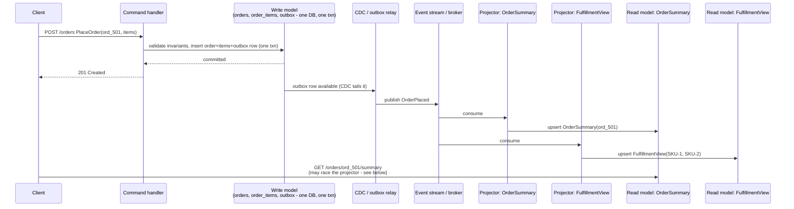

# CQRS (Command Query Responsibility Segregation)

_[Event sourcing's own closing section](09-event-sourcing.md#event-sourcing-and-cqrs-related-not-the-same-thing) introduced this topic only as far as it needed to: "CQRS is an architectural pattern that splits an application's write path... from its read path... into two separate models, each optimized for what it actually needs to do, kept in sync asynchronously... a distinct idea from event sourcing and does not require it." It also named the informal version this level had already built, without naming it, twice over - [data modeling and denormalization's `Conversation_Summary`](06-data-modeling-and-denormalization.md#materialized-views-and-precomputed-aggregates) and [CDC/outbox's entire reason for existing](08-cdc-and-outbox.md#change-data-capture-cdc). This topic is where that instinct gets a name, a full mechanical treatment, and its own honest cost-benefit account - not "event sourcing's sidekick," but a pattern that shows up, on its own, in a large fraction of production systems that never touch an event store at all._

## Contents

- [What CQRS is](#what-cqrs-is)
- [Command handlers and write-model invariants](#command-handlers-and-write-model-invariants)
- [Read models: one or more, shaped per query](#read-models-one-or-more-shaped-per-query)
- [Keeping read models in sync: two ways to derive a projection](#keeping-read-models-in-sync-two-ways-to-derive-a-projection)
- [Synchronous vs asynchronous read-model updates](#synchronous-vs-asynchronous-read-model-updates)
- [Worked example: placing an order](#worked-example-placing-an-order)
- [CQRS and event sourcing: composable, not the same decision](#cqrs-and-event-sourcing-composable-not-the-same-decision)
- [CQRS without event sourcing: "CQRS-lite," the common case](#cqrs-without-event-sourcing-cqrs-lite-the-common-case)
- [Consistency implications: eventual consistency and read-your-writes](#consistency-implications-eventual-consistency-and-read-your-writes)
- [When to use it, and when it's overkill](#when-to-use-it-and-when-its-overkill)
- [Trade-offs](#trade-offs)
- [Interview weight](#interview-weight)
- [How this connects](#how-this-connects)
- [Real-world & sources](#real-world--sources)
- [Check yourself](#check-yourself)

## What CQRS is

**CQRS is the architectural decision to serve an application's writes (commands) and its reads (queries) through two separate models, each shaped for what it actually needs to do, rather than through one shared model that tries to do both.** The name comes from **Command-Query Separation** (Bertrand Meyer's older, method-level object-oriented principle - a single method should either change state or answer a question, never both) generalized from "one method" up to "the whole application's data-access architecture" - a generalization credited to **Greg Young**, `verify` exact year (widely cited as circa 2010, the same period [already named in event sourcing's own real-world section](09-event-sourcing.md#real-world--sources) for EventStoreDB's own origin).

The traditional, single-model alternative - what nearly every CRUD application defaults to - reads and writes the *same* schema for both purposes: `SELECT * FROM orders WHERE customer_id = ...` runs against the identical, normalized `orders`/`order_items` tables that `INSERT`/`UPDATE` statements just wrote to. CQRS breaks that symmetry deliberately:

| | Single-model CRUD (traditional) | CQRS |
| --- | --- | --- |
| **What handles a write** | Same model/schema that also serves reads - an `UPDATE` against the row a query would later `SELECT` | A **command handler** operating against a **write model** built for validating business rules and persisting facts correctly, nothing else |
| **What handles a read** | Same model/schema, queried directly - joins, aggregations, filters computed at query time against normalized tables | One or more **read models**, each a denormalized, query-shaped projection built specifically to answer *one* access pattern fast, with no joins or aggregation needed at query time |
| **Number of models** | One | Two or more - exactly one write model, and as many read models as there are genuinely different query shapes worth optimizing for |
| **How the read model gets current data** | It doesn't need to - it *is* the current data | Kept in sync with the write model via a **projection** mechanism, synchronously or (far more commonly) asynchronously |
| **Consistency between what was written and what a query returns** | Immediate - same row, same transaction boundary | Eventually consistent by default when the sync path is asynchronous (below) - a genuine, named trade-off, not an oversight |
| **Where business rules/invariants live** | Enforced (or, all too often, informally scattered) wherever code happens to write to the shared model | Enforced in exactly one place - the write model's command handlers - and nowhere else; read models never re-validate anything, they only reflect facts the write side already accepted |

**The precise scope of the term.** CQRS is a statement about *how many models serve reads and writes and whether they're kept in sync synchronously or asynchronously* - nothing more. It says nothing, on its own, about what storage technology backs either side (same database, different tables; same database, a materialized view; entirely different databases and technologies), and nothing about whether the write side stores events or rows - that second question is [event sourcing's](09-event-sourcing.md#what-event-sourcing-is) to answer, a genuinely separate decision covered fully below.

## Command handlers and write-model invariants

**A command is a request that something happen** (`PlaceOrder`, `CancelOrder`, `WithdrawFunds` - [the same vocabulary event sourcing already established](09-event-sourcing.md#what-event-sourcing-is), reused here because it is CQRS's vocabulary just as much as event sourcing's), as distinct from a query, which only ever asks a question and never changes anything. A **command handler** is the single piece of code responsible for taking a command, checking it against the write model's *current* state, and either accepting it (producing a durable state change) or rejecting it outright.

**Invariants are the business rules a command handler exists to enforce**, and enforcing them is the write model's entire job: an order's total must equal the sum of its line items' subtotals; a withdrawal must never take a balance below zero; a warehouse can't ship more units of a SKU than it holds. CQRS's structural promise is that these rules are checked in exactly one place - the write model, at command-handling time - and nowhere else. This matters because the alternative (the failure mode [data modeling and denormalization's own trade-offs section already named](06-data-modeling-and-denormalization.md#materialized-views-and-precomputed-aggregates) for uncoordinated denormalized copies) is several independently-writable copies of "the truth," each capable of drifting out of agreement with the others because nothing forces them through one validating gate. A read model, under CQRS, is never independently writable by a client at all - it only ever receives already-validated facts via its own projection mechanism (below), so it structurally cannot violate an invariant the write model already enforced, because it never re-decides anything; it only reflects.

## Read models: one or more, shaped per query

**A read model is a denormalized, purpose-built representation of data, designed around one specific access pattern rather than around the entities themselves.** This is exactly [data modeling and denormalization's "query-first, not normalize-first" discipline](06-data-modeling-and-denormalization.md#the-inversion-query-first-vs-normalize-first), now given its own name and its own explicit place in the architecture: instead of one normalized schema that every query has to join and aggregate its way through at read time, CQRS licenses **as many read models as there are genuinely distinct query shapes**, each pre-computed so that the corresponding query becomes a direct key lookup or a single-table scan, no joins, no runtime aggregation.

A single write model commonly feeds several read models simultaneously, each serving a different consumer of the same underlying facts:

- An **order-summary view** for the customer-facing order-confirmation and order-history pages: `{order_id, item_count, total_cents, status, display_line}` - one row per order, no join to `order_items` needed at read time.
- A **fulfillment/warehouse view** for the operations team: `{sku, warehouse_id, pending_qty}`, aggregated across every open order touching that SKU - a completely different shape, built from the same underlying `OrderPlaced` facts, answering a completely different question.
- A **search index** (Elasticsearch, OpenSearch) for full-text/faceted product or order search - a shape a relational write model is structurally poor at serving directly at all.

Each of these can live in whatever storage technology actually fits its access pattern best - a key-value store for the O(1) summary lookup, a document store or search index for the search view, a plain relational table for the fulfillment aggregate - entirely independent of what the write model itself uses, and independent of each other.

## Keeping read models in sync: two ways to derive a projection

**A projection is the process of turning a change on the write side into an update on a read model** - the mechanism, not just the destination. Exactly two ways to derive one, and which is available depends entirely on what the write side already produces:

- **From an event stream, if the write side is event-sourced.** [Event sourcing's own core mechanic](09-event-sourcing.md#core-mechanics-the-event-store) already produces the raw ingredient a projector needs for free: an ordered stream of immutable facts. A projector subscribes to that stream (an EventStoreDB catch-up subscription, a Kafka consumer reading the event-store topic) and folds each event into whichever read model it maintains, exactly [the projector/idempotent-consumer mechanics already covered in full](09-event-sourcing.md#idempotent-event-application).
- **From CDC/outbox, if the write side is an ordinary mutable store.** A normal, CRUD-style write model (a plain `orders` table, mutated in place) has no event stream lying around by default - one has to be synthesized out of row changes, which is exactly [the transactional outbox pattern and change data capture's entire job](08-cdc-and-outbox.md#the-transactional-outbox-pattern): write an outbox row in the same local transaction as the business write, tail it (via CDC log-tailing or a polling relay), publish it, and let a projector consume the resulting stream the same way it would consume an event-sourced system's native stream. Mechanically, once the event/change stream exists, the projector logic on the read side is identical either way - the difference is entirely in *how the stream got produced in the first place*, not in how a projector consumes it.

Both paths converge on the same read-side discipline [event sourcing's projector section already established](09-event-sourcing.md#idempotent-event-application): a projector must be **idempotent**, because whichever mechanism feeds it (a subscription or a CDC/outbox relay) can only offer **at-least-once delivery**, [never exactly-once, for the reasons already proven in full](08-cdc-and-outbox.md#at-least-once-delivery-and-idempotent-consumers).

## Synchronous vs asynchronous read-model updates

The projection step above can run on two different timelines relative to the command that triggered it, and this choice is CQRS's single biggest lever on the consistency-vs-scalability trade named throughout this topic:

- **Synchronous.** The read model is updated in the *same* transaction (or immediately, blockingly, before the command handler returns success) as the write. A Postgres materialized view refreshed on every write, or a second table updated inside the same local transaction as the first, are both synchronous CQRS: the read model is guaranteed current the instant the command completes, at the cost of the write path now paying the read model's own write latency too, and - critically - only being possible at all when the read model lives in a store that can actually participate in the same transaction as the write model (ruling out, by construction, a separate technology like Elasticsearch or a different physical database as the synchronous target, without reintroducing [the exact dual-write problem CDC/outbox already exists to solve](08-cdc-and-outbox.md#the-dual-write-problem)).
- **Asynchronous.** The command handler commits the write and returns success *without* waiting for any read model to update; a projector, consuming a stream or relay running independently and after the fact, updates the read model on its own schedule - milliseconds to seconds later depending on the mechanism (CDC log-tailing typically single-digit-seconds or less, per [the concrete p99 figures the CDC topic's own real-world section already measured](08-cdc-and-outbox.md#real-world--sources)). This is the dominant choice in practice, and the one that actually delivers CQRS's core promise - each side scales, fails, and evolves independently of the other - at the deliberate cost of a real, non-zero staleness window between write and read, covered in full below.

## Worked example: placing an order

A customer places an order, `ord_501`, for two line items (amounts in cents, this level's own convention): 2 units of `SKU-1` at 2500 cents each, 1 unit of `SKU-2` at 4000 cents - total 9000 cents ($90.00).

**Command side.** `PlaceOrder(ord_501, cust_44, [...])` arrives at the command handler. The handler checks its invariants against the write model's current state: enough inventory exists for both SKUs, the customer's payment method is valid, no order with this idempotency key has already been placed. All pass. The handler writes, in one local transaction, exactly [the outbox-pattern shape this level already established](08-cdc-and-outbox.md#the-transactional-outbox-pattern):

```sql
BEGIN;
  INSERT INTO orders (id, customer_id, total_cents, status)
    VALUES ('ord_501', 'cust_44', 9000, 'placed');
  INSERT INTO order_items (order_id, sku, qty, unit_price_cents) VALUES
    ('ord_501', 'SKU-1', 2, 2500),
    ('ord_501', 'SKU-2', 1, 4000);
  INSERT INTO outbox (id, event_type, aggregate_id, payload) VALUES
    (gen_random_uuid(), 'OrderPlaced', 'ord_501',
     '{"order_id":"ord_501","customer_id":"cust_44","total_cents":9000,"items":[...]}');
COMMIT;
```

The handler returns `201 Created` to the client the instant this commits - it does not wait for any read model.

**Read side.** A log-tailing relay picks up the outbox row and publishes `OrderPlaced`. Two independent projectors consume it: one upserts an `OrderSummary` read model (`{order_id: ord_501, item_count: 3, total_cents: 9000, status: 'placed', display_line: "3 items - $90.00"}`) purpose-built for the confirmation/history page; another updates a `FulfillmentView` aggregate (`{sku: 'SKU-1', warehouse_id: ..., pending_qty: +=2}`, `{sku: 'SKU-2', ..., pending_qty: +=1}`) purpose-built for the warehouse team's completely different query. Neither projector re-validates the order - both simply reflect a fact the command handler already accepted.



**The race, concretely.** If the client's confirmation page issues `GET /orders/ord_501/summary` in the tens-of-milliseconds immediately after the `201`, it can arrive *before* `P1` has applied `OrderPlaced` - the read model genuinely does not have `ord_501` yet, and the query returns "not found" or stale data for an order the write side has already fully and durably accepted. This is not a bug in either projector; it's the direct, structural consequence of choosing asynchronous projection, covered next.

## CQRS and event sourcing: composable, not the same decision

[Event sourcing's own treatment of this relationship](09-event-sourcing.md#event-sourcing-and-cqrs-related-not-the-same-thing) already stated the precise line, and this topic does not re-derive it, only restates it from CQRS's own side: **event sourcing is a decision about how the write side persists state** (a log of facts vs. a mutated row); **CQRS is a decision about whether the read path is served by a separate, asynchronously-synced model at all.** Either can exist without the other - an event-sourced write model with no separate read model at all (querying by replaying streams on demand, [the exact cost event sourcing's own trade-offs section names](09-event-sourcing.md#trade-offs) as its query-side complexity) is event sourcing without CQRS; a plain CRUD write model feeding a denormalized read replica via CDC (this topic's own worked example above) is CQRS without event sourcing.

**Why they pair so often anyway.** An event-sourced write side already produces exactly the raw ingredient a CQRS projector needs - an ordered stream of immutable facts - at zero extra plumbing cost; a CDC/outbox-derived stream has to be synthesized first. And CQRS solves a real problem event sourcing creates on its own: without a separate, queryable read model, "which accounts have a balance over $10,000" has no answer short of replaying every stream and checking. Each pattern makes the other cheaper, which is why production event-sourced systems adopt CQRS far more often than they don't - but the causality only runs one direction: adopting CQRS never obligates a team to adopt event sourcing, and the far more common real-world shape, covered next, is exactly the reverse pairing.

## CQRS without event sourcing: "CQRS-lite," the common case

**Most production CQRS in the wild is CQRS-lite: one ordinary, mutable write database, plus one or more denormalized read models kept in sync via CDC**, with no event store, no aggregate-replay mechanic, no upcasting concern anywhere in the system. This is precisely the shape [the CDC/outbox topic's own worked pipeline already demonstrated](08-cdc-and-outbox.md#change-data-capture-cdc) without naming it CQRS at the time: a source-of-truth table, tailed via log-based CDC, feeding "a search index, cache invalidation, an analytics warehouse, another service's own database" - each of those downstream stores *is* a read model in CQRS's sense, kept asynchronously in sync with a perfectly conventional, mutated-in-place write table.

This is also, concretely, [data modeling and denormalization's `Conversation_Summary` worked example](06-data-modeling-and-denormalization.md#materialized-views-and-precomputed-aggregates) restated in this topic's own vocabulary: a normal write path, a separately-maintained, write-time-fanned-out summary table serving a different access pattern than the source rows were shaped for. The reason CQRS-lite is the common case rather than the exception: it costs far less to adopt than full event sourcing (no new storage discipline for the write side, no schema-evolution/upcasting tax, no unbounded log-growth concern) while still delivering CQRS's actual payoff - a read path that can be scaled, indexed, and evolved completely independently of the write path.

## Consistency implications: eventual consistency and read-your-writes

**Every asynchronously-projected read model is eventually consistent with the write model, by construction, and this is the trade CQRS is explicitly making, not an accident to be engineered away.** The staleness window is bounded below by however long the projection mechanism takes end to end - the relay/CDC latency figures [already measured concretely in the prior topic](08-cdc-and-outbox.md#real-world--sources) (Shopify's own log-tailing pipeline: p99 under 10 seconds; a purpose-built event-store subscription: often single-digit milliseconds) - but it is never, structurally, zero for an asynchronous projector, no matter how fast the mechanism.

**The concrete UX failure mode: read-your-writes.** A client that just successfully wrote something and immediately reads it back through the read model can see a response inconsistent with the write it just made - the worked example's confirmation-page race above, or a user who edits their profile and reloads the page to see the old value still displayed, because the read model that serves the profile page hasn't caught up yet. This is the same **read-your-writes consistency** concern [event sourcing's own trade-offs section already named](09-event-sourcing.md#trade-offs) for its own projections, generalized here to any asynchronous CQRS read model regardless of what feeds it.

**Standard mitigations, in order of how commonly they're reached for:**

- **Don't query the read model for the thing you just wrote at all.** Return enough of the write model's own result directly in the command's response (the `201 Created` body already carries `order_id`, `total_cents`, `status`) so the immediate confirmation UI never needs a separate read-model round trip in the first place - the cheapest fix, and the one that eliminates the race rather than managing it.
- **Route the immediate post-write read to the write model itself**, accepting the write model's own (usually higher) query cost only for that one moment, and only for the entity just written - falling back to the cheap, denormalized read model for every subsequent, non-post-write read.
- **Versioned/monotonic reads.** The write returns a version or sequence number (the outbox row's own position, or an event's stream version); the client passes that version back on its next read, and the read model either blocks briefly until its own applied-version watermark catches up, or the API layer retries with backoff until it does - the identical mechanism [event sourcing's own read-your-writes mitigation already named](09-event-sourcing.md#trade-offs) ("the client pass[es] along the version it just wrote and... the read wait[s] until the projection has caught up to at least that version"), reused here verbatim because the underlying problem (an asynchronous projector, a client that can't tell how far behind it is) is identical regardless of what produced the stream feeding it.
- **Session-level pinning.** Route a given client's reads to a specific replica/read-model instance known to be at least as fresh as the write it just made (session affinity), rather than a load-balanced pool where a different, further-behind instance might answer next - a mitigation this level's own consistency-models vocabulary (formalized fully in [L5](../L5/02-consistency-models.md)) names as session-level read-your-writes guarantees layered on top of an otherwise eventually-consistent store.

## When to use it, and when it's overkill

**CQRS earns its keep when read and write workloads have genuinely different shapes or scaling needs - not by default.** Concrete signals worth naming explicitly:

- **Read:write ratio is heavily skewed**, often by one or two orders of magnitude (a product catalog read thousands of times per write; a social feed read far more often than posted to) - the read side needs to scale independently, and paying normalized-schema query cost on every read at that volume is the wasteful default CQRS's denormalized read models exist to avoid.
- **The read side needs a genuinely different query shape than the write side can serve well at all** - full-text search, geospatial queries, multi-entity aggregation - where the fix isn't "add an index," it's "materialize a different representation entirely."
- **Reads and writes need independent technology or independent failure domains** - a search index that can be temporarily behind without blocking checkout, an analytics warehouse that can be rebuilt from scratch without touching the transactional path at all.

**Where it's overkill.** A CRUD application with one dominant, roughly symmetric access pattern, no meaningfully distinct query shapes, and no independent-scaling requirement gains nothing from a second model, a sync mechanism, and an eventual-consistency window it now has to reason about on every screen - it only pays CQRS's real costs (more moving parts, a genuinely harder consistency story, more code to keep two models honestly in sync) for a benefit that never materializes. [Martin Fowler's own bliki treatment of CQRS](https://martinfowler.com/bliki/CQRS.html) is widely cited for exactly this caution - that CQRS is "a significant mental leap for all involved" and worth real skepticism before reaching for it as a default, rather than a pattern to apply everywhere the way normalization or indexing are (`verify` exact wording - not independently re-fetched this session; paraphrased from the well-established substance of that page, already confirmed to exist and be stable in [the prior topic's own real-world section](09-event-sourcing.md#real-world--sources)). In practice this also is not all-or-nothing at the application level: a team can adopt CQRS-lite for exactly the one or two hot entities whose read/write shapes genuinely diverge (the product catalog, the order-summary view) while leaving the rest of the application on a single, ordinary CRUD model - CQRS is a per-entity architectural choice, not a system-wide commitment.

## Trade-offs

✅ **What CQRS buys:**

- **Independent scaling of reads and writes.** Each side can be scaled, cached, indexed, and even hosted on different technology entirely, in direct proportion to its own load, rather than both being forced through the same schema's own scaling ceiling.
- **Query-optimized read models with no runtime joins or aggregation.** Every access pattern that matters gets its own precomputed shape - the direct payoff of [the query-first modeling discipline this level already established](06-data-modeling-and-denormalization.md#the-inversion-query-first-vs-normalize-first), formalized into an explicit architectural layer.
- **A single, unambiguous place invariants are enforced.** The write model is the only place business rules are checked; read models cannot drift into enforcing conflicting or stale rules because they never make decisions, they only reflect already-validated facts.
- **Read models can be added, changed, or rebuilt from scratch without touching the write path**, provided the projection source (an event stream or a CDC feed) retains enough history to replay from - a new query shape nobody anticipated becomes a new projector, not a write-model migration.

❌ **What it costs:**

- **Eventual consistency between write and read, with a real, user-facing read-your-writes problem**, whenever the sync path is asynchronous - covered in full above, and never fully eliminated, only mitigated.
- **More moving parts, full stop.** At minimum, a projection mechanism (a CDC pipeline, an event subscription) has to be built, monitored, and kept idempotent - genuine, ongoing operational surface a single-model CRUD system simply does not have.
- **Two (or more) schemas to keep conceptually aligned.** A field added to the write model's invariants often needs a corresponding change to every read model's projector logic - a coordination cost a single shared schema never incurs, because there's only ever one schema to change.
- **Overkill risk is real and common.** Adopted as a default rather than in response to an actual asymmetric-workload signal, CQRS is pure added complexity for zero realized benefit - the single most common misapplication of this pattern in practice.

## Interview weight

Flagged here as a priority signal, per this repo's standing convention: CQRS is a common, senior-level system design topic, and it surfaces reliably in exactly the prompts where read and write workloads are visibly asymmetric - **design a social media feed** (writes: one post; reads: fanned out to every follower, [the exact fan-out-on-write-vs-fan-out-on-read trade this level's own data-modeling topic already forward-pointed to L12 for](06-data-modeling-and-denormalization.md#how-this-connects)), **design an e-commerce product catalog + order system** (a catalog read millions of times per write, an order write path with strict inventory/payment invariants), **design an analytics-heavy system** (an OLTP write path feeding an OLAP-shaped read side, a pairing [this level's own roadmap names as its own upcoming real-time-OLAP topic](../../../roadmap.md)). A candidate who reaches for "CQRS" as a buzzword without being able to answer the follow-ups this topic directly equips them for is demonstrating surface familiarity, not depth: *how does the read model actually stay in sync* (name the mechanism - event subscription or CDC/outbox - and be able to say whether it's sync or async and why), *what happens if a client reads immediately after writing* (the read-your-writes race, and a concrete mitigation), and *would you actually reach for this here, or is a materialized view / a cache / an index enough* - the last one being the single question that separates a candidate who understands CQRS's actual cost-benefit shape from one who has only memorized its name.

## How this connects

- **Back to L4/06 (data modeling and denormalization)** - the `Conversation_Summary` worked example there was, informally, exactly a CQRS read model; this topic gave that instinct its name and its own dedicated sync-mechanism, consistency, and cost-benefit treatment.
- **Back to L4/08 (CDC and outbox)** - CQRS-lite's entire sync mechanism is the outbox pattern and log-based CDC this topic already built in full; this topic adds nothing new to *how* the stream gets produced, only to *what a downstream projector does with it* and *why a team would want two models in the first place*.
- **Back to L4/09 (event sourcing)** - the two patterns' precise, non-identical relationship was stated once there and restated from CQRS's own side here: either can exist without the other, but an event-sourced write side gives a CQRS projector its raw ingredient for free, which is why the two show up together as often as they do.
- **Back to L2 (materialized views, ACID, WAL)** - a synchronous, same-database CQRS read model is functionally a materialized view kept current inside the same transaction as the write; [ACID's atomicity](../L2/04-acid.md) and [the WAL](../L2/09-write-ahead-log.md) are exactly what make that synchronous option safe when it's chosen, the same way they underwrite the outbox pattern's own atomicity guarantee.
- **Forward to L5 (consistency models, sagas)** - [consistency models](../L5/02-consistency-models.md) formalizes read-your-writes as one point on the strong-to-eventual spectrum this topic only named informally; keeping two separate write-model aggregates consistent with each other across a single business operation (an order command and a separate payment command) without one atomic transaction spanning both is exactly what sagas exist to solve, the same gap [event sourcing's own forward pointer already named](09-event-sourcing.md#how-this-connects) for cross-aggregate consistency.
- **Forward to L6 (messaging and streaming)** - the event stream or CDC topic a CQRS projector consumes gets its own full mechanical treatment (partitioning, consumer groups, ordering) there; this topic used only as much of that machinery as the sync-mechanism section needed.
- **Forward to L12 (scalability and performance patterns)** - fan-out-on-write vs. fan-out-on-read, [already forward-pointed to from data modeling](06-data-modeling-and-denormalization.md#how-this-connects), is the same write-time-vs-read-time projection choice this topic's synchronous-vs-asynchronous section covers, generalized into its own named, cross-cutting scalability pattern.
- **Forward to real-time OLAP (later in this level)** - an OLTP write model feeding a Pinot/Druid/ClickHouse-shaped read model for analytics queries is CQRS applied at the OLTP/OLAP boundary specifically, the next place this level's own roadmap returns to this same read/write-separation idea.

## Real-world & sources

This section has now been through a live web-fetch verification pass (URLs fetched and checked directly; access date 2026-07-17). Claims are marked verified where a real, checkable source was fetched; unconfirmed claims from the prior draft have been corrected, softened, or removed rather than left stated as fact.

- **Netflix's Tudum architecture - CQRS explicitly named by the company, media/streaming (fetch-verified).** Netflix's own engineering blog post, ["Netflix Tudum Architecture: from CQRS with Kafka to CQRS with RAW Hollow"](https://netflixtechblog.com/netflix-tudum-architecture-from-cqrs-with-kafka-to-cqrs-with-raw-hollow-86d141b72e52) (Netflix TechBlog, published **10 July 2025** - fetch-verified date, well within currency), is a direct, first-party account: Netflix names CQRS explicitly as the pattern behind Tudum (Netflix's editorial fan site). **Command/write side**: an editorial CMS where editors create and publish page content and metadata, with revisions and version history. **Read/query side**: consumer-facing services serving personalized page experiences (enriched with CDN URLs, movie/actor metadata) from a read-optimized store. The sync mechanism *evolved*, which is itself a useful, current data point on how CQRS read-side plumbing changes with scale: originally, a Tudum Ingestion Service transformed CMS data and published it to **Kafka**, consumed into Cassandra by a Data Service Consumer - but edits took minutes to propagate (webhook latency, queueing, cache-refresh cycles), which made in-CMS content previews impractical as content volume grew. Netflix replaced Kafka, the key-value abstraction layer, and the page-data service with **RAW Hollow**, an in-memory, co-located, compressed object database offering strong read-after-write consistency, embedding the read-side dataset directly in application memory. Result (Netflix's own reported numbers): editors now preview changes in seconds instead of minutes, and homepage construction time dropped from roughly 1.4s to roughly 0.4s. This is a strong illustration that the *synchronous vs. asynchronous* and *sync-mechanism* choices this topic covers are live, evolving engineering decisions, not settled once and left alone - and that even Netflix started with the "CQRS-lite over Kafka" shape this topic calls the common case before optimizing further.
- **Shopify's Debezium/Kafka Connect pipeline - CQRS-lite in production, e-commerce (already fetch-verified elsewhere, unchanged).** [The CDC/outbox topic's own real-world section](08-cdc-and-outbox.md#real-world--sources) already fetch-verified Shopify's migration to per-shard Debezium connectors feeding consolidated, per-table Kafka topics at **p99 change-to-Kafka latency under 10 seconds** - that pipeline, feeding downstream consumers, is precisely a CQRS read-side sync mechanism, even though Shopify's own write-up does not use the term "CQRS" to describe it. Cited here as a direct, already-verified instance of this topic's "CQRS-lite, the common case" section, not as a new claim needing re-verification.
- **Microsoft's `eShopOnContainers` reference architecture - a canonical, current worked implementation of "CQRS-lite" (fetch-verified, corrected).** Fetch-verified directly at [Microsoft's ".NET Microservices Architecture" docs, "Applying CQRS and CQS approaches in a DDD microservice in eShopOnContainers"](https://learn.microsoft.com/en-us/dotnet/architecture/microservices/microservice-ddd-cqrs-patterns/eshoponcontainers-cqrs-ddd-microservice) (page metadata shows last substantive update **2021-01-13**, page last touched 2022-04-13 - within this repo's currency window, and still Microsoft's current, non-archived .NET architecture guidance as of this pass). It confirms, in Microsoft's own words: the Ordering microservice's design "is based on CQRS principles," using "the simplest approach... just separating the queries from the commands and using the same database for both actions" - i.e., exactly this topic's "CQRS-lite" (a single database, two logical models), not a two-database design. Queries are implemented with the micro-ORM **Dapper** directly against SQL, deliberately bypassing the DDD/Aggregate-pattern write model, because "for read-only queries, you do not get the advantages of treating multiple objects as a single Aggregate; you only get the complexity." The page also explicitly cautions against over-applying CQRS: "Do not use CQRS and DDD patterns everywhere... many subsystems... are simpler and can be implemented more easily using simple CRUD."
- **Microsoft's "CQRS Journey" guide - real, but historical, not current practice (fetch-verified, downgraded).** The prior draft's claim is confirmed real but its currency was wrong: Microsoft's `patterns & practices` group did publish "Exploring CQRS and Event Sourcing" (the "CQRS Journey" guide), fetch-verified at [the archived Microsoft Learn page](https://learn.microsoft.com/en-us/previous-versions/msp-n-p/jj554200(v=pandp.10)), dated **July 2012** and explicitly marked `is_archived: true` / `ROBOTS: NOINDEX` in the page's own metadata. Per this repo's "discard sources older than 4 years" convention, this guide is **not cited as current practice** - it is kept only as a dated historical note on CQRS's early popularization (a reference implementation built with input from Greg Young and other named CQRS/DDD community figures), superseded for current .NET guidance by the `eShopOnContainers` page above, which is the source actually cited for "what CQRS looks like in practice" going forward.
- **Stripe's Ledger - event sourcing at scale, fintech (kept, CQRS-pairing claim removed as unverifiable).** [Event sourcing's own real-world section](09-event-sourcing.md#real-world--sources) already fetch-verified Stripe's Ledger as an event-sourced money-movement system processing roughly five billion events daily; that citation stands on its own for event sourcing. The prior draft's inference that Stripe's Ledger *also* pairs this with a CQRS-style separate read model was **not found in any Stripe engineering publication** during this pass (Stripe's own engineering blog was checked; no post describing Ledger's query side in CQRS terms was located) - that inference has been **removed** here rather than repeated as fact. No fintech-specific CQRS engineering write-up (Stripe, PayPal, Coinbase, Block/Square) was found in this pass; this gap is flagged openly rather than papered over.
- **UPI/NPCI angle - checked again, still not found.** A second, targeted search for a UPI/NPCI engineering or policy write-up describing India's real-time payments rail in explicit CQRS terms (a named command/query model split, as distinct from the general reconciliation/ledger architecture any payments rail needs) again turned up nothing citable. Per this repo's standing UPI-priority instruction, this is flagged openly rather than a claim being forced into the section.
- **Greg Young and Martin Fowler - origin and canonical caution (reused from the prior topic's already fetch-verified citations, unchanged).** [Event sourcing's real-world section](09-event-sourcing.md#real-world--sources) already fetch-verified that Greg Young is widely credited with coining and popularizing CQRS starting around 2010, and that [Martin Fowler's bliki/CQRS page](https://martinfowler.com/bliki/CQRS.html) is a stable, frequently-cited reference. This topic's "when it's overkill" section paraphrases that page's well-established substance (a caution against reaching for CQRS by default); the exact quoted wording ("a significant mental leap for all involved") was not independently re-fetched word-for-word in this pass - `verify` precise wording before quoting it directly to a learner, though the underlying claim (that Fowler's page carries this caution) is well-established and low-risk.

## Check yourself

- A teammate says "CQRS just means using a cache for reads." Explain precisely why this undersells the pattern - what does CQRS require that a plain read-through cache in front of the same schema does not?
- Using the order-placement worked example, explain exactly what would go wrong for a customer if the confirmation page queried the `OrderSummary` read model instead of using the command's own response body - and name two different fixes, one that avoids the race entirely and one that manages it.
- A system is event-sourced but has no separate read models at all - every query replays the relevant aggregate's stream. Is this CQRS? Is it event sourcing? Justify both answers precisely.
- Give one concrete signal that would make you recommend CQRS for a given system, and one concrete signal that would make you recommend *against* it for a different system - be specific about what "read and write workload shape" means in each case.
- Explain why a read model, under CQRS, structurally cannot violate an invariant the write model already enforced - what would have to be true for that to stop being the case?
- In an interview, you propose CQRS for a product catalog. The interviewer asks: "why not just add a materialized view instead?" Give an honest answer - under what conditions is a materialized view actually the same thing as CQRS, and under what conditions does full CQRS buy something a materialized view alone can't?
