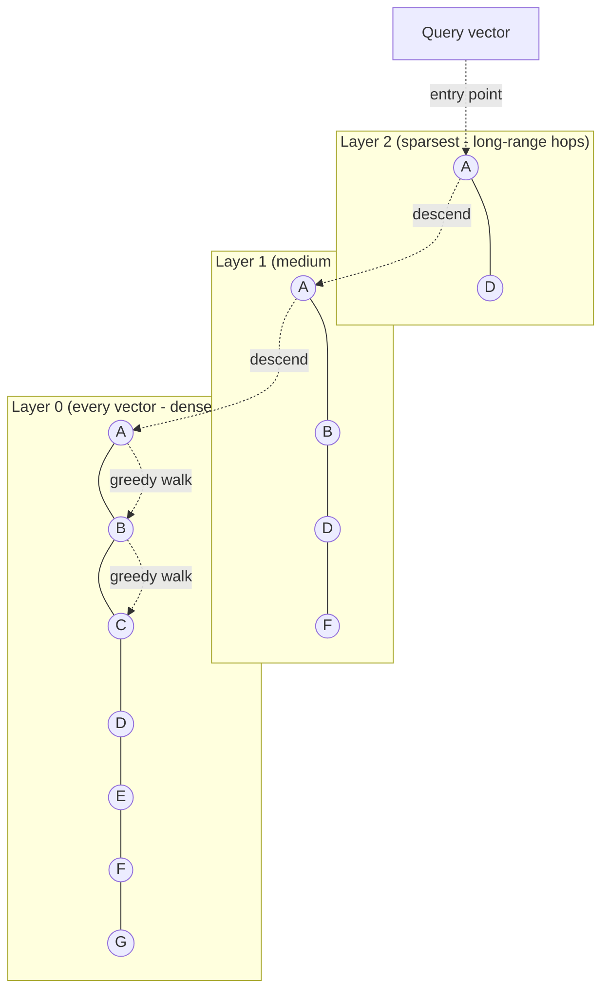

# Vector Databases and ANN Search (HNSW)

_[NoSQL families' own survey](01-nosql-families.md#vector-databases) already placed vector databases on the map at a glance - "a specialized index type bolted onto or built around whatever holds the actual data," built on HNSW, traded against IVF and product quantization in one paragraph each. This topic is where that glance becomes a full mechanical treatment: what an embedding actually is, why no index this level has covered so far (B-tree, hash, LSM-tree) can answer a similarity query at all, exactly how HNSW's layered graph gets built and searched, where IVF/PQ/LSH still win, and how a vector index gets filtered, mutated, and distributed once it has to live in a real, multi-node production system._

## Contents

- [What a vector embedding is](#what-a-vector-embedding-is)
- [Why similarity search is a different problem](#why-similarity-search-is-a-different-problem)
- [Brute-force k-NN and why it doesn't scale](#brute-force-k-nn-and-why-it-doesnt-scale)
- [Approximate nearest neighbor (ANN): the trade, and recall@k](#approximate-nearest-neighbor-ann-the-trade-and-recallk)
- [HNSW: the layered graph](#hnsw-the-layered-graph)
- [HNSW construction: M, efConstruction, layer assignment](#hnsw-construction-m-efconstruction-layer-assignment)
- [HNSW query time: ef and greedy descent](#hnsw-query-time-ef-and-greedy-descent)
- [Worked example: layer probabilities and recall@k](#worked-example-layer-probabilities-and-recallk)
- [Other ANN approaches: IVF, product quantization, LSH](#other-ann-approaches-ivf-product-quantization-lsh)
- [Why HNSW became the default](#why-hnsw-became-the-default)
- [Vector database architecture](#vector-database-architecture)
- [Metadata filtering: pre-, post-, and integrated filtering](#metadata-filtering-pre--post--and-integrated-filtering)
- [CRUD and the graph-mutation challenge](#crud-and-the-graph-mutation-challenge)
- [Distributing and replicating the index](#distributing-and-replicating-the-index)
- [Dedicated vector database vs. bolt-on ANN extension](#dedicated-vector-database-vs-bolt-on-ann-extension)
- [Trade-offs](#trade-offs)
- [Interview weight](#interview-weight)
- [How this connects](#how-this-connects)
- [Real-world & sources](#real-world--sources)
- [Check yourself](#check-yourself)

## What a vector embedding is

**An embedding is a fixed-length array of real numbers (a vector in a d-dimensional space, commonly a few hundred to a few thousand dimensions) produced by a machine-learning model so that geometric distance between vectors reflects semantic similarity between the things they represent.** A sentence, an image, an audio clip, a product, a user's behavior history - each gets encoded into a vector such that "similar in meaning" (two sentences that paraphrase each other, two product photos of the same shoe from different angles, two users with similar taste) becomes "close together" under a distance metric such as **cosine similarity**, **Euclidean (L2) distance**, or **dot product** - the same three metrics [already named in the NoSQL-families survey](01-nosql-families.md#vector-databases), unchanged here.

**The critical property this depends on entirely: the embedding model already did the hard semantic work.** A vector database, and every algorithm in this topic, treats a vector as nothing more than a point in space - it has no idea the point represents a sentence or a shoe. All of the "understanding" is baked into the embedding model at encoding time (a transformer encoder, a CNN, a two-tower recommendation model); the vector database's entire job, downstream of that, is a purely geometric one: **given a query vector, find the k stored vectors closest to it, fast, at scale.**

## Why similarity search is a different problem

Every index this level has built on so far - [B-tree indexes and hash indexes from L2](../L2/08-indexing.md#b-tree-indexes) - answers queries by exploiting a **total order or an exact-equality hash over a single scalar key** (or a lexicographically ordered tuple of keys, for a composite index). A B-tree can answer "give me all rows with `created_at` between X and Y" because it keeps keys sorted and can binary-search a comparison; a hash index can answer "give me the row with `user_id = 42`" because a hash function deterministically maps that one exact value to one bucket. Neither structure has any notion of *distance* at all - only "less than," "greater than," or "equal."

**A vector has no single total order to sort by.** A 768-dimensional embedding is 768 independent coordinates simultaneously; "sort by dimension 1" tells you nothing about closeness in the other 767 dimensions, and no ordering of any one coordinate (or any fixed combination of them) preserves the geometric notion of "nearby in all dimensions at once" that similarity search actually needs. This isn't a missing feature that a smarter B-tree variant could add - it's a structural mismatch between what these indexes are built to exploit (order, or exact equality) and what a similarity query actually asks (multi-dimensional geometric proximity).

**Low-dimensional spatial indexes (k-d trees, R-trees) do partially solve this - but only at low dimensionality.** A k-d tree recursively splits space along alternating axes and an R-tree groups nearby points into bounding boxes - both work well for 2-3 dimensional geospatial data (exactly the geohash/quadtree/S2 territory this repo's own roadmap places at a domain-specific level, `verify` exact cross-reference once that topic is written), where "nearby" still means something intuitive and a handful of axis-aligned splits meaningfully narrows the search. Past roughly a few dozen dimensions - orders of magnitude below where embeddings actually live - both structures degrade until they perform **no better than a brute-force linear scan** (`verify` exact crossover dimensionality; widely cited in the ANN literature as somewhere in the 10-20 dimension range for k-d trees specifically), because at high dimensionality nearly every bounding box or every axis-split ends up needing to be checked anyway.

**The curse of dimensionality is the deeper reason why.** As dimensionality grows, the *contrast* between "nearest" and "farthest" collapses: for many common distance distributions, the ratio of the distance to the nearest neighbor over the distance to the farthest neighbor tends toward 1 as dimensionality increases (`verify` precise statement and citation - a well-established theoretical result in the nearest-neighbor literature, commonly associated with work from the late 1990s on when nearest-neighbor search stops being meaningful). Intuitively: in very high-dimensional space, almost all points end up roughly equidistant from any given query point, so the geometric pruning that makes a k-d tree or an R-tree fast in 2-3 dimensions (discard this whole region, it's clearly farther away) stops working, because "clearly farther away" stops being a meaningful distinction. This is precisely why embeddings need a **fundamentally different family of algorithms** - approximate nearest neighbor search, covered from here on - rather than a deeper or smarter version of any exact-match/range/spatial index this level has covered so far.

## Brute-force k-NN and why it doesn't scale

**Exact k-nearest-neighbor search means comparing the query vector against every single stored vector, computing the exact distance to each, and keeping the k smallest** - guaranteed correct, and the baseline every ANN algorithm's recall gets measured against. Its cost is **O(N x d)** per query: N stored vectors, each comparison costing O(d) work (d multiply-adds for a dot product or squared-Euclidean distance over d dimensions).

Illustrative math (not a benchmark, just the arithmetic that motivates everything that follows): at N = 1 billion vectors and d = 768 dimensions, one query requires roughly 768 billion multiply-add operations - and that cost is paid **again, in full, for every single query**, growing linearly with however many vectors get added. There is no caching or precomputation that reduces the per-query cost of exact brute-force search, because every query vector is different; the only way to make this practical at real production scale (millions to billions of vectors, sub-100ms latency budgets, `verify` typical production SLA figures) is to give up exactness - which is exactly what approximate nearest neighbor search does.

## Approximate nearest neighbor (ANN): the trade, and recall@k

**ANN search accepts a small, tunable probability of missing some true nearest neighbors in exchange for search cost that is sub-linear in N** (in HNSW's case, close to logarithmic - covered below) - **orders of magnitude faster and far less memory-hungry than exact search, at scale.** This is a deliberate, named trade-off, not a compromise a well-tuned system quietly makes without measuring it: every ANN algorithm exposes at least one parameter that trades some fraction of accuracy for speed or memory, and every production ANN system is expected to measure exactly how much accuracy that trade costs.

**Recall@k is the standard quality metric.** For a set of test queries, run the ANN algorithm to get its top-k results, and separately run exact brute-force search to get the true top-k; recall@k is the fraction of the true top-k that the ANN search actually returned, averaged across queries:

```
recall@k = |{ANN's top-k results} ∩ {true top-k results}| / k
```

A recall@10 of 0.95 means, on average, 9.5 of the true 10 nearest neighbors show up in the ANN algorithm's returned top-10 - the remaining ~0.5 are false negatives the approximation missed. Every tuning knob covered in the rest of this topic (`ef`, `efConstruction`, `M`, `nprobe`, quantization aggressiveness) is, underneath, a knob on this one number, traded against latency and memory.

## HNSW: the layered graph

**HNSW (Hierarchical Navigable Small World graphs) is the dominant ANN algorithm in production vector databases today** (`verify` originally described by Malkov and Yashunin, commonly cited circa 2016-2018). Its structure is a **multi-layer graph** where every stored vector is a node, and edges connect each node to some of its approximate nearest neighbors - but different layers have deliberately different edge densities:

- **Layer 0 (the bottom layer) contains every single vector**, densely connected to its close neighbors - fine-grained, short-range edges, for precise local search once the query is already in roughly the right neighborhood.
- **Higher layers contain exponentially fewer nodes** (a small, randomly-selected subset of the layer below), connected by sparser, longer-range edges - built specifically for fast, coarse navigation across large distances in the vector space before descending into fine-grained search.



**Why this approximates small-world navigability.** A "small-world" graph is one where any two nodes are reachable from each other in very few hops, despite most edges being local - the same structural property that makes a real-world social network's "six degrees of separation" work, and the same property a **skip list** exploits in one dimension (fast lane on top, dense lane at the bottom). HNSW builds exactly this property deliberately into a high-dimensional space: the sparse top layers act as the "highway," letting a query jump close to its destination region in very few long hops, while the dense bottom layer does the fine-grained work of finding the actual nearest neighbors once the search is already in the right neighborhood - giving search cost that scales roughly with the number of layers (logarithmic in N) rather than with N itself.

## HNSW construction: M, efConstruction, layer assignment

Three parameters govern how the graph gets built, each with a direct, nameable effect on the recall/speed/memory/build-time trade:

- **M - the maximum number of edges per node per layer.** Each node keeps roughly M bidirectional connections to other nodes at a given layer (commonly M = 16 as a typical library default, `verify` exact defaults per implementation - hnswlib and Faiss both commonly ship this figure). A higher M means a denser graph - better recall and faster queries at a given search-time budget - at the direct cost of more memory (each node stores more edges) and slower construction (more candidate comparisons per insertion).
- **efConstruction - the size of the candidate list explored while inserting a new node.** When a new vector is inserted, the algorithm doesn't simply connect it to its M literally-closest existing neighbors; it explores a candidate list of size `efConstruction` (commonly 200, `verify` exact typical default) at each layer during insertion, then selects the best M edges from that wider candidate pool - using a diversity-aware heuristic (favoring some longer-range, non-redundant edges over purely closest ones) rather than picking only the M nearest, because the original HNSW paper found that "closest-only" edge selection produces a worse-connected, less navigable graph (`verify` this specific heuristic detail). A higher `efConstruction` builds a higher-quality (better final recall) graph, at the cost of slower index construction; it has no effect on query-time cost once the graph already exists.
- **Layer assignment - each new node is assigned a random maximum layer via an exponentially decaying probability**, so that far fewer nodes exist at each successive higher layer. Concretely: `level = floor(-ln(uniform(0,1)) x mL)`, where `mL = 1/ln(M)` is a normalization constant. This single random draw, run once per inserted vector, is what produces the exponentially-shrinking layer structure the whole algorithm depends on - worked through with exact numbers below.

**Insertion, end to end.** A new vector draws its random top layer `l` via the formula above. Starting from the graph's current global entry point (the node sitting at the highest layer anyone has reached so far), the algorithm greedily descends layer by layer down to layer `l + 1`, at each layer moving only to the single closest node found (a fast, coarse descent, `ef = 1` in effect) - this locates roughly the right neighborhood without yet doing any real search. From layer `l` down to layer 0, it switches to a wider beam search using the `efConstruction` candidate-list size, and at each of those layers connects the new node to (up to) M neighbors selected from that candidate set, pruning back to M if the node - or an existing neighbor now over capacity from having a new edge added - would otherwise exceed it.

## HNSW query time: ef and greedy descent

**A query behaves exactly like an insertion's own construction-time descent, with one query-time-only parameter added: `ef` (sometimes called `efSearch`), the size of the candidate list explored at layer 0.** The query vector enters at the graph's fixed global entry point (the top layer's designated node), greedily descends layer by layer using a single-closest-neighbor walk (mirroring the coarse phase of insertion) until reaching layer 0, then runs a beam search over a candidate list of size `ef`, expanding to each candidate's own neighbors and keeping the `ef` best-so-far, until no closer candidate remains to explore. The final top-k is read off the top of that candidate list once it converges.

- **Higher `ef` → higher recall, higher query latency** - more of the graph gets explored before the search commits to an answer. `ef` must be at least k (you cannot return more results than candidates explored), and production defaults commonly sit well above k (`ef` in the tens to low hundreds for k in the single-to-low-double digits, `verify` typical production ratios) to buy meaningful recall headroom.
- `ef` has **zero effect on memory or index size** - it is a pure query-time knob, tunable per query without touching the graph at all, which is exactly why it's the parameter most commonly exposed directly to an application (a query that needs higher precision can simply ask for a higher `ef`, at the cost of that one query's own latency).
- **Complexity: roughly O(log N) search cost**, in contrast to exact search's O(N x d) - the direct payoff of the layered small-world structure above: the number of layers grows logarithmically with N (because layer assignment shrinks node counts geometrically per layer, worked out exactly below), and within any one layer the average node degree stays roughly constant (bounded by M, independent of N) rather than growing with the dataset - so total hops scale with the number of layers, not with the number of vectors (`verify` this is the complexity characterization given in HNSW's own published evaluation, empirically closer to logarithmic than proven as a tight asymptotic bound in the general case).

## Worked example: layer probabilities and recall@k

**Deriving the layer-decay factor exactly, for M = 16.** `mL = 1/ln(M) = 1/ln(16) ≈ 0.3607`. The probability that a freshly inserted node reaches at least layer `l + 1`, given it's already at layer `l`, works out to a clean, layer-independent constant:

```
P(level ≥ l+1 | level ≥ l) = e^(-1/mL) = e^(-ln M) = 1/M
```

For M = 16, that's **exactly 1/16 (6.25%)** at every layer transition: roughly 1 in 16 nodes present at layer 0 also appears at layer 1; roughly 1 in 16 of *those* (1 in 256 overall) also appears at layer 2; and so on. This is precisely why M does double duty as both "how many edges per node" and "how sharply the layer structure decays" - a single parameter governing both the graph's local density and its global navigability shape. Concretely, for a 16-million-vector collection: roughly 1 million vectors reach layer 1, roughly 62,500 reach layer 2, roughly 3,900 reach layer 3 - each layer shrinking by the same factor of 16, which is exactly the geometric shrinkage that keeps the number of layers, and therefore query cost, logarithmic in the total vector count.

**A recall@k calculation, concretely.** A product-search index runs a query at `ef = 50` for k = 10. Brute-force ground truth for that same query, computed once for evaluation, returns true nearest neighbors `{p1, p2, p3, p4, p5, p6, p7, p8, p9, p10}`. HNSW's approximate top-10 returns `{p1, p2, p3, p4, p6, p7, p8, p9, p10, p14}` - nine of the true ten, plus one that wasn't actually in the true top-10 (`p14`, likely just outside the true top-10 boundary, still a very close neighbor). Recall@10 for this query = 9/10 = **0.90**. Re-running the same query at `ef = 200` might recover `p5` as well, at the cost of exploring a wider candidate list (more distance computations, higher latency) - the exact recall-for-latency purchase `ef` exists to make, one query at a time.

## Other ANN approaches: IVF, product quantization, LSH

- **IVF (Inverted File Index): partition-then-search.** A k-means-style clustering step (run once, offline) divides the vector space into `nlist` clusters, each represented by a centroid; every stored vector is assigned to its nearest centroid at index-build time. A query first finds the `nprobe` centroids closest to the query vector, then searches only the vectors assigned to those clusters, skipping every other cluster entirely - directly analogous to [partitioning's own "route to the right shard, not every shard" principle](03-partitioning-and-sharding.md#what-partitioning-is-and-why-it-exists), applied to a vector space's own geometry instead of a hash or range. IVF's genuinely different requirement, and its biggest structural contrast with HNSW: it needs a **training step** (the k-means clustering) run over a representative sample of the data *before* any vectors can be indexed at all - a real cost HNSW doesn't pay, since HNSW builds its graph fully incrementally, one insertion at a time, with no separate training phase.
- **Product quantization (PQ): compress, don't just search less.** Each d-dimensional vector is split into `m` sub-vectors, and each sub-vector is independently quantized to the nearest of a small, pre-trained set of centroids (commonly 256 centroids per sub-vector, representable in a single byte) - replacing a full-precision vector with a short sequence of centroid IDs. Concretely: a 128-dimensional float32 vector normally costs 128 x 4 = 512 bytes; split into m = 16 sub-vectors of 8 dimensions each, each coded in a single byte against a 256-centroid codebook, the compressed representation costs only 16 bytes - a **32x memory reduction** (`verify` this exact worked ratio against a specific production system's real configuration; the arithmetic itself is illustrative, not a benchmark). Distances are then computed approximately from the quantized codes via a precomputed lookup table (asymmetric distance computation), trading a small further recall loss for that memory win. PQ is very commonly paired with IVF as **IVF-PQ** (a standard Faiss configuration, `verify`): IVF narrows the search to a handful of clusters, PQ keeps each cluster's vectors cheap to store and cheap to compare.
- **LSH (Locality-Sensitive Hashing): hash so that near things collide.** A family of hash functions is chosen specifically so that vectors close together in the original space collide into the same hash bucket with much higher probability than distant vectors do (random hyperplane projections are a common construction for cosine similarity - "SimHash"-style, `verify` exact construction naming). A query hashes into its bucket(s) and only compares against whatever else landed there. LSH was an early, influential approach to ANN, but has been largely superseded in modern vector databases: getting good recall typically requires many independent hash tables (multiplying memory and lookup cost), and its recall/speed trade-off has been shown to be dominated by graph-based methods like HNSW at comparable memory budgets in independent ANN benchmarking efforts (`verify` specific comparative benchmark citation, e.g. the ann-benchmarks.com project - reserved for the real-world pass).

## Why HNSW became the default

Modern vector databases (Pinecone, Milvus, Weaviate, Qdrant) and bolt-on extensions (pgvector) converge on HNSW as their primary or default index type for several concrete, structural reasons, not just popularity:

- **Fully incremental, no training step.** A vector can be inserted the moment it's produced - no k-means clustering has to be fit first, unlike IVF and PQ, which both need a representative sample of the data upfront to build their clusters/codebooks. This matters directly for any system where vectors arrive continuously (new products, new documents, new user interactions) rather than as one large upfront batch.
- **Consistently strong recall-vs-latency trade-off** in independent comparative benchmarking across a wide range of dataset sizes and dimensionalities (`verify` specific benchmark figures - the ann-benchmarks.com project is the standard, widely-cited reference here, reserved for the real-world pass rather than asserted with unverified numbers in this concept pass).
- **The trade it makes in return: higher memory overhead per vector than a quantized method.** HNSW, in its plain form, stores full-precision vectors plus every node's graph edges (roughly M x 1.x floats worth of edge pointers per node across all its layers, `verify` exact overhead formula) - meaningfully more memory per vector than IVF-PQ's heavily compressed codes. This is precisely why many production systems now combine both ideas rather than choosing one exclusively: **HNSW's graph for navigation, PQ-compressed vectors for the actual stored/compared representation** (Faiss's HNSW+PQ configuration, and Microsoft's DiskANN design for disk-resident billion-scale indexes, are both concrete instances of this combination, `verify` specifics for the real-world pass) - graph-based navigability's speed, quantization's memory footprint, in one index.

## Vector database architecture

**A production vector database is never just "an HNSW graph" - it is an ANN index plus a metadata store plus a distribution/replication layer, because a real query is almost never "find the k nearest vectors" in isolation.** The far more common real query looks like: *"find the 10 products most similar to this embedding, where `category = 'electronics'` and `in_stock = true` and `price < 10000` cents"* - a similarity search **combined with** exact-match/range filtering over ordinary metadata columns, which is why every purpose-built vector database (Pinecone, Milvus, Weaviate, Qdrant) and every bolt-on extension (pgvector, Elasticsearch/OpenSearch vector fields) stores metadata payloads alongside each vector rather than shipping a bare ANN index with nothing else.

## Metadata filtering: pre-, post-, and integrated filtering

Combining a metadata predicate with an ANN graph search is a genuinely harder problem than it looks, because HNSW's greedy traversal assumes it can freely hop to whichever neighbor is geometrically closest - a filter that excludes most of the graph's nodes can strand the search with nowhere useful to walk. Three strategies, each with a real, named cost:

- **Pre-filtering.** Apply the metadata filter first (an ordinary index lookup against `category`/`price`/etc.) to produce a candidate set, then search - exactly or approximately - only within it. Correct by construction, but if the filtered candidate set is still large, the whole benefit of a sub-linear ANN index is lost (the search degrades toward brute force over the filtered subset); if the filtered set is small relative to the whole graph, a generic HNSW graph built over *all* vectors may have very few edges that even lead into that subset, so a naive pre-filtered graph walk can dead-end without ever reaching a filtered-in node that was actually a true near neighbor.
- **Post-filtering.** Run the ANN search first, ignoring the filter entirely, over-fetch more candidates than k (commonly several times k), then discard whatever doesn't pass the filter afterward. Cheap and simple, but if the filter is selective enough, the over-fetched candidate pool can be exhausted before k filtered results are found at all - silently returning fewer than k results, or forcing an expensive re-query with an even larger candidate pool.
- **Integrated (filter-aware) filtering.** The traversal itself is made filter-aware: the graph walk is still allowed to pass *through* filtered-out nodes as pure navigational stepping stones (to preserve connectivity and avoid dead-ending) while only ever counting filtered-in nodes toward the returned top-k. This genuinely combines both correctness and the ANN index's speed, at the cost of a meaningfully more complex traversal implementation - the approach purpose-built vector databases increasingly favor precisely because it avoids both pre-filtering's search-space collapse and post-filtering's under-fetching risk (`verify` exact naming and implementation details per vendor - Pinecone and Weaviate both publish engineering material on this specific problem, reserved for the real-world pass).

## CRUD and the graph-mutation challenge

**Insertion into HNSW is well-defined** (covered above: draw a random layer, descend, connect via beam search) - the graph is built for incremental growth by design. **Deletion is the genuinely hard operation.** Simply removing a node and splicing out every edge that pointed to it risks disconnecting the graph or stranding other nodes that relied on that node purely as a navigational waypoint on the way to somewhere else - the deleted node may never have been a true near neighbor of many queries, but still have served as an essential bridge in the graph's small-world connectivity.

The standard production answer is **tombstoning, not true removal**: mark a deleted vector as deleted (excluded from any query's returned results) but leave it, and its edges, physically present in the graph, so it keeps doing its structural job as a routing waypoint even though it can never again be a query's actual answer - a direct structural cousin of [MVCC's own dead-tuple problem](../L2/06-mvcc.md#garbage-collection-vacuum-bloat-and-transaction-id-wraparound): old versions are kept around rather than removed in place, and a background process eventually reclaims the space. Once the tombstone ratio grows too high (accumulated dead nodes bloating memory and slightly degrading traversal quality), the index is **rebuilt from scratch in the background** from the current live vector set - the same "periodic compaction rather than in-place removal" discipline [an LSM-tree's own compaction already established generically at L2](../L2/08-indexing.md#lsm-tree-indexes), applied here to a graph instead of sorted runs. **Updating a vector's value is typically implemented as delete-then-reinsert rather than in-place edge modification** - because a vector's position moving invalidates every one of its existing edges at once (its old neighbors are no longer necessarily its near neighbors at all), there's no cheaper partial-update path than tombstoning the old node and inserting the new value as if it were a brand-new vector.

## Distributing and replicating the index

**A k-nearest-neighbor query is inherently non-local, which breaks the partitioning intuition this level already built.** [Hash partitioning and range partitioning](03-partitioning-and-sharding.md#partitioning-strategies-for-key-value-data) both work by routing a query to *exactly the one partition* that could possibly hold the answer, because a key's hash or its position in a sorted range deterministically identifies its home shard. A similarity query has no such guarantee: the true nearest neighbor of any given query vector could, in principle, live on any shard, regardless of how vectors were partitioned across nodes - there's no hash or range function that guarantees "geometrically close vectors land on the same shard" the way a hash function guarantees "the same key always lands on the same shard."

- **Scatter-gather (the default).** Shard vectors arbitrarily (e.g. hashed by vector ID, exactly like an ordinary partitioning scheme), fan every query out to *every* shard, let each shard run its own local ANN search and return its own local top-k, then merge and re-rank all the per-shard results at a query coordinator into one global top-k. Correct and simple, but query cost now scales with the number of shards touched - **all of them, by default** - a genuine structural departure from a hash/range-partitioned relational query, which touches exactly one shard.
- **Cluster-aware sharding.** Assign IVF-style cluster centroids to specific shards, so that geometrically similar vectors are more likely to land on the same shard together, and a query can be routed to only the shards holding the nearest few clusters - cutting fan-out at the cost of reintroducing exactly [the hot-partition risk rebalancing and hotspots already covered generically](04-rebalancing-and-hotspots.md#what-partitioning-is-and-why-it-exists): some semantic clusters (a wildly popular product category, a trending topic) get queried far more often than others, concentrating load onto whichever shard happens to hold that cluster.
- **Replication has its own wrinkle here.** HNSW insertion has a genuinely random component - the layer-assignment draw. If two replicas each independently insert "the same" vector and independently draw different random layers, their graphs diverge structurally even though they hold identical data - unlike [replaying a deterministic write-ahead log to reconstruct an identical B-tree](../L2/09-write-ahead-log.md), which is exactly what ordinary [leader-follower replication](02-replication.md#leader-follower-replication) relies on. In practice this means either the graph's actual structure (or its random seed, alongside the insertion command) has to be part of what's replicated, rather than replaying "insert this vector" as an independent operation on each replica and trusting the result to converge.

## Dedicated vector database vs. bolt-on ANN extension

- **A dedicated, purpose-built vector database** (Pinecone, Milvus, Weaviate, Qdrant) earns its keep at the largest scale (hundreds of millions to billions of vectors), when filtering needs to be genuinely integrated into the ANN traversal itself rather than bolted on afterward, and when the vector index needs to scale and be operated entirely independently of wherever the source objects and metadata otherwise live. The real, ongoing cost: it is another system to run, secure, and keep synchronized with the source-of-truth store that actually owns the underlying objects - exactly [the dual-store synchronization problem CDC and the outbox pattern exist to solve generically](08-cdc-and-outbox.md#the-transactional-outbox-pattern), applied here specifically: when a product's description changes, its embedding has to be recomputed and the vector index has to be updated, asynchronously, via the same kind of change-stream pipeline.
- **A bolt-on ANN extension inside an existing general-purpose database** (**pgvector** inside PostgreSQL - a native vector column type plus HNSW and IVFFlat index types, `verify` version each index type shipped; vector-search fields inside Elasticsearch/OpenSearch, MongoDB Atlas, or Redis) keeps the embedding physically co-located with the rest of an application's relational or document data. This buys transactional consistency between a row and its own embedding (an `UPDATE` to a product row and its embedding commit together, in one transaction, with no separate system to keep eventually in sync at all) and one fewer system to operate - at a real cost in ANN performance and scale ceiling relative to a system architected around ANN search as its sole reason for existing, and typically a narrower, less integrated set of filtering strategies than a purpose-built system offers.
- **The deciding question, concretely:** does this workload's dominant cost live in the vector search itself (scale, filtering sophistication, the index's own availability and latency budget), or does it live in keeping the embedding consistent with a small-to-medium amount of frequently-changing source data the application already manages elsewhere? The first answer points to a dedicated vector database; the second points to a bolt-on extension - the identical "specialized index vs. general-purpose store with a bolted-on capability" trade [NoSQL families' own closing trade-off already generalized for search indexes (Elasticsearch) alongside relational stores](01-nosql-families.md#how-newsql-and-vector-databases-relate-to-the-classic-families), reused here for vectors specifically.

## Trade-offs

| Lever | Turning it up | Turning it down |
| --- | --- | --- |
| `ef` (query-time) | Higher recall, higher query latency, no memory or build-time cost | Lower recall, lower latency - the single cheapest per-query dial |
| `efConstruction` (build-time) | Higher achievable recall at any given `ef`, slower index build, zero query-time cost | Faster builds, a lower recall ceiling no amount of query-time `ef` can fully recover |
| `M` (structural) | Higher recall and faster queries at fixed `ef`, but linearly more memory per node and slower construction | Less memory, faster builds, a structurally worse graph regardless of query-time tuning |
| Product quantization | Large memory reduction (tens of times smaller), faster distance computation | Recall loss, usually mitigated by exact-reranking a small shortlist rather than trusting quantized distances alone |
| IVF `nprobe` | Higher recall (more clusters searched), higher latency | Faster queries, real risk of missing the true nearest neighbor's cluster entirely |

✅ **What ANN/HNSW buys:** sub-linear (roughly logarithmic) query cost instead of brute force's O(N x d); fully incremental construction with no training step; consistently strong recall-vs-latency trade-offs across dataset sizes; a tunable, per-query accuracy dial (`ef`) that costs nothing when left alone.

❌ **What it costs:** approximate by construction - recall is never guaranteed to be 100% and must be measured, not assumed; higher memory footprint per vector than quantization-based methods unless explicitly combined with PQ; deletion and update are structurally awkward (tombstone-and-rebuild, not true in-place removal); k-NN queries don't partition the way hash/range-partitioned relational queries do, forcing either full scatter-gather fan-out or a cluster-aware sharding scheme with its own hotspot risk.

## Interview weight

Vector search and ANN indexing is an increasingly common system-design prompt, driven directly by the rise of retrieval-augmented generation (RAG) and embedding-based recommendation - **design a semantic search engine**, **design a RAG pipeline for a chatbot over a company's documents**, **design a "similar products" or "for you" recommendation feed**. A candidate expected to go beyond naming "use a vector database" should be able to answer, concretely: *why can't you just add an index to your existing relational table for this* (the curse of dimensionality, and precisely why B-tree/hash/even k-d-tree indexes stop working at this dimensionality), *how does the ANN index actually find near neighbors fast* (HNSW's layered graph and its `ef`/`M`/`efConstruction` knobs, or at minimum the recall/speed/memory trade every ANN method makes), *how do you filter by metadata alongside a similarity query* (pre-/post-/integrated filtering, and the dead-end risk pre-filtering specifically creates), and *how do you keep the embedding fresh when the source data changes* (a CDC-fed re-embedding pipeline, not a one-time offline batch job). The last question is the one most likely to separate a candidate who has only used a vector database's API from one who understands it as a system with real consistency and operational trade-offs.

## How this connects

- **Back to L2 (indexing, MVCC, LSM-trees)** - [B-tree and hash indexes](../L2/08-indexing.md#b-tree-indexes) are exactly the exact-match/range machinery this topic explained why similarity search can't reuse; HNSW's tombstone-and-background-rebuild deletion strategy is a direct structural cousin of [MVCC's dead-tuple/VACUUM discipline](../L2/06-mvcc.md#garbage-collection-vacuum-bloat-and-transaction-id-wraparound) and [an LSM-tree's own compaction](../L2/08-indexing.md#lsm-tree-indexes) - old, dead entries tolerated and periodically reclaimed, never removed in place.
- **Back to L4/01 (NoSQL families)** - [that topic's own vector-database section](01-nosql-families.md#vector-databases) introduced this whole area at survey depth; this topic is its full mechanical deep dive, and the "specialized index bolted onto a source store" framing established there is exactly what the dedicated-vs-bolt-on section above builds on directly.
- **Back to L4/03-05 (partitioning, rebalancing, consistent hashing)** - [partitioning's own "route to one shard" principle](03-partitioning-and-sharding.md#what-partitioning-is-and-why-it-exists) is precisely what breaks for k-NN queries, forcing scatter-gather or cluster-aware sharding, whose own hotspot risk is [rebalancing and hotspots' own generic concern](04-rebalancing-and-hotspots.md#what-partitioning-is-and-why-it-exists) applied to semantically popular clusters instead of popular keys.
- **Back to L4/02 (replication)** - HNSW's random layer-assignment draw is why naively replaying "insert this vector" independently on each replica, the way [ordinary leader-follower replication](02-replication.md#leader-follower-replication) otherwise assumes, can produce structurally divergent graphs across replicas holding identical data.
- **Back to L4/08-10 (CDC/outbox, event sourcing, CQRS)** - keeping an embedding fresh when its source row changes is exactly [the CDC/outbox synchronization pattern](08-cdc-and-outbox.md#the-transactional-outbox-pattern) applied to a re-embedding pipeline; a vector index populated this way is, in [CQRS's own vocabulary](10-cqrs.md#read-models-one-or-more-shaped-per-query), simply another asynchronously-projected read model - shaped for similarity queries instead of key lookups or aggregation.
- **Forward to L6 (messaging and streaming)** - the CDC-fed re-embedding pipeline this topic names only in outline gets its full mechanical treatment (consumer groups, ordering, backpressure) once that level covers how a stream of source-data changes actually gets consumed reliably at scale.
- **Forward to L12 (scalability and performance patterns)** - a "hot" semantic cluster overloading one shard under cluster-aware sharding is a direct instance of that level's own hot-key mitigation topic, and probabilistic structures covered there (Bloom filters especially) are commonly layered in front of a vector index to cheaply reject "definitely not present" lookups before paying for a graph traversal at all.
- **Forward to L13 (specialized systems)** - retrieval-augmented generation (RAG) and recommendation systems are the two dominant production use cases this entire topic exists to serve: a RAG pipeline's retrieval step *is* an ANN query over a document-chunk embedding index, exactly as built here, and a recommendation feed's "find items similar to what this user engaged with" is the identical k-NN query over a differently-trained embedding space.

## Real-world & sources

Three verified examples, each fetched directly from its source, deliberately spanning different domains (social/visual discovery, media/recommendations, ride-hailing/marketplace search) rather than defaulting to one company:

- **Pinterest - HNSW with streaming, filter-aware traversal (social/visual discovery, e-commerce-adjacent).** Pinterest's in-house ANN service, **Manas**, serves embedding-based retrieval across Pinterest's "300 billion ideas and counting" using **HNSW graphs**. The specific engineering problem this post solves is exactly the pre-/post-/integrated filtering trade-off named above: a real query looks like "find pins visually similar to this pair of shoes, under $100, rated 4+ stars, shipping to the UK" - naive pre-filtering can strand the graph walk, and naive post-filtering can under-return results when the filter is selective. Pinterest's answer is to apply the metadata filter **during the HNSW graph traversal itself, in a streaming fashion**, automatically determining how much to over-fetch per request rather than picking a fixed static multiplier - a production instance of the "integrated (filter-aware) filtering" strategy this topic names as the state of the art. Source: [Pinterest Engineering Blog - "Manas HNSW Streaming Filters"](https://medium.com/pinterest-engineering/manas-hnsw-streaming-filters-351adf9ac1c4) (published 2022-05-05; fetched 2026-07-20).

- **Spotify - Annoy to Voyager, an HNSW migration for recommendations (media/streaming).** Spotify's ANN library **Annoy** (tree-based, not graph-based) powered a decade of personalization, recommendation, and search - including Discover Weekly and Home - via nearest-neighbor lookups in a learned embedding space (e.g., recommending a track close to a user's own position in that space). In 2023 Spotify replaced it with **Voyager**, built on **HNSW** (derived from and substantially modified from the open-source `hnswlib`), reporting **more than 10x the query speed of Annoy at the same recall** (or up to 50% better accuracy at the same speed) and **up to 4x less memory usage**, while adding full multithreading and matched Python/Java bindings for production deployment. This is a concrete, dated illustration of exactly the trade-off this topic's "why HNSW became the default" section describes in the abstract - a real company outgrowing a tree-based ANN method and migrating specifically to graph-based HNSW for the recall/speed/memory win. Source: [Spotify Engineering - "Introducing Voyager: Spotify's New Nearest-Neighbor Search Library"](https://engineering.atspotify.com/2023/10/introducing-voyager-spotifys-new-nearest-neighbor-search-library) (published 2023-10-25; fetched 2026-07-20).

- **Uber - HNSW at billion-item scale (ride-hailing/delivery marketplace search).** Uber built a semantic search platform on **OpenSearch**, whose vector search is itself backed by **HNSW** (Uber's prototype started on Apache Lucene's own HNSW implementation before migrating to OpenSearch for algorithmic flexibility and native Faiss/GPU-acceleration support), to move beyond keyword matching across **over 1.5 billion items** (roughly 400-dimensional vectors) under a strict **100ms P99 latency at 2,000 QPS** budget. Through indexing and quantization optimizations (storing both non-quantized float32 and quantized int8 vector representations to trade latency against storage per use case) Uber cut full-dataset ingestion time from 12.5 hours to 2.5 hours (a 79% improvement), reduced P99 query latency from roughly 250ms to under 120ms, and shrank total index size from 11TB to 4TB. This is a concrete, published instance of this topic's "distributing and replicating the index" and PQ/quantization trade-off sections, at genuine billion-scale production volume. Source: [Uber Engineering Blog - "Powering Billion-Scale Vector Search with OpenSearch"](https://www.uber.com/blog/powering-billion-scale-vector-search-with-opensearch/) (published 2025-12-18; fetched 2026-07-20).

**Flagged gap - fintech example.** Per this repo's standing preference to include a fintech example (Stripe first) wherever one genuinely exists: a search specifically for Stripe's use of vector/embedding-based similarity search turned up only Stripe's 2020 "Similarity Clustering to Catch Fraud Rings" post, which is (a) more than 4 years old and outside this document's freshness bar, and (b) not actually an ANN/vector-database use case - it clusters accounts using gradient-boosted trees (XGBoost) over hand/learned features and connected-component analysis, not embeddings compared via HNSW or any ANN index. No credible, current, fetch-verified fintech example of HNSW/vector-database use was found for this specific topic; this is flagged openly rather than forced in. UPI/NPCI was also checked and no published architecture detail on vector/ANN search specifically was found there either.

## Check yourself

- Explain, precisely, why a B-tree index on a `VECTOR(768)` column would be structurally useless for a nearest-neighbor query - what property does a B-tree rely on that a 768-dimensional vector doesn't have?
- Walk through, with numbers, why HNSW's layer-assignment formula makes the probability of reaching the next layer up exactly `1/M`, and explain why that's the same parameter that also controls the graph's edge density at any one layer.
- A colleague sets `ef = 10` for k = 10 and complains about poor recall. What's the first thing you'd check, and why would raising `ef` (say, to 100) likely help without touching the index itself?
- Compare IVF and HNSW on exactly one axis: what has to happen before a single vector can be inserted into each, and why does that difference matter for a system where new vectors arrive continuously rather than in one big upfront batch?
- A team wants to delete a vector from their HNSW index the moment a user deletes their account. Explain why the index doesn't just remove the node and its edges immediately, and what actually happens instead.
- You're asked to filter a similarity search by `category = 'shoes'`, and only about 2% of the whole collection is in that category. Explain, concretely, why naive pre-filtering could produce badly degraded recall here, and what an integrated/filter-aware traversal does differently.
- Why can't a vector index simply be hash-partitioned across shards the same way an ordinary key-value store is, and route each query to exactly one shard? What does a production system do instead, and what does that cost?
