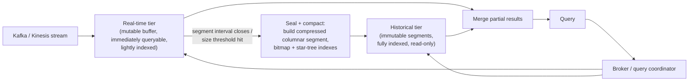
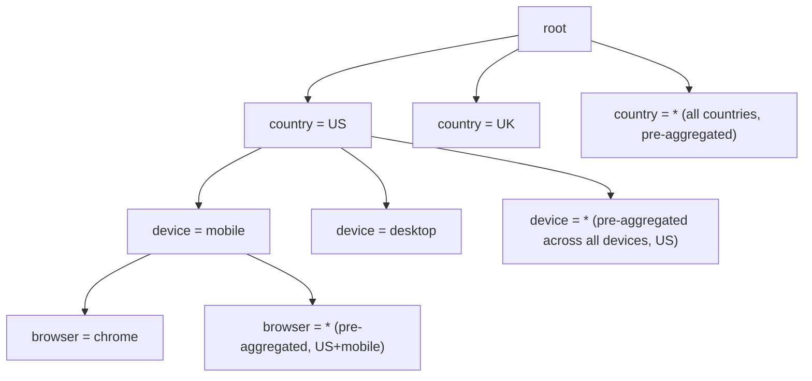

# Real-Time OLAP (Pinot, Druid, ClickHouse)

_[OLTP vs OLAP at L2](../L2/13-oltp-vs-olap.md) drew one clean line: OLTP for many small transactions against live state, OLAP for few large scan-and-aggregate queries against a historical or derived copy - and closed by naming the gap between the two: an OLTP write typically takes minutes to hours to become visible in a batch-loaded warehouse (Redshift/Snowflake/BigQuery-style), because [ETL/ELT](../L2/13-oltp-vs-olap.md#getting-data-from-oltp-to-olap-etl-elt-cdc-the-warehouse) runs on a schedule. This topic is the category of system built specifically to close that gap to seconds, without giving up OLAP's columnar, aggregate-optimized query engine - and it does so by recombining machinery this level already built (segments, CDC-fed streaming ingestion, LSM-style compaction) into a third architectural shape, distinct from both a batch warehouse and an OLTP database._

## Contents

- [What real-time OLAP is, and why it's a third category](#what-real-time-olap-is-and-why-its-a-third-category)
- [The core tension: fast ingestion and fast queries, at once](#the-core-tension-fast-ingestion-and-fast-queries-at-once)
- [Segment-based storage: the hot/cold, real-time/historical split](#segment-based-storage-the-hotcold-real-timehistorical-split)
- [Pre-aggregation vs raw-event query: rollup and grain, revisited](#pre-aggregation-vs-raw-event-query-rollup-and-grain-revisited)
- [Star-tree indexes: pre-aggregating combinations of dimensions](#star-tree-indexes-pre-aggregating-combinations-of-dimensions)
- [Bitmap and inverted indexes for fast filtering](#bitmap-and-inverted-indexes-for-fast-filtering)
- [ClickHouse's MergeTree: LSM-style ingestion, sparse primary index](#clickhouses-mergetree-lsm-style-ingestion-sparse-primary-index)
- [Vectorized execution, revisited](#vectorized-execution-revisited)
- [How data gets in: streaming ingestion and exactly-once bookkeeping](#how-data-gets-in-streaming-ingestion-and-exactly-once-bookkeeping)
- [Worked example: a live product-analytics dashboard](#worked-example-a-live-product-analytics-dashboard)
- [Pinot, Druid, and ClickHouse compared](#pinot-druid-and-clickhouse-compared)
- [What real-time OLAP is not good for](#what-real-time-olap-is-not-good-for)
- [Trade-offs](#trade-offs)
- [Interview weight](#interview-weight)
- [How this connects](#how-this-connects)
- [Real-world & sources](#real-world--sources)
- [Check yourself](#check-yourself)

## What real-time OLAP is, and why it's a third category

**Real-time OLAP is a class of database purpose-built to run sub-second-to-low-second analytical (scan, filter, `GROUP BY`, aggregate) queries directly against data that is still arriving, continuously, from a live stream** - not a nightly-loaded copy. It sits in a genuinely different point in the design space than either system this level and L2 already covered:

| | OLTP | Batch OLAP warehouse | Real-time OLAP |
| --- | --- | --- | --- |
| Example systems | Postgres, MySQL, DynamoDB | Snowflake, BigQuery, Redshift | Pinot, Druid, ClickHouse |
| Write -> queryable latency | Immediate (the write itself) | Minutes to hours (batch ETL/ELT window) | Seconds (streaming ingestion) |
| Query latency | Milliseconds | Seconds to minutes | Milliseconds to low seconds |
| Query concurrency | Very high (thousands-millions/sec) | Low - a handful of analysts | High - thousands of concurrent dashboard/API consumers |
| Query flexibility | High, but over small row sets | Very high - arbitrary joins, ad hoc exploration | Constrained - built around known dimensions/measures; joins limited |
| System of record? | Yes | No - a derived copy | No - a derived copy |

The reason this is a *third* category rather than "OLAP, but faster" is the **concurrency and freshness combination**: a batch warehouse is built for a small number of analysts running occasional, arbitrarily complex queries against data that's allowed to be hours stale; real-time OLAP is built for a large number of concurrent, comparatively simpler, predictable-shape queries (a dashboard refreshing every few seconds, an API serving "your video has 4,213 views right now" to every viewer) against data that's only seconds stale. Optimizing for that combination - high QPS, low latency, low staleness - forces a genuinely different physical design, not just a faster warehouse.

**What it's for, concretely:** live operational dashboards (ad-tech spend/impressions, product analytics, infrastructure metrics), user-facing analytics embedded directly into a product (view counts, leaderboard rankings, "who viewed your profile"-style features), and anomaly/fraud detection that needs to spot a pattern in traffic within seconds of it happening, not after the next nightly ETL run.

## The core tension: fast ingestion and fast queries, at once

Every technique in this topic exists to resolve one structural tension: **columnar storage (the thing that makes OLAP-style scans fast) is built around large, immutable, sorted, heavily-indexed blocks - and building one of those blocks well takes time and a batch of rows to work with, which is in direct conflict with "make this row queryable within a second of it arriving."**

A batch warehouse resolves this tension by not trying to resolve it: it accepts a large ingestion latency (minutes-to-hours) in exchange for spending that time building excellent columnar segments (heavily compressed, heavily indexed, sorted/clustered for data skipping - all the machinery [L2's OLTP-vs-OLAP topic](../L2/13-oltp-vs-olap.md#inside-a-column-store-compression-data-skipping-vectorized-execution) already covered). Real-time OLAP instead **splits storage into two tiers with two different trade-offs**, covered next - a fast, mutable, "good enough" tier for the freshest data, and a slower-to-build, excellent, immutable tier for everything else - so that no single tier has to be both instantly-writable and perfectly optimized for scanning at once.

## Segment-based storage: the hot/cold, real-time/historical split

**A segment is a self-contained, columnar-encoded chunk of data covering some interval - almost always a time interval (an hour, a day) - that is built once and never mutated in place afterward.** Apache Druid and Apache Pinot both organize essentially their entire storage model around segments, and split segment *serving* into two roles:

- **The real-time (ingestion) tier** consumes directly from a stream (Kafka, Kinesis - covered in full below) and buffers newly-arrived rows in a **mutable, immediately-queryable form** - an in-memory or lightly-indexed columnar buffer, not yet compressed or indexed to the same standard as a finished segment. This is what makes a row queryable within seconds of arriving: it doesn't wait for a full segment build, it's just appended and immediately included in query scans against that tier.
- Once a segment's time interval closes (or it reaches a size/row-count threshold), the real-time tier **seals** it: the buffered rows are compacted into a proper immutable columnar segment - fully compressed, fully indexed (dictionary-encoded, bitmap-indexed, star-tree-indexed, covered below) - and handed off to a separate **historical tier** built purely to serve fast scans against finished, optimized segments, with no write path at all.
- A query is **scattered across both tiers** by a broker/coordinator role: historical segments answer everything older than the ingestion window currently in flight, the real-time tier answers the freshest slice, and the two partial results are merged before being returned - the same scatter-gather shape [vector search's own distributed-index section](11-vector-databases-ann-search.md#distributing-and-replicating-the-index) already used for a structurally different reason (there, because similarity search has no partition key to route by; here, because two physically different storage tiers each hold a slice of the answer).

**This is a direct structural cousin of an LSM-tree's memtable/SSTable split**, one level up the stack: [an LSM-tree](../L2/10-storage-engines.md#lsm-tree-storage-engines-the-write-path-and-read-path-end-to-end) absorbs writes into a fast, mutable in-memory memtable and periodically flushes/compacts it into immutable, sorted, on-disk SSTables, precisely so a single storage engine doesn't have to be simultaneously fast-to-write and optimally-organized-for-reads. Druid/Pinot's real-time/historical tier split does the identical trade at the scale of a whole cluster instead of one engine's internal write path: the real-time tier is the memtable (fast, mutable, "good enough" to query), the historical tier is the compacted SSTable equivalent (slower to produce, excellent to scan), and "sealing a segment" is the cluster-level analogue of a memtable flush plus compaction.

## Pre-aggregation vs raw-event query: rollup and grain, revisited

Once rows are flowing into segments, a real-time OLAP system has a choice, made at ingestion time, that trades query flexibility for storage and speed - the same **grain** decision [L2's OLAP topic named for a star-schema fact table](../L2/13-oltp-vs-olap.md#schema-modeling-normalized-oltp-vs-starsnowflake-olap), applied here at ingest time rather than at data-modeling time:

- **Rollup (pre-aggregation at ingest).** Incoming rows are grouped by their dimension values at a chosen time granularity (e.g. per-minute) *before* ever being written into a segment, with measures summed/counted/averaged across that group. Druid supports this natively as an ingestion-time option. The payoff is large: instead of storing (and later scanning) one row per raw event, the segment stores one row per distinct dimension-combination-per-minute - often an order-of-magnitude-or-more reduction in row count - at the direct cost of losing the ability to ever query at a finer grain than what was rolled up (you cannot recover individual raw events from a rolled-up segment, the same way a fact table's grain, once chosen, constrains every query built on top of it).
- **Raw-event storage, index-compensated.** Keep every row at its original, finest grain, and instead rely on heavy indexing (bitmap indexes, star-tree indexes, covered next) to make aggregate queries over the full raw dataset fast without ever discarding detail. Apache Pinot leans more toward this by default, and ClickHouse's default `INSERT` behavior keeps raw rows as well (though both can layer materialized aggregate views on top, covered below).

Neither is strictly better: rollup buys smaller segments and faster queries in exchange for a hard, permanent ceiling on query granularity decided once at ingest time; raw-event storage keeps full flexibility (any query at any grain, including ones nobody anticipated) at the cost of needing much heavier per-row indexing to keep aggregate queries fast anyway.

## Star-tree indexes: pre-aggregating combinations of dimensions

**A star-tree index (Druid and Pinot both implement a version of this) is a structure that pre-aggregates measures across *combinations* of dimension values, specifically to answer `GROUP BY`/aggregate queries that don't need every dimension broken out, without needing a separately materialized rollup table for every possible subset of dimensions.**

Mechanically: pick an ordering of the dimension columns (say `country`, then `device_type`, then `browser`). The star-tree is built as a tree where each level corresponds to one dimension in that order. At any node, in addition to a child branch for each specific value of that dimension actually present in the data, there is one extra, special child: the **star (`*`) node**, which holds the aggregate measures summed/counted **across every value of that dimension at once** - "any value of `browser` you don't care to filter or break out by, already pre-summed."

A query with a `GROUP BY country` (no breakdown by `device_type` or `browser`, and no filter on them either) can walk straight to `country -> * -> *` and read a single pre-aggregated node directly, instead of scanning every raw row for that country and aggregating across all of its `device_type`/`browser` combinations at query time. A query that *does* filter on `device_type = 'mobile'` but not `browser` walks `country -> mobile -> *` instead - still hitting a pre-aggregated node, just one level deeper.

**Why this doesn't just materialize all 2^d combinations naively:** a star-tree's build process is configurable and prunable - a dimension can be excluded from star-tree materialization entirely (kept as a raw, unaggregated leaf-level scan target instead) when its cardinality is too high or it's rarely used in a `GROUP BY` without a filter, keeping the index's size and build cost bounded rather than combinatorially exploding with the number of dimension columns. The trade this index makes, precisely: extra ingest-time build cost and extra storage for the pre-aggregated nodes, in exchange for near-instant answers to *any* aggregate query that only needs a subset of dimensions broken out - a materially more flexible payoff than a single fixed rollup grain, at a real storage cost between "raw rows only" and "fully rolled up to one specific grain."

## Bitmap and inverted indexes for fast filtering

Two further index structures, both borrowed conceptually from search-engine and analytics-engine territory this level and L2 have already introduced once each, reused here specifically to make the **filter** half of an aggregate query (the `WHERE` clause feeding into a `GROUP BY`) fast:

- **Bitmap indexes.** For a low-to-medium-cardinality column (`country`, `device_type`, `status`), store one bit per row per distinct value - a bit set to 1 exactly where that row holds that value. Filtering `WHERE country = 'US' AND device_type = 'mobile'` becomes a single bitwise `AND` of two bitmaps, instead of a per-row comparison scan - and combining several such filters is just more bitwise `AND`/`OR` operations, which CPUs execute extremely cheaply. Sparse or clustered bitmaps compress well under run-length encoding; **Roaring bitmaps** are the compressed representation both Druid and Pinot use in practice (`verify` exact adoption details per version), keeping the memory cost of a bitmap index manageable even at high row counts.
- **Inverted indexes for multi-value/string dimensions.** The exact same structure [already covered for search engines](01-nosql-families.md#search-engines) - a mapping from each distinct value to the row IDs (here, typically stored as a bitmap rather than a plain list, for the same bitwise-AND benefit above) containing it - gets reused for text or multi-valued dimension columns (a `tags` array field on an event), so a filter like `WHERE 'checkout' = ANY(tags)` runs as an index lookup instead of scanning and unpacking every row's array.

Both structures are, in effect, doing the same job zone-maps did in [L2's column-store treatment](../L2/13-oltp-vs-olap.md#inside-a-column-store-compression-data-skipping-vectorized-execution) - letting a query skip work instead of doing it - but operate at row-level precision (exact matching rows) rather than zone-maps' coarser block-level precision (skip whole blocks that can't match), which is why real-time OLAP engines commonly carry both: zone-map-style block skipping to avoid opening whole segments, and bitmap/inverted indexes within a segment to avoid scanning rows that don't match a filter.

## ClickHouse's MergeTree: LSM-style ingestion, sparse primary index

**ClickHouse takes a structurally simpler path to the same fast-ingest-fast-scan goal: no separate real-time/historical tier at all - just one storage engine family, MergeTree, built directly on an LSM-tree-style write path.**

- Each `INSERT` (typically batched - ClickHouse is explicitly tuned for batch inserts of thousands of rows at once, not one-row-at-a-time inserts) writes a new, immutable, columnar **part**, sorted by the table's declared `ORDER BY` key. This is exactly [an LSM-tree's SSTable flush](../L2/10-storage-engines.md#lsm-tree-storage-engines-the-write-path-and-read-path-end-to-end), one level reused: a batch of writes becomes one new sorted, immutable file, rather than being merged in place.
- A **background merge process** periodically combines smaller parts into larger ones - the same **compaction** discipline [L2's storage-engines topic](../L2/10-storage-engines.md#compaction-strategies-in-depth) already covered generically, here reducing the number of parts a query has to open and scan, and doing the merge-time work specific to whichever MergeTree variant is chosen: plain `MergeTree` just merges and sorts; `ReplacingMergeTree` deduplicates rows sharing a key at merge time (keeping only the latest version, a merge-time analogue of upsert semantics); `SummingMergeTree`/`AggregatingMergeTree` **pre-aggregate measures at merge time** - ClickHouse's own answer to the rollup trade-off above, applied during background compaction rather than at ingest time or via a separate star-tree structure.
- **ClickHouse's "primary key" is not a uniqueness constraint the way an OLTP primary key is - it's a sparse index.** It stores one index entry roughly every N rows (a configurable granularity, commonly 8,192 rows, `verify` exact default) into the part's data, sorted by the `ORDER BY` key - enough to jump to roughly the right block and skip everything outside a filtered range, but not enough to look up one exact row cheaply the way a B-tree primary key does. This is a direct consequence of ClickHouse's design center: it is built to make "scan a large contiguous range fast" cheap, not "find and update exactly one row fast" - the same OLTP-vs-OLAP index-tradeoff [L2 already made explicit in the abstract](../L2/13-oltp-vs-olap.md#why-the-distinction-exists-workload-shape-drives-physical-design), concretely realized here as an actual index structure a ClickHouse table owner has to understand: duplicate "primary key" values are legal and common (unlike an OLTP table), and point lookups by a non-sorted column are comparatively expensive.

## Vectorized execution, revisited

[L2's OLAP topic already established vectorized execution](../L2/13-oltp-vs-olap.md#inside-a-column-store-compression-data-skipping-vectorized-execution) as the technique of processing a batch ("vector") of column values at once - typically 1,024-4,096 values per batch - in a tight, type-specialized loop, rather than one interpreted step per row. Real-time OLAP engines lean on this even more heavily than a batch warehouse does, precisely because the latency budget is far tighter: a warehouse query tolerating seconds-to-minutes has room for a less-optimized executor; a dashboard query with a sub-second budget does not. ClickHouse in particular is commonly cited as one of the most aggressively vectorized open-source SQL engines available, and Pinot/Druid apply the same principle within their own segment-scan code paths - the same mechanism, reused here under a materially tighter latency constraint than the batch-warehouse case it was first introduced against.

## How data gets in: streaming ingestion and exactly-once bookkeeping

**Streaming ingestion from Kafka (or Kinesis) is the default, primary ingestion path for real-time OLAP - not an add-on.** Both Pinot and Druid ship native connectors that consume directly from a Kafka topic (or Kinesis stream), tracking consumer offsets per partition, and are built to replay from a specific offset after a failure rather than losing or silently duplicating data.

**This runs directly into the same at-least-once-delivery problem [CDC and the outbox pattern already established generically](08-cdc-and-outbox.md#at-least-once-delivery-and-idempotent-consumers): a consumer that crashes mid-batch and restarts from its last committed offset can, in the naive case, reprocess rows it already ingested.** Druid and Pinot both solve this specifically for ingestion by making segment creation **offset-keyed and deterministic**: a sealed segment records precisely which Kafka offset range it was built from, so a restarted ingestion task resumes from the last durably-recorded offset rather than blindly reprocessing or skipping - effectively giving **exactly-once ingestion semantics** for the specific case of "this stream, consumed into this system," even though the broader guarantee available from Kafka itself is only at-least-once delivery (`verify` exact protocol naming per system - Pinot documents this as part of its "segment completion protocol"; Druid's Kafka indexing service performs equivalent offset-tracking - reserved for the real-world pass). ClickHouse, by contrast, has no equivalent first-class streaming-ingestion role built into its primary architecture: ingestion is normally driven by an external Kafka-consuming component (ClickHouse's own `Kafka` table engine can poll a topic directly, or - more commonly in production - an external pipeline pushes batched `INSERT`s), and getting the same exactly-once effect relies on the same idempotent-consumer discipline (deduplicating by an offset or event-ID column, or using `ReplacingMergeTree`'s merge-time dedup) established generically rather than a dedicated built-in mechanism.

**This is why real-time OLAP is so frequently the last hop of a CDC or event-sourcing pipeline, not a system fed by hand-written application code:**

- A [CDC connector (Debezium)](08-cdc-and-outbox.md#change-data-capture-cdc) tailing an OLTP database's WAL/binlog publishes row-level changes to a Kafka topic exactly as already covered; a real-time OLAP engine consumes that same topic directly as its ingestion source - closing the gap [L2's OLAP topic named](../L2/13-oltp-vs-olap.md#getting-data-from-oltp-to-olap-etl-elt-cdc-the-warehouse) between "the OLTP source changed" and "the analytical copy reflects it" from a batch-ETL window (hours) down to single-digit seconds.
- In an [event-sourced system](09-event-sourcing.md#what-event-sourcing-is), the event store's own append log is already an ordered, durable stream of everything that happened - a real-time OLAP engine can tail that stream directly as its ingestion source, with no separate CDC connector needed at all, since the events are already exactly the artifact the OLAP engine wants to ingest.
- In [CQRS's vocabulary](10-cqrs.md#read-models-one-or-more-shaped-per-query), a real-time OLAP store populated this way is simply **another asynchronously-projected read model** - shaped for high-QPS aggregate/dashboard queries instead of key lookups, exactly the same framing [the vector-database topic already used for an ANN index fed by CDC](11-vector-databases-ann-search.md#how-this-connects).

## Worked example: a live product-analytics dashboard

An e-commerce site streams a clickstream event for every page view - `{timestamp, product_category, country, device_type, page_load_ms}` - into a Kafka topic at roughly **50,000 events/sec**, and wants a dashboard showing "page views by product category, by country, over the last 24 hours," refreshing every few seconds, served to hundreds of internal analysts and an external partner dashboard simultaneously.

1. **Ingestion.** A Pinot real-time server (or Druid's equivalent ingestion task) consumes the Kafka topic, buffering incoming rows into a mutable, in-memory columnar segment for the current, still-open time window (say, the current hour). Each row is queryable within roughly a second of arriving - well before that hour's segment is finalized.
2. **Sealing.** At the top of the hour, the real-time tier seals the segment: the ~180 million rows accumulated that hour (50,000/sec x 3,600 sec) get compressed, dictionary-encoded, bitmap-indexed on `country`/`device_type`, and star-tree-indexed across `(product_category, country, device_type)` in whichever order was configured - then handed off to the historical tier as an immutable, fully-optimized segment. The real-time tier immediately starts a fresh, empty segment for the new hour.
3. **Query.** The dashboard's `SELECT product_category, country, SUM(1) FROM events WHERE ts > now() - interval '24 hours' GROUP BY product_category, country` query is scattered by the broker to: the historical tier (roughly 23 sealed, fully-indexed hourly segments) and the real-time tier (the current, still-filling hour). The historical portion answers almost instantly by walking straight to pre-aggregated star-tree nodes for `product_category -> country -> *` (no breakdown by `device_type` needed, so the query never touches a single raw row). The real-time portion scans its smaller, less-indexed in-flight buffer directly - slower per-row, but a far smaller row count (at most one hour's worth) - and the broker merges both partial results into one answer, typically in well under a second end to end.
4. **Contrast with the batch-warehouse path** the same company might also run overnight: the identical 24 hours of events, loaded via nightly ETL into Snowflake/BigQuery, would answer this same query in seconds once the data has landed - but the data itself would be up to 24 hours stale, and the query would compete with a much smaller number of ad hoc analytical queries rather than serving hundreds of concurrent dashboard refreshes without a purpose-built serving tier.

## Pinot, Druid, and ClickHouse compared

All three implement some version of the shared machinery above; where they differ is architectural role separation and, as a direct consequence, what each is best suited for.

**Apache Pinot** (originated at LinkedIn) separates concerns into explicit, independently-scalable roles: a **Controller** (cluster metadata, segment assignment), **Broker** (query routing and result merging - the query-facing role), **Server** (holds segments, split into real-time servers consuming Kafka directly and offline/historical servers holding sealed segments), and **Minion** (background tasks - merging, purging, further rollup). Pinot's star-tree index is a first-class, heavily-used feature, reflecting its design center: **very high-QPS, low-latency, user-facing analytics** - the kind of workload where thousands of concurrent requests hit a small number of predictable query shapes against a dashboard or an embedded product feature (LinkedIn's own original motivating use cases, and [Stripe Billing's real-time dashboards, already covered at L2](../L2/13-oltp-vs-olap.md), run on Pinot for exactly this reason - `verify` cross-reference reserved for this topic's own real-world pass).

**Apache Druid** separates a similar but distinctly different set of roles: **Coordinator** (data/segment management, load rules), **Overlord** (manages ingestion tasks specifically, as a separate leader process from the Coordinator), **Broker** (query routing/merging), **Historical** (serves immutable segments), and **MiddleManager/Peon** (runs ingestion tasks, including real-time Kafka/Kinesis consumption). Druid's entire segment model is fundamentally, unconditionally time-partitioned - every segment covers a time interval with no exception - which makes it an exceptionally strong fit for **time-series-flavored, streaming, exploratory analytics** (ad-tech spend/impression analytics was Druid's original motivating use case at Metamarkets), but is a structural constraint for a workload that doesn't have a dominant time axis at all.

**ClickHouse** takes the architecturally simplest path of the three: no separate broker/coordinator/historical/real-time role split at all - a cluster is (from an architectural standpoint) ordinary `MergeTree`-family tables sharded across nodes, presented as one logical table via the `Distributed` table engine, with replication coordinated via `ReplicatedMergeTree` and ZooKeeper/ClickHouse Keeper rather than a whole separate metadata-management service tier. This buys real operational simplicity relative to Pinot/Druid's multi-role clusters, and pairs with an unusually broad SQL surface (window functions, array functions, joins, approximate aggregate functions like `uniqCombined` for approximate distinct counts `verify` exact function name/version) - making it the strongest fit for **broad analytical SQL workloads** where flexibility and raw scan speed matter more than a purpose-built, ultra-high-QPS serving layer tuned for one narrow query shape: observability/log analytics, general BI dashboards, and the OLAP half of the "Postgres + ClickHouse, connected by CDC" pattern [L2's OLTP-vs-OLAP topic already named as today's de facto default](../L2/13-oltp-vs-olap.md).

| | Pinot | Druid | ClickHouse |
| --- | --- | --- | --- |
| Origin / design center | LinkedIn - high-QPS user-facing analytics | Metamarkets - ad-tech, time-series, streaming exploration | Yandex - broad, general-purpose analytical SQL |
| Role separation | Controller / Broker / Server (real-time + offline) / Minion | Coordinator / Overlord / Broker / Historical / MiddleManager | None distinct - Distributed table over sharded MergeTree, Keeper for replication |
| Segment model | Segment-based, real-time + historical split | Segment-based, unconditionally time-partitioned | Part-based (MergeTree), merged/compacted in the background |
| Signature index | Star-tree index | Bitmap + inverted, time-partition pruning | Sparse primary index + skip indexes |
| Best fit | Very high-QPS, predictable-shape, user-facing dashboards/APIs | Time-series-dominant, exploratory streaming analytics | Broad ad hoc SQL, observability/log analytics, operational simplicity |

## What real-time OLAP is not good for

- **Multi-row ACID transactions.** None of these systems offer OLTP-style transactional guarantees across multiple rows - they are not, and are not meant to be, a system of record, the identical disclaimer [already established for search engines and CDC](01-nosql-families.md#search-engines): a genuine source of truth sits upstream (an OLTP database, or an event store), and the real-time OLAP layer is always a derived, eventually-consistent copy fed by a pipeline.
- **Complex, arbitrary joins across large dimension tables.** The whole low-latency design - segments, star-trees, bitmap indexes - assumes a largely denormalized, fact-table-like shape, pushing the star-schema denormalization bias [L2's OLAP topic already established](../L2/13-oltp-vs-olap.md#schema-modeling-normalized-oltp-vs-starsnowflake-olap) further still: Druid and Pinot in particular expect dimension data to already be denormalized onto the fact rows at ingest time (a "wide event" containing everything a query might need), because an expensive join computed at query time defeats the sub-second latency the whole architecture exists to deliver. ClickHouse supports joins more broadly than Pinot/Druid typically do, but large joins between two big tables remain a comparatively weak spot relative to a purpose-built batch-warehouse query optimizer with a larger memory/compute budget and no sub-second latency target to hit.
- **Genuinely novel, ad hoc exploratory analysis over dimensions the index wasn't built for.** A star-tree or a rollup grain, once built, accelerates the query shapes it was configured for; a truly new, never-anticipated slice-and-dice query over a dimension combination the index didn't materialize falls back to a much slower raw scan - or, in a rollup-based system, may simply be impossible to answer at all if the needed grain was discarded at ingest time. A batch warehouse's more general-purpose query optimizer, or ClickHouse's broader ad hoc SQL surface, is the better fit for that kind of genuinely exploratory workload.

## Trade-offs

✅ **What real-time OLAP buys:** sub-second-to-low-second query latency at high concurrency, against data that's only seconds stale - closing the OLTP-to-analytics gap far tighter than any batch ETL/ELT cycle can; purpose-built indexes (star-tree, bitmap, inverted) that make predictable aggregate query shapes extremely fast without discarding the ability to filter/slice; a direct, natural downstream fit for CDC and event-sourcing pipelines already built for other reasons.

❌ **What it costs:** real operational complexity - Pinot and Druid in particular run several independently-scaled cluster roles (controller/broker/server-or-historical/ingestion-task-manager), a materially heavier footprint than a single OLTP database or even a managed batch warehouse; consistency is essentially always eventual, since the system is a derived copy fed by a stream with its own lag; query flexibility is genuinely narrower than a batch warehouse's - great at the query shapes anticipated and indexed for, comparatively weak at truly novel ad hoc joins/dimensions; and it is never a system of record, so it always adds a pipeline (CDC or direct stream ingestion) as another moving part to keep healthy and monitored for lag, exactly the same operational burden [CDC's own failure-modes section already named generically](08-cdc-and-outbox.md#failure-modes).

## Interview weight

🟨 Emerging-but-growing. Real-time OLAP shows up less often as the *entire* system-design prompt than as a component inside a larger one - **design a live analytics dashboard**, **design a fraud-detection/anomaly-alerting pipeline**, **design a metrics/observability platform**, **design a user-facing "live view count" feature** - where a candidate who only says "put it in a data warehouse" is visibly missing the freshness requirement the prompt is actually testing. A strong answer names *why* a batch warehouse doesn't fit (the ETL/ELT latency gap), names the streaming-ingestion-plus-columnar-segment shape as the fix, and can explain at least one concrete mechanism (segment sealing / hot-cold split, or star-tree/bitmap indexing) rather than treating "Druid" or "ClickHouse" as an unexplained brand name to drop. The topic's weight is rising specifically because more product features are becoming "user-facing analytics" (view counts, leaderboards, real-time recommendations feedback) rather than staying purely internal-BI, which is exactly the workload shape this topic describes.

## How this connects

- **Back to L2/13 (OLTP vs OLAP)** - this topic is the direct answer to [that topic's own forward pointer](../L2/13-oltp-vs-olap.md#how-this-connects) naming Druid/Pinot/ClickHouse as systems built to shrink the OLTP-to-OLAP freshness gap; every column-store mechanism established there (columnar layout, compression, zone maps, vectorized execution) is reused here, just under a materially tighter latency budget.
- **Back to L2/10 (storage engines) and L2/08 (indexing)** - the real-time/historical segment split is a cluster-level cousin of [an LSM-tree's memtable/SSTable split](../L2/10-storage-engines.md#lsm-tree-storage-engines-the-write-path-and-read-path-end-to-end) and its [compaction discipline](../L2/10-storage-engines.md#compaction-strategies-in-depth); ClickHouse's MergeTree engine is that same LSM-tree discipline applied directly, one level down, as an actual single-node storage engine rather than a cluster-wide tiering scheme.
- **Back to L4/01 (NoSQL families)** - the inverted index reused here for filtering multi-value/string dimensions is [the identical structure already covered for search engines](01-nosql-families.md#search-engines); this topic's own "not a system of record" caveat is the same one already established there.
- **Back to L4/08-10 (CDC/outbox, event sourcing, CQRS)** - real-time OLAP is overwhelmingly fed by [a CDC pipeline](08-cdc-and-outbox.md#change-data-capture-cdc) or [an event store's own append log](09-event-sourcing.md#what-event-sourcing-is) directly, and once populated this way is simply another [CQRS-style asynchronously-projected read model](10-cqrs.md#read-models-one-or-more-shaped-per-query) - the same framing [the vector-database topic used for an ANN index](11-vector-databases-ann-search.md#how-this-connects), reused here for aggregate/dashboard queries instead of similarity search.
- **Back to L4/02-05 (replication, partitioning, hotspots, consistent hashing)** - segments are themselves a partitioning scheme (by time interval, and often further by a chosen shard key), replicated across historical nodes using the same leader/follower or quorum-style mechanisms this level already built generically.
- **Forward to L4/13 (HTAP)** - real-time OLAP is one way to *approximate* HTAP's goal (serve fresh transactional data and analytical queries with minimal staleness) without unifying the transactional and analytical storage engines: it keeps two separate systems (an OLTP store as system of record, a real-time OLAP store as the analytical serving layer) connected by a low-latency streaming pipeline. HTAP takes the harder path instead - one system natively serving both workload shapes from unified (or tightly co-located) storage - which is exactly what the next topic covers.
- **Forward to L6 (messaging and streaming)** - the Kafka/Kinesis ingestion mechanics named here only in outline (partitions, consumer offsets, exactly-once bookkeeping) get their full mechanical treatment there.
- **Forward to L11 (data pipelines / lakehouse)** - real-time OLAP is the low-latency-serving counterpart to that level's batch/lakehouse pipeline architecture; the two are frequently run side by side, real-time OLAP for seconds-fresh dashboards and the lakehouse for arbitrarily deep historical/ad hoc analysis over the same underlying event stream.
- **Forward to L12 (scalability and performance patterns)** - approximate aggregate functions (ClickHouse's `uniqCombined`-style approximate distinct count) are a direct application of the probabilistic structures (HyperLogLog especially) that level covers in full; a hot time-partition or a hot dimension value overloading one segment/shard is the same hot-key mitigation problem already generalized there.

## Real-world & sources

- **Stripe - Apache Pinot for real-time billing analytics (fintech).** Stripe's own engineering blog confirms the claim [already cited at L2](../L2/13-oltp-vs-olap.md): Stripe Dashboard's real-time billing analytics (MRR, churn, conversion metrics) is served by Apache Pinot, fed by a Kafka/Flink streaming pipeline, with query latency kept under 300ms and most underlying data landing within a minute (nearly all within 15 minutes) - because customers now expect same-day visibility into billing metrics, not a next-day batch refresh. Stripe runs roughly 8 production Pinot clusters (the largest ~3 PB) and recently adopted Pinot's v2 engine specifically to support windowed aggregation without offline pre-aggregation - a direct, live illustration of the raw-event-plus-heavy-indexing path this topic described, chosen over rollup. Source: [Stripe Dev Blog, "How we built it: Real-time analytics for Stripe Billing"](https://stripe.dev/blog/how-we-built-it-real-time-analytics-for-stripe-billing) (published Sep 16, 2025, fetched and verified directly).
- **Cloudflare - ClickHouse at extreme scale.** Cloudflare runs its global analytics system on ClickHouse across 300+ data centers, processing roughly **1.61 quadrillion events per day**, with single queries scanning up to 96 trillion rows returning in under 2 seconds - and an active-active design where losing an entire region (verified by deliberately simulating the failure) shifts load to surviving clusters without breaking query accuracy. This is the ClickHouse "broad, general-purpose analytical SQL, operational simplicity" design point from the comparison table above, pushed to one of the largest known production scales for any of these three engines. Source: [ClickHouse Blog, "Trouble will find you: How Cloudflare uses ClickHouse to scale analytics at quadrillion-row scale"](https://clickhouse.com/blog/cloudflare) (published Feb 18, 2026, fetched and verified directly).
- **Confluent - Apache Druid for multi-tenant observability.** Confluent uses Druid to power real-time observability (dashboards, alerting, Cloud Metrics API, internal billing analytics) across its multi-tenant Kafka infrastructure spanning AWS/GCP/Azure, ingesting **5+ million events per second** and serving hundreds of concurrent queries over high-cardinality metrics (partitions, offsets, consumer groups) - the time-series-dominant, streaming-exploration workload Druid was originally built for. `verify`: this figure comes from Imply's vendor-hosted case study page, which carries no visible publish/update date; Confluent's own dated engineering post on the same architecture (Nov 2021, ~3M events/sec) is now past this repo's 4-year freshness window, and the higher throughput number on the undated page suggests it's a more recent refresh, but the exact date couldn't be confirmed - flagging this openly rather than presenting it as freshly dated. Source: [Imply, "Confluent Delivers Real-Time Observability Across Multi-Tenant Streaming Infrastructure"](https://imply.io/case-studies/confluent-delivers-real-time-observability-across-multi-tenant-streaming-infrastructure/) (date not visible on page, fetched and verified directly).
- **India's UPI/NPCI:** no credible, fetchable source was found tying UPI/NPCI's infrastructure specifically to Apache Pinot, Druid, or ClickHouse (or to real-time OLAP as a named architectural pattern) - NPCI does not publish detailed engineering write-ups of its internal analytics/fraud-detection stack at this level of specificity. Flagging this gap openly rather than forcing an unverified connection; UPI remains a strong example for the payments-scale and idempotency topics elsewhere in this repo, just not confirmed here.

## Check yourself

- A dashboard needs to show "orders per minute, by region" with data no more than 5 seconds stale, refreshed continuously for hundreds of concurrent internal viewers. Explain concretely why loading this into Snowflake/BigQuery via nightly batch ETL doesn't meet the requirement, and what a real-time OLAP engine does differently at the storage-tier level to close that gap.
- Explain, precisely, why the real-time/historical segment split in Druid and Pinot is a structural cousin of an LSM-tree's memtable/SSTable split - what problem is each one-mutable-tier-plus-one-immutable-tier design solving, at its own level of the stack?
- Walk through a star-tree index answering a `GROUP BY country` query with no filter on `device_type` or `browser` - which node does the query land on, and why doesn't it need to touch a single raw row?
- A table's dimension column `country` has 200 distinct values and a query filters `WHERE country = 'US' AND device_type = 'mobile'`. Explain how a bitmap index answers this filter, and why it's cheaper than a per-row scan-and-compare.
- Why is ClickHouse's "primary key" not a uniqueness constraint the way a B-tree primary key in an OLTP table is? What is it actually for, and what query pattern does it make fast versus what it leaves expensive?
- A real-time OLAP ingestion task consuming from Kafka crashes mid-batch and restarts. Explain why this could, in the naive case, cause double-counted rows, and what mechanism Druid/Pinot use specifically to avoid it.
- A team wants to run a genuinely novel, never-before-seen ad hoc query slicing their event data by a dimension combination nobody indexed for. Explain why their Pinot/Druid deployment might handle this query poorly, and what kind of system would handle it better - and why.
- Explain, in one or two sentences, why real-time OLAP is described as "approximating HTAP" rather than actually being HTAP.
