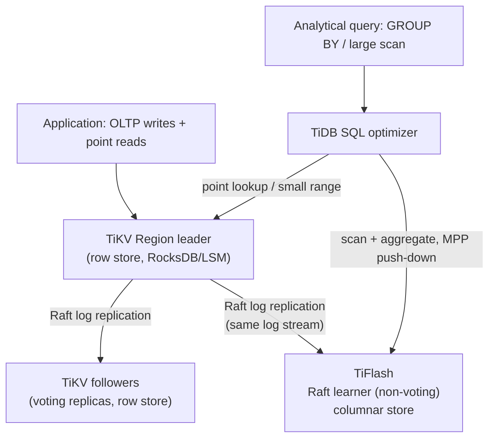

# HTAP (Hybrid Transactional/Analytical Processing)

_[Real-time OLAP](12-real-time-olap.md) closed the OLTP-to-analytics freshness gap down to seconds by keeping the OLTP system and the analytical system as two separate things, connected by a low-latency streaming pipeline - CDC or an event log feeding a purpose-built columnar engine. That topic's own forward pointer named the harder alternative: instead of *approximating* zero staleness with a fast pipeline between two systems, make **one system** (or one logically unified system) serve both workload shapes directly, with no pipeline - and therefore no pipeline lag - in between at all. This topic is that harder path: what it buys, why it's genuinely difficult to build, and the two structurally different ways real systems have actually built it._

## Contents

- [What HTAP is, and the problem it solves](#what-htap-is-and-the-problem-it-solves)
- [Why unifying the two workloads is hard: format and contention](#why-unifying-the-two-workloads-is-hard-format-and-contention)
- [Approach 1: dual storage with background conversion - TiDB's TiKV + TiFlash](#approach-1-dual-storage-with-background-conversion---tidbs-tikv--tiflash)
- [Approach 2: in-memory hybrid engines - SAP HANA and SingleStore](#approach-2-in-memory-hybrid-engines---sap-hana-and-singlestore)
- [Three architectures, side by side](#three-architectures-side-by-side)
- [HTAP vs. CDC + outbox to a separate OLAP store](#htap-vs-cdc--outbox-to-a-separate-olap-store)
- [When true HTAP earns its cost, and when it doesn't](#when-true-htap-earns-its-cost-and-when-it-doesnt)
- [Workload isolation: keeping OLTP and OLAP from stepping on each other anyway](#workload-isolation-keeping-oltp-and-olap-from-stepping-on-each-other-anyway)
- [Worked example: a live per-merchant dashboard over transactional data](#worked-example-a-live-per-merchant-dashboard-over-transactional-data)
- [Trade-offs](#trade-offs)
- [Interview weight](#interview-weight)
- [How this connects](#how-this-connects)
- [Real-world & sources](#real-world--sources)
- [Check yourself](#check-yourself)

## What HTAP is, and the problem it solves

**HTAP (Hybrid Transactional/Analytical Processing) is a class of database designed to serve both OLTP-style transactional workloads and OLAP-style analytical workloads from one system, or one logically unified system, with little or no staleness between a write committing and that write being visible to an analytical query.** The term was popularized by Gartner around 2014 (`verify` exact year/attribution) to name a category distinct from either pure OLTP databases or pure OLAP warehouses.

The problem it targets is the exact one [L2's OLTP-vs-OLAP topic named](../L2/13-oltp-vs-olap.md#getting-data-from-oltp-to-olap-etl-elt-cdc-the-warehouse) and [real-time OLAP shrank but didn't eliminate](12-real-time-olap.md#what-real-time-olap-is-and-why-its-a-third-category): every mainstream architecture keeps the system of record (an OLTP database) and the analytical serving layer (a warehouse, or a real-time OLAP engine) as **two separate systems**, connected by some pipeline - batch ETL/ELT (hours), or CDC/streaming ingestion (seconds, per [L4/08](08-cdc-and-outbox.md) and [L4/12](12-real-time-olap.md)). However fast that pipeline gets, it is still a second moving part with its own lag, its own failure modes (connector lag, poison messages, offset bookkeeping - all named generically in [CDC's failure-modes section](08-cdc-and-outbox.md#failure-modes)), and its own operational surface to run and monitor. **HTAP's proposition is to remove the pipeline entirely**: instead of shipping changes *out* of the transactional store and *into* a separate analytical one, keep both representations of the data inside the same database product - ideally the same cluster, sometimes even the same node - so an analytical query can run directly against data a transaction just committed, with no external system in between.

| | Batch OLAP warehouse | Real-time OLAP (L4/12) | HTAP |
| --- | --- | --- | --- |
| Freshness | Minutes to hours | Seconds | Sub-second to near-zero |
| Mechanism | Scheduled batch ETL/ELT | Streaming ingestion (CDC or event log) into a separate columnar engine | Both workloads served by one database product, internally maintaining transactional and analytical storage together |
| Number of systems | 2 (OLTP source + warehouse) | 2 (OLTP source + real-time OLAP store), plus a pipeline | 1 logical system (though, as covered below, still 2 physical storage engines under the hood in every real implementation) |
| Consistency of analytical read | Whatever the last batch load landed | Eventually consistent, bounded by pipeline/connector lag | Often snapshot-consistent or stronger, since both engines share one transaction manager |

## Why unifying the two workloads is hard: format and contention

Two genuinely separate obstacles stand between "wouldn't it be nice" and a working HTAP system - it's worth naming both, because conflating them makes the engineering problem look easier than it is.

**Obstacle 1: row-store and column-store are opposite physical layouts, not two settings of the same one.** [L2's storage-engines topic](../L2/10-storage-engines.md#b-tree-storage-engines-the-write-path-and-read-path-end-to-end) and [L2's OLTP-vs-OLAP topic](../L2/13-oltp-vs-olap.md#row-oriented-vs-column-oriented-storage) already established why: a **row store** keeps all columns of one row contiguous, indexed (B-tree or LSM) by primary key, built to make "fetch/update one row fast" cheap - exactly what an OLTP transaction needs. A **column store** keeps each column contiguous across many rows, heavily compressed (dictionary encoding, run-length encoding, delta encoding) and organized for [data skipping and vectorized scanning](../L2/13-oltp-vs-olap.md#inside-a-column-store-compression-data-skipping-vectorized-execution) - exactly what a `GROUP BY`/aggregate query needs, but at the direct cost of making a single-row update expensive: updating one value inside a compressed, sorted column block can mean decompressing, rewriting, and recompressing a whole block, which is why real column stores (ClickHouse's MergeTree, per [L4/12](12-real-time-olap.md#clickhouses-mergetree-lsm-style-ingestion-sparse-primary-index)) are built around **immutable, append-only parts merged in the background**, not in-place row updates. There is no single physical data structure that is simultaneously the best possible row store and the best possible column store - which is why, as covered below, every real HTAP system maintains **two physical representations** under one logical umbrella rather than inventing one universal format that serves both equally well.

**Obstacle 2: even with two storage engines, OLTP and OLAP compete for the same finite CPU, memory, and I/O if run on shared hardware.** An OLTP transaction wants low, predictable latency (single-digit milliseconds) touching a handful of rows; an OLAP query wants to consume as much CPU/memory/I/O bandwidth as it can get for a large scan, and is comparatively latency-tolerant (a dashboard refresh completing in 200ms vs. 2 seconds matters far less than a checkout transaction completing in 5ms vs. 500ms). Run both against the same buffer pool, the same disks, the same CPU cores with no isolation, and a single heavy analytical scan can evict an OLTP working set from cache, saturate I/O, and cause transaction latency spikes or timeouts - the classic **noisy-neighbor problem**, here expressed at the storage/compute layer rather than at the multi-tenant infrastructure layer it's more commonly named at. This is the second, independent reason "just run analytical queries against your production Postgres" degrades badly at scale even *before* row-store-vs-column-store format is considered at all - and it is exactly why, as covered further down, real HTAP deployments still isolate the two workloads at the compute level even when the storage is logically unified.

## Approach 1: dual storage with background conversion - TiDB's TiKV + TiFlash

**TiDB** (PingCAP) is a distributed, MySQL-wire-compatible NewSQL database whose HTAP story is built on genuinely separate storage engines kept in sync through the database's own native replication protocol, not an external pipeline.

- **TiKV** is TiDB's row-oriented transactional storage layer: an LSM-tree-based (built on RocksDB) key-value store, horizontally partitioned into key ranges ("Regions"), each Region replicated - typically 3-way (`verify` exact default) - and kept consistent across replicas using the **Raft consensus protocol**: one Region leader accepts writes, appends them to its Raft log, and replicates that log to follower replicas, which must acknowledge before a write is considered committed. This is TiDB's OLTP engine: point lookups and small-range scans by primary key or secondary index, exactly the access pattern a row store and a B-tree/LSM-style index are built for.
- **TiFlash** is TiDB's columnar storage extension, and the specific mechanism that makes this "HTAP" rather than "OLTP database with a bolted-on warehouse": a TiFlash node registers itself as a **Raft learner** on the same Regions TiKV replicates. A Raft learner receives and applies the exact same replicated log stream an ordinary Raft follower does, but does **not** participate in leader elections or count toward the write quorum - it is a non-voting, log-consuming replica. TiFlash applies that incoming log stream into a columnar, compressed, sorted storage format (conceptually similar to the MergeTree-style engine [L4/12 already covered for ClickHouse](12-real-time-olap.md#clickhouses-mergetree-lsm-style-ingestion-sparse-primary-index)) instead of TiKV's row format.
- **Sync mechanism, precisely:** because TiFlash consumes the *same Raft log* TiKV's own followers consume - not a change stream bolted on after the fact - replication to TiFlash inherits Raft's own ordering and durability guarantees, typically landing changes within a low-single-digit-second window (`verify` exact steady-state lag figures) rather than depending on a separately-operated CDC connector's own offset tracking and failure modes. For queries that need a stronger guarantee than "eventually caught up," TiDB can require a TiFlash replica to prove it has applied the Raft log up to a specific index/timestamp before answering (a "replica read" style mechanism, `verify` exact terminology and consistency semantics) - trading a small wait for a snapshot-consistent analytical read against the same timestamp an OLTP transaction would see.
- **Query routing:** TiDB's SQL optimizer decides, per query (and can even split a single query), whether to route to TiKV (point lookups, small-range scans - the row engine) or push a scan-and-aggregate down to TiFlash's MPP-style execution (large scans, the columnar engine) - transparently to the application, which only ever sees one logical table and one SQL interface.

The key architectural point: **this is not one storage engine serving both workloads - it is two storage engines, kept in sync at the database's own replication-protocol layer instead of via an external CDC pipeline.** The important leap relative to "Postgres + Debezium + ClickHouse" isn't that TiDB has invented a magical unified format; it's that the sync mechanism is a first-class part of the database's own consensus protocol (Raft), inheriting that protocol's ordering and durability guarantees directly, rather than being a separately-operated pipeline with its own connector-lag and poison-message failure modes layered on top after the fact.

## Approach 2: in-memory hybrid engines - SAP HANA and SingleStore

A second, structurally different family gets to the same goal by maintaining both representations **in memory**, inside a single database engine, rather than as physically separate replica types across a cluster.

**SAP HANA** maintains column-store tables using a **delta-main** split: new writes land in a small, write-optimized **delta store** - row-oriented or lightly-indexed, fast to insert and update - and a background **merge** process periodically folds the delta store into the compressed, read-optimized **main store**, the actual columnar structure queries scan against. This is, structurally, the same **memtable/SSTable-style two-tier trade** already generalized in [L2's storage-engines topic](../L2/10-storage-engines.md#lsm-tree-storage-engines-the-write-path-and-read-path-end-to-end) and reused again for [real-time OLAP's real-time/historical segment split](12-real-time-olap.md#segment-based-storage-the-hotcold-real-timehistorical-split) - here applied one level further down, inside a single in-memory storage engine rather than across cluster-level tiers or replica types. HANA keeps both the delta and main representations consistent using MVCC (`verify` exact isolation semantics per HANA version), so a query sees one coherent snapshot spanning both stores transparently.

**SingleStore** (formerly MemSQL) has historically taken an explicit "pick per table" approach - Rowstore (in-memory, skiplist-indexed, for hot OLTP tables) versus Columnstore (compressed, disk-based, for large analytical fact tables) declared per table at creation time. As of late 2024, SingleStore's own documentation describes this splitting as evolving toward one blended format called **Universal Storage**: rather than a strict either/or choice, Universal Storage extends the columnstore with hash indexes, row-level locking, subsegment access, and upserts specifically so a disk-based columnar table can also absorb transactional-style point writes and updates efficiently - `verify` exact current default and how much of a genuinely new production workload this handles versus still being Columnstore-with-transactional-extensions under the hood (see sources below). Either way - old two-table-types model or the newer Universal Storage extensions - both storage forms sit inside one distributed SQL engine and one MVCC-based transaction manager, so a query joining a small hot table against a large fact table sees one consistent snapshot across the two physically different representations, exactly the way [MVCC](../L2/04-acid.md) already provides snapshot consistency within a single engine, generalized here across two.

## Three architectures, side by side

The three systems above are all called "HTAP," but they unify transactional and analytical serving in **three distinguishable ways** - worth naming precisely rather than treating "HTAP" as one architecture:

| | TiDB (TiKV + TiFlash) | SingleStore (Rowstore + Columnstore/Universal Storage) | SAP HANA (delta + main) |
| --- | --- | --- | --- |
| What the two engines hold | Two full replicas of the **same table** - one row-formatted, one columnar | **Different tables** - the schema designer picks row or column per table (though Universal Storage is narrowing this choice, `verify` current extent) | **One table**, internally split into a write-optimized delta buffer and a read-optimized main columnar store |
| Sync mechanism | Raft log replication (TiFlash is a non-voting learner) | Shared distributed transaction manager - no separate "sync," both engines are written directly | Background delta-merge process inside one engine |
| Consistency mechanism | Raft log ordering + optional replica-read wait for a target log index | MVCC across both engines in one transaction manager | MVCC across the delta/main split within one engine |
| Granularity of the choice | Whole table gets both representations automatically | Per-table: pick the engine that fits that table's workload | Per-table (or universal, depending on deployment), invisible to the query |

## HTAP vs. CDC + outbox to a separate OLAP store

The mainstream, far more commonly deployed pattern remains the one [L4/08](08-cdc-and-outbox.md) and [L4/12](12-real-time-olap.md) already built in full: an OLTP system of record, a CDC connector (Debezium, tailing the WAL/binlog) or an event store's own append log, streaming into a separately-operated real-time OLAP engine (Pinot, Druid, ClickHouse) or lakehouse. It's worth contrasting this directly against true HTAP rather than treating one as simply a worse version of the other - they are genuinely different engineering trade-offs:

| | CDC/event log + separate real-time OLAP (L4/08, L4/12) | True HTAP (TiDB, SingleStore, HANA) |
| --- | --- | --- |
| Staleness | Seconds - bounded by connector/pipeline lag | Sub-second to near-zero - bounded by internal replication (Raft log lag, or none at all for an in-memory delta-main split) |
| Number of systems to operate | Two clusters (OLTP store + OLAP store) plus a pipeline (Debezium/Kafka Connect, or Kafka itself) | One product, one cluster - though still two physical storage engines under the hood in every real implementation |
| Consistency of analytical reads | Eventually consistent, bounded by pipeline lag; [the same at-least-once/idempotent-consumer caveats CDC always carries](08-cdc-and-outbox.md#at-least-once-delivery-and-idempotent-consumers) apply | Often snapshot-consistent, sometimes strongly consistent on demand (TiDB's replica-read-to-a-log-index), because both engines share one transaction manager instead of an asynchronous message-passing pipeline |
| Independent scaling of each workload | Fully independent - the OLTP store and the OLAP store can each be sized, tuned, and operated by different teams with zero coupling beyond the pipeline | Coupled - both engines usually share the same cluster/vendor/failure domain, even when workload isolation (below) keeps their physical resources separate |
| Ecosystem maturity | Very mature and widely deployed - Debezium, Kafka, ClickHouse/Pinot/Druid all have deep production track records and large hiring pools | Narrower - TiDB, SingleStore, and HANA are production-proven at real companies but represent a materially smaller ecosystem and hiring pool than "Postgres + Kafka + ClickHouse" |
| Migration cost from an existing estate | Low - bolt a CDC connector onto an existing OLTP database, stand up a separate OLAP engine alongside it | High - typically means adopting a new database product as the system of record, not an incremental addition |

## When true HTAP earns its cost, and when it doesn't

**True HTAP tends to earn its cost when all of the following hold together:** the business genuinely needs sub-second analytical visibility into data a transaction *just* wrote (not "a few seconds is fine" - that's real-time OLAP's job, and it's materially cheaper to operate); the team cannot or does not want to run two separate clusters plus a pipeline (small platform team, limited CDC/streaming operational expertise); and the read/write mix and scale genuinely fit what a specific HTAP product is good at - TiDB's own sweet spot, for instance, is large-scale, horizontally-scalable OLTP that also needs embedded, always-fresh reporting against the exact same data (a live per-branch or per-merchant dashboard with no separate ETL step), rather than a workload that's overwhelmingly one-sided (nearly all writes, almost no analytics, or vice versa).

**CDC/event-log-fed separate OLAP remains the better default for most companies**, precisely because most organizations' OLTP and OLAP workloads already have different owners, different SLAs, and different query patterns evolving independently of each other - and because seconds-level staleness (real-time OLAP) is, in practice, "good enough" for the overwhelming majority of dashboards and user-facing analytics features: a live view counter or a billing dashboard refreshing every few seconds rarely needs millisecond-exact correctness, just visible freshness. Choosing true HTAP over the mainstream pattern is a bet that the sub-second gap specifically, and the single-system operational story, are worth a smaller ecosystem, a bigger migration, and (per below) real engineering effort to keep the two workloads from contending on shared hardware anyway. **Flipkart's own migration (below) is a live example of this bet being made in stages**: they moved a large transactional platform onto TiDB first and are treating HTAP/TiFlash adoption as a distinct, later step - a reminder that "adopt an HTAP-capable database" and "actually run HTAP workloads on it" are not the same milestone.

## Workload isolation: keeping OLTP and OLAP from stepping on each other anyway

Because Obstacle 2 above (resource contention) doesn't disappear just because storage is logically unified, **essentially every real HTAP deployment still isolates the two workloads at the compute level**, in one of a few concrete ways:

- **Physically separate replica types, reading a shared/synced dataset.** TiFlash nodes are literally separate machines from TiKV nodes - even though they're part of the same logical cluster and stay synced via Raft learner replication, the CPU/memory/I/O for a heavy analytical scan runs entirely on TiFlash's own hardware, never stealing cycles from TiKV's OLTP path. This is the single most common real-world isolation technique: pay a small replication-lag cost in exchange for near-total contention elimination between the two workloads - which somewhat tempers the "one unified system, zero infrastructure" pitch, but is exactly the trade real production deployments make on purpose.
- **Separate compute pools over shared storage.** Cloud data warehouses apply the same underlying isolation principle from a different direction: decoupling storage from compute so that multiple independent compute clusters can read the same underlying data without contending with each other for CPU/memory (`verify` exact mechanism per vendor for the real-world pass) - the general pattern this section is naming, reused here for a related but distinct purpose.
- **Resource governors on a single shared instance.** Where no dedicated HTAP engine is in play at all, some relational databases let an operator cap CPU/memory/I/O per workload group directly (e.g., tagging analytical/reporting connections and capping their resource share) - a coarser, single-node alternative to physically separate compute (`verify` exact feature name/limits per engine for the real-world pass).

The throughline across all three: whether via a dedicated non-voting replica type, a separate compute pool over shared storage, or a per-query resource cap, **almost every real mixed-workload deployment ends up doing some explicit form of workload isolation** - because running a latency-sensitive point-lookup workload and a throughput-hungry scan workload on fully shared, unisolated physical resources reliably reproduces the noisy-neighbor problem this topic opened with, unified storage format or not.

## Worked example: a live per-merchant dashboard over transactional data

A payments platform processes card-present transactions at roughly **2,000 writes/sec** across thousands of merchants, and wants every merchant to see a live "today's sales, by hour, by store location" dashboard that reflects a transaction within a second or two of it clearing - with no separate analytics pipeline to operate.

1. **Without HTAP (the mainstream pattern):** transactions land in Postgres; a Debezium connector tails Postgres's logical replication slot; a Kafka topic streams row-level changes into a real-time OLAP engine (Pinot/ClickHouse) that serves the dashboard query. This works, and gets the dashboard to single-digit-second freshness - but it's three systems (Postgres, Kafka/Debezium, the OLAP engine) with three sets of operational concerns: connector lag to monitor, idempotent consumption to guarantee, a second cluster to capacity-plan and keep available.
2. **With TiDB-style HTAP:** the same transaction write commits to a TiKV Region leader, replicates via Raft to both TiKV followers (for OLTP durability/failover) and a TiFlash learner (for the columnar copy) in the same replication round. The dashboard's `SELECT store_id, hour, SUM(amount) FROM transactions WHERE txn_date = today() GROUP BY store_id, hour` query gets pushed down to TiFlash's columnar MPP execution, scanning today's transactions in columnar form while TiKV keeps serving the payment-processing path's own point writes/reads completely undisturbed, on separate hardware. Freshness is bounded by Raft replication lag to the TiFlash learner - typically a low-single-digit-second window - with no separate connector, no separate cluster to run, and one SQL surface for both the transactional writes and the analytical reads.
3. **The trade actually made:** the platform gave up an enormously battle-tested, well-understood stack (Postgres + Debezium + a purpose-built OLAP engine, each independently swappable) for a single vendor/product's dual-engine internals, a smaller talent pool familiar with operating it, and a genuine migration cost if the payments system wasn't already on TiDB - in exchange for one fewer moving part to operate and a materially tighter freshness bound than any CDC pipeline can promise.

## Trade-offs

✅ **What true HTAP buys:** eliminates, or shrinks to sub-second, the OLTP-to-analytics freshness gap without operating a second external pipeline; one logical schema and one transaction manager, so analytical queries can see transactionally-consistent (sometimes strongly consistent, on demand) data instead of a pipeline-lag-bound eventually-consistent copy; fewer distinct operational surfaces than "OLTP DB + CDC connector + separate OLAP cluster," provided the dual-engine machinery inside the HTAP product is counted as one thing to operate.

❌ **What it costs:** every real implementation surveyed here still maintains **two physical storage representations** under the hood - "unification" happens at the logical/query layer, not via one magical structure that's simultaneously an ideal row store and an ideal column store; genuine resource-contention risk if workload isolation (separate replica types or compute pools) isn't deliberately configured; a materially smaller ecosystem, vendor pool, and hiring pool than the "Postgres + Debezium + ClickHouse" default; a bigger, riskier migration for an existing OLTP-only or OLAP-only estate than incrementally bolting a CDC pipeline onto what already exists; and because most organizations' OLTP and OLAP workloads are already owned by different teams with different scaling needs and different SLAs, the case for keeping them as two independently-scalable systems - even connected by only an eventually-consistent pipeline - often wins on organizational grounds as much as technical ones.

## Interview weight

🟨 Emerging. HTAP rarely anchors an entire system-design prompt on its own; it shows up as a strong follow-up answer to "how would you avoid the ETL/CDC lag your design just introduced" or "what if the freshness requirement were sub-second, not a few seconds" - questions that follow naturally after a candidate has already reached for a CDC-to-separate-OLAP design (per [L4/12](12-real-time-olap.md)). A strong answer names HTAP as the harder alternative to that pipeline, explains *why* unifying the two workloads is genuinely difficult (format mismatch, resource contention - not just "engineering effort"), and can describe at least one concrete real mechanism (TiFlash as a Raft learner, or a rowstore/columnstore split under one transaction manager) rather than treating "HTAP" as an unexplained buzzword - and, just as important, can explain when the mainstream CDC/pipeline pattern is still the better default, since that judgment call is usually the actual thing being tested.

## How this connects

- **Back to L2/13 (OLTP vs OLAP)** - this topic is a direct attempt to erase the row-store/column-store, workload-shape-drives-physical-design distinction that topic established as foundational; the row-vs-column format tension named there as *why the distinction exists* is exactly Obstacle 1 here.
- **Back to L2/10 (storage engines) and L2/04 (ACID/MVCC)** - the delta-main and rowstore/columnstore splits are the same memtable/SSTable-style two-tier trade [L2's storage-engines topic](../L2/10-storage-engines.md#lsm-tree-storage-engines-the-write-path-and-read-path-end-to-end) already generalized, reused again here one level down inside a single in-memory engine; MVCC, covered there for a single engine, gets reused across two physically different engines to give a consistent cross-engine snapshot.
- **Back to L4/08 (CDC and outbox)** - the mainstream alternative this topic contrasts against throughout; TiFlash's Raft-learner sync can be read as "CDC performed at the database's own native consensus-protocol layer" rather than via an external pipeline, inheriting Raft's ordering/durability guarantees instead of a connector's own offset-tracking machinery.
- **Back to L4/12 (real-time OLAP)** - the more common, cheaper way to approximate HTAP's freshness goal without unifying storage engines; that topic's own forward pointer named this topic directly as the harder path.
- **Forward to L5 (consistency, consensus, and coordination)** - Raft, invoked here only as far as "TiFlash learners consume the same replicated log TiKV followers do, without voting," gets its full formal treatment (leader election, log replication, quorums, learners as a distinct replica role) in that level; a precise understanding of what a non-voting learner actually guarantees depends on that fuller treatment.
- **Forward to L12 (scalability and performance patterns)** - the workload-isolation techniques here (separate compute pools reading shared storage, resource governors) are specific instances of that level's general resource-isolation/noisy-neighbor patterns, applied to the OLTP-vs-OLAP contention case specifically.
- **Forward to L4/14 (database branching / serverless DBs)** - both this topic and the next share a broader trend of the database absorbing more of what used to be separate external infrastructure (a pipeline and a second cluster here; a provisioning/ops layer there), without one directly depending on the other.

## Real-world & sources

**1. TiDB's TiFlash mechanism, confirmed against current official docs.** PingCAP's own TiDB Cloud documentation confirms, in its own words, the Raft-learner mechanism this topic describes: "The replica in TiFlash is asynchronously replicated as a special role, Raft Learner," and TiFlash "conducts real-time replication of data in the TiKV nodes at a low cost that does not block writes in TiKV." On consistency, the same docs state TiFlash "provides the same Snapshot Isolation level of consistency as TiKV" by having each read request validate that the local replication progress has caught up to the read's timestamp before answering - i.e., the "replica read to a target log index" mechanism named above is real and documented, not a `verify`-flagged guess. Source: [TiFlash Overview, TiDB Cloud docs](https://docs.pingcap.com/tidbcloud/tiflash-overview/) (accessed 2026-07-23; docs page has no visible last-updated date but is PingCAP's current, continuously-maintained product documentation).

**2. E-commerce, in production: Flipkart's migration off sharded MySQL, with HTAP named as the next step.** Flipkart's Coin Manager platform ran on over 700 sharded MySQL clusters (five-way consistent hashing, each shard with a master, hot standby, and multiple read replicas across regions) and hit scalability, reliability, and operational-complexity limits during high-traffic shopping events. Flipkart migrated to two self-managed TiDB clusters running in Kubernetes. The case study is explicit that, as of publication, Flipkart has used TiDB primarily for transactional workloads so far, and names HTAP/TiFlash adoption for real-time analytics as a *planned next step*, not something already running in production - a useful, honest data point on adoption sequencing (migrate the OLTP workload first, add the analytical engine later) rather than "flip an HTAP switch on day one." Source: [Flipkart: Transforming Database Management and Reducing Complexity with TiDB, PingCAP case study](https://www.pingcap.com/case-study/flipkart-transforming-database-management-and-reducing-complexity-with-tidb/) (accessed 2026-07-23; page content indicates publication around October 2024).

**3. Real-time analytics/CX platform, Japan: PLAID Inc. benchmarking TiFlash against BigQuery.** PLAID Inc. (株式会社プレイド), which runs the KARTE real-time customer-experience/behavioral-analytics platform (19.9 billion cumulative users tracked, peak throughput of 134,000 events/sec, per the case study), benchmarked TiFlash against BigQuery for its analytics workload and, per their own presentation at TiDB User Day 2023 (July 2023), found TiDB/TiFlash delivered "performance comparable to OLAP-specialized databases" with strong horizontal scalability as data volume grew, while noting it required further tuning versus a fully managed warehouse. This is a genuine "how do we evaluate TiFlash for real-time analytical serving" engineering exercise rather than a marketing case study. Source: [PingCAP Japan case study on PLAID Inc.](https://pingcap.co.jp/case-study/plaid/) (accessed 2026-07-23; published November 27, 2023 - within this repo's 4-year freshness window). Note: this is PLAID Inc., a Japanese customer-experience/analytics company, not the US fintech data-connectivity company of a similar name - flagged here explicitly to avoid the two being confused.

**4. SingleStore's architecture has moved on from a strict Rowstore-vs-Columnstore choice.** Current SingleStore documentation (last modified October 18, 2024) describes **Universal Storage** as "a continuing evolution of the columnstore, supporting transactional workloads that would have traditionally used the rowstore" - adding hash indexes (optionally unique), subsegment access, row-level locking, and upserts directly to the disk-based columnstore so it can absorb transactional-style point writes without requiring the separate in-memory Rowstore for every hot table. This is a genuine, verifiable evolution worth naming: the "pick Rowstore or Columnstore per table" model this topic describes above is SingleStore's older story, and the concept file's description above should be read as the historical MemSQL-era baseline that Universal Storage is narrowing, not necessarily the current default recommendation for every workload (`verify` exact current guidance on when Rowstore is still preferred). Source: [Universal Storage, SingleStore Cloud docs](https://docs.singlestore.com/cloud/create-a-database/columnstore/universal-storage/) (accessed 2026-07-23; last modified October 18, 2024).

**Gaps flagged openly, per this repo's sourcing standard:**
- **No verified fintech example of *true HTAP in production* (TiFlash/Universal-Storage-style unified engine actually serving live transactional + analytical queries together) was found within the 4-year freshness window.** SB Payment Service (a SoftBank Group payments company) has a verified, dated (cutover completed October 2023) PingCAP case study - [SB Payment Service Adopts Distributed SQL for Zero-Downtime Scaling](https://www.pingcap.com/case-study/sb-payment-service-adopts-distributed-sql-for-zero-downtime-scaling/) - but it documents a straightforward OLTP migration off MySQL to TiDB for scaling and availability, with no mention of TiFlash or HTAP specifically, so it is not cited above as an HTAP example. A WeBank (Chinese digital bank) HTAP write-up exists but could not be independently re-verified with a fetchable, dated source distinct from marketing summaries during this pass, so it is omitted rather than included on secondhand confidence. A PingCAP blog post describing Xiaohongshu's (RED) TiFlash-based anti-fraud/analytics use case is a strong, concrete fit for "fintech-adjacent, real-time fraud analytics on transactional data" but is dated October 2020 - outside this repo's 4-year cutoff - and was excluded on that basis; a reader wanting deeper HTAP-in-fintech detail may still find it useful to read with that caveat: [How We Use a Scale-Out HTAP Database for Real-Time Analytics and Complex Queries](https://github.com/pingcap/blog/blob/master/how-we-use-a-scale-out-htap-database-for-real-time-analytics-and-complex-queries.md).
- **No SAP HANA customer production case study specific to the delta-main mechanism** (as opposed to general S/4HANA migration case studies) was found and verified within scope/budget for this pass; HANA's delta-main mechanics above should be treated as architecture-verified via SAP's own product documentation conventions but not accompanied by a named, dated customer story here.
- **No UPI/NPCI angle was found for HTAP specifically** - UPI's architecture (per other topics in this repo) is well-documented as a real-time payments switch, not as a database vendor's HTAP product, so forcing an HTAP connection here would be a weak fit; omitted deliberately rather than stretched in.

## Check yourself

- Explain, precisely, why "row store vs. column store" is a real obstacle to HTAP even before any resource-contention concern is considered - what specifically makes one physical layout bad at the other layout's job?
- A TiFlash node is described as a "Raft learner." What does that term mean precisely - what does a learner receive, and what does it *not* get to do, compared with an ordinary Raft follower?
- Contrast TiDB's TiKV+TiFlash split against SingleStore's Rowstore+Columnstore split: in TiDB, are the two engines holding the same table or different tables? What about SingleStore? Why does this distinction matter for how a schema designer would use each product?
- A team already runs Postgres and is considering adding Debezium + ClickHouse versus migrating to TiDB for a live analytics requirement. Name two concrete factors that would favor staying with the CDC pipeline, and two that would favor migrating to true HTAP.
- Why does even a "logically unified" HTAP system still need explicit workload isolation (separate replica types, separate compute pools, or resource governors)? What failure mode does skipping this step reproduce?
- In one or two sentences, explain why real-time OLAP (L4/12) is described as "approximating" HTAP rather than being HTAP itself - what specifically is still present in the real-time OLAP pattern that true HTAP removes?
- Flipkart's own case study describes adopting TiDB for OLTP first and treating HTAP/TiFlash as a later step. Why might a company sequence a migration this way rather than adopting the full HTAP stack on day one?
