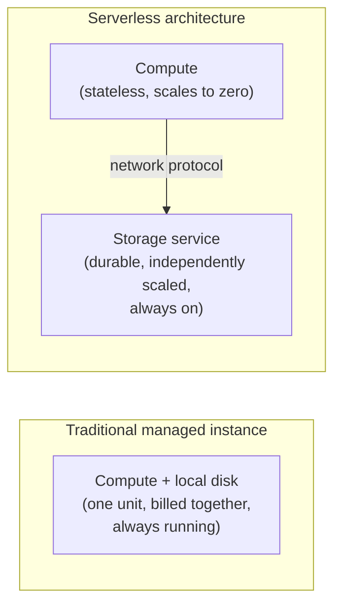
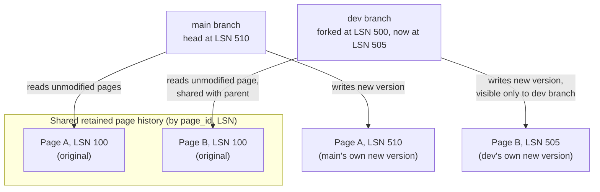

# Database Branching / Serverless Databases

_[HTAP](13-htap.md) closed by naming a thread this topic continues: the database absorbing infrastructure that used to live outside it - there, a CDC pipeline and a whole second analytical cluster; here, an entire provisioning/ops layer. This topic asks a question none of L4's other topics have asked: not "how is data replicated or partitioned across many nodes," but "what would a storage engine have to look like so that cloning an entire database becomes as cheap as creating a git branch, and turning a database instance off stops meaning `lose it, or keep paying for it`?" The answer to both halves turns out to be the same storage-engine trick this level already has the vocabulary for - copy-on-write, multi-version storage - applied one level up, to whole databases instead of individual rows or pages._

## Contents

- [What a serverless database is, architecturally](#what-a-serverless-database-is-architecturally)
- [Separating compute from storage](#separating-compute-from-storage)
- [Storage as a copy-on-write, multi-version page store](#storage-as-a-copy-on-write-multi-version-page-store)
- [Scale-to-zero compute and cold starts](#scale-to-zero-compute-and-cold-starts)
- [Autoscaling connection pooling in front of the database](#autoscaling-connection-pooling-in-front-of-the-database)
- [What database branching is](#what-database-branching-is)
- [The mechanism that makes a branch cheap: copy-on-write forking](#the-mechanism-that-makes-a-branch-cheap-copy-on-write-forking)
- [Worked example: forking a branch at an LSN](#worked-example-forking-a-branch-at-an-lsn)
- [Contrast: traditional database cloning](#contrast-traditional-database-cloning)
- [Trade-offs](#trade-offs)
- [Where this fits in real systems](#where-this-fits-in-real-systems)
- [Interview weight](#interview-weight)
- [How this connects](#how-this-connects)
- [Check yourself](#check-yourself)
- [Real-world & sources](#real-world--sources)

## What a serverless database is, architecturally

**"Serverless database" is a marketing label over a specific architectural choice: separating compute (the process that executes queries and enforces transactional semantics) from storage (the durable, persistent record of the data), so each can be provisioned, scaled, and billed independently - down to zero, for compute, when nothing is running.** It has nothing to do with "no servers exist"; it describes who provisions and pays for them, and on what timescale. A traditional managed database (a single RDS instance, a self-hosted PostgreSQL box) bundles compute and storage into one unit that is provisioned together, sized together, and billed together for as long as it exists, whether or not it is actually being queried right now. A serverless database unbundles that unit into (at least) two independently-scaling services connected over a network, which is the single architectural decision every other property in this topic - branching, scale-to-zero, autoscaling pooling - falls out of.

Neon (PostgreSQL-compatible) and PlanetScale (MySQL-compatible, built on the Vitess sharding middleware `verify` current storage-engine specifics) are the two most commonly cited examples of this architecture applied to otherwise-familiar relational engines, and both are used throughout this topic to make the mechanism concrete - not as a verified case study (a later pass adds that), just as the named systems the pattern is best known through.

## Separating compute from storage

**Compute** is a stateless (or near-stateless) process that speaks the database's wire protocol, plans and executes queries, and enforces transactions and isolation - exactly the query-execution machinery [L2](../L2/11-query-planning-optimization.md) and this level have already covered in full - but holds no unique durable copy of the data locally. **Storage** is a separate, independently-scaled service whose only job is to durably persist every change and answer "give me page P as of some point in time" requests from whichever compute node asks.

This single decoupling is what makes every other property in this topic possible: compute can be destroyed and recreated freely because it was never the only copy of anything; storage can be shared by more than one compute process reading (or forking) the same underlying data; and the two can scale on completely different axes - storage scales with data volume, compute scales with query load, and they no longer have to move together the way they do in one bundled instance.

## Storage as a copy-on-write, multi-version page store

A traditional B-tree engine (InnoDB, standard PostgreSQL) keeps exactly **one current physical copy of each page**, mutated in place on every write, with the [WAL](../L2/09-write-ahead-log.md) existing purely as a *recovery* mechanism - a log of changes that gets replayed forward after a crash and is otherwise disposable once a checkpoint confirms its contents are durably reflected in the pages themselves. This is precisely the property that makes cloning a traditional database expensive: the current state lives *only* in the current pages, so getting a second copy of it means copying those pages, in full, one way or another.

**A serverless storage tier inverts this by keeping the log itself as the durable source of truth, and treating a page's current content as a value derived from replaying that log** - the exact same "the log is truth, current state is a derived projection" idea [event sourcing](09-event-sourcing.md) already established at the *application/domain* layer, reapplied here at the *physical storage* layer, transparently, underneath an otherwise ordinary relational engine. Concretely (this is the mechanism Neon's Pageserver + Safekeeper split implements, `verify` exact component names/boundaries): every write still produces a normal WAL record, tagged with an LSN exactly as [L2's WAL topic](../L2/09-write-ahead-log.md#log-records-and-log-sequence-numbers-lsns) defined it; that WAL stream is durably persisted by the storage tier (not just the compute node's local disk); and rather than discarding old page versions once a checkpoint confirms the current one is safe, the storage tier deliberately **retains every version of every page it has ever produced**, keyed by `(page_id, LSN)`, and answers "give me page P as of LSN X" by finding the closest prior version and replaying only the deltas since. This generalizes [MVCC's row-versioning idea](../L2/06-mvcc.md#the-core-idea-versions-not-overwrites) - keep old versions around instead of overwriting, let a reader ask for the version as of its own snapshot - from individual rows up to entire physical pages, and deliberately keeps far more history around than MVCC's own garbage collector (`VACUUM`) would ever let survive, because that retained history is precisely what a branch needs to fork from later.

**Why this needed a genuinely new storage layer rather than just running vanilla PostgreSQL harder.** [L2's storage-engines comparison](../L2/10-storage-engines.md#b-tree-storage-engines-the-write-path-and-read-path-end-to-end) established that a B-tree engine's on-disk pages are mutated **in place** - updating a page destroys the old version's bytes, keeping only the WAL's *logical description* of the change, not the old page image itself, once a checkpoint has run. An LSM-tree engine's SSTables, by contrast, are already immutable and append-only once written - a much more natural starting point for "keep every version around and let a reader ask for one as of a point in time," which is part of why several NoSQL and NewSQL systems (Cassandra, CockroachDB, TiDB's TiKV per [L4/13](13-htap.md#approach-1-dual-storage-with-background-conversion---tidbs-tikv--tiflash)) get multi-version, log-structured behavior closer to natively. Making this work for PostgreSQL and MySQL - both B-tree engines at their core - specifically required building a *separate* storage service underneath the standard engine that intercepts the WAL stream and reconstructs pages on demand, rather than letting the standard engine's own buffer pool and page files be the only copy of current state, exactly the retrofit Neon's Pageserver/Safekeeper split and PlanetScale's Vitess-based storage layer each represent in their own way.

## Scale-to-zero compute and cold starts

Because compute holds no unique durable state - all of it lives in the separately-scaled storage tier - a compute process can be torn down entirely when idle with no risk of losing anything, and recreated on the next incoming query. This is **scale-to-zero**: an idle branch or database costs nothing for compute (only storage, which is typically tiny for an idle branch), in direct contrast to a traditional bundled instance, which is either running (and billed) or explicitly stopped/deleted (and then has to be re-provisioned, a much slower and heavier operation than "wake up an existing serverless compute node").

The cost of this is a **cold start**: the first query after idling has to wait for a new compute process to start, establish a session with the storage tier over the network, and warm whatever in-memory buffer-pool cache it wants before it can serve a query at the latency a warm instance would. Vendors report sub-second to low-single-digit-second cold starts for typical small/medium databases (`verify` exact current figures per vendor), which is fast relative to provisioning a whole new traditional instance (minutes) but is not zero, and directly reappears in the trade-offs below as the reason this architecture is a poor fit for an always-on, latency-sensitive OLTP path.

## Autoscaling connection pooling in front of the database

PostgreSQL and MySQL both use one OS process (or thread) per connection, with real memory and scheduling overhead per connection and a practical ceiling in the hundreds to low thousands - exactly the constraint [L2's connection-pooling topic](../L2/12-connection-pooling.md) already covered for a single long-lived application server holding a small, fixed-size pool open to amortize connection setup. Serverless *application* compute (AWS Lambda, similar FaaS platforms) breaks the assumption that pooling was originally built around: instead of one long-lived server holding one steady pool, a burst of traffic can spin up dozens or hundreds of short-lived function invocations simultaneously, each wanting its own database connection, which can exhaust a database's connection ceiling in seconds even at fairly modest total query volume.

Serverless database platforms solve this the same way a single application server already did - a pooler multiplexing many logical client connections onto a much smaller number of real backend connections - just relocated to sit in front of the database itself, as a shared platform service, and scaled elastically with demand rather than sized once at deployment time. Neon, concretely, fronts each project with a PgBouncer-based pooler running in transaction-pooling mode (`verify` exact current default/mode), so a burst of Lambda invocations connects to the pooler, not directly to Postgres, and the pooler holds the small set of real backend connections Postgres can actually sustain. This is not a new idea - it is [L2's connection-pooling mechanism](../L2/12-connection-pooling.md) reused at a platform level, specifically because the compute side of a serverless architecture reintroduces the exact bursty-many-short-lived-callers pattern pooling was invented to absorb, at a scale one static, hand-sized pool can no longer handle alone.

## What database branching is

**Database branching is creating an instant, cheap, full copy of a database - schema and data both - for an isolated use (a dev environment, a PR preview, a migration test), directly analogous to a git branch: a lightweight fork off a known point that can be written to, tested against, and discarded without ever touching the thing it was forked from.** A branch is a complete, independently-writable database from the querying application's point of view - it has its own connection string, its own schema, its own rows - not a read replica (which only ever mirrors its source and can never diverge with its own writes) and not a logical/materialized view (which is always a live, current derivative of its source, never an independently-writable fork frozen at a point in time).

The property that makes this a genuinely new capability, not just "cloning, but marketed differently," is speed and cost: a branch of a multi-gigabyte (or larger) production database is typically created in low seconds, at negligible additional storage cost at the moment of creation - because, as the next section makes precise, creating one copies nothing.

## The mechanism that makes a branch cheap: copy-on-write forking

**A branch is created by recording a new named pointer at a specific point in the shared, retained page history described above - not by copying a single byte of data.** Concretely: creating a branch means picking a source LSN (almost always "the parent's current LSN, right now"), and telling the storage tier "a new branch exists, and its history is: everything the parent had up to this LSN, plus whatever new writes land on the branch itself from this point forward." Because the storage tier already retains every page version keyed by `(page_id, LSN)`, this is a metadata-only operation - create a record, no page data moves - which is exactly why it is fast regardless of how large the parent database actually is.

From that point, reads and writes on the branch behave exactly like **copy-on-write forking** in any other system that uses the same trick (a filesystem snapshot in ZFS/Btrfs, or an OS process's memory pages after `fork()`): a read for a page the branch has never modified is served by walking up to the parent's history and reconstructing that page from the shared, unmodified version - the branch and its parent are, for that page, reading the *identical* underlying bytes, and no divergence has happened yet. A write on the branch produces a *new* version of that page, tagged with an LSN in the branch's own forward history, visible only to the branch; the parent's own page store is completely unaffected, and the branch's page-lookup path now prefers its own newer version over the parent's for that specific page going forward. Storage cost from that moment on is proportional only to how much the branch has actually diverged - the pages it has itself written - never to the full size of the dataset it was forked from, which is the direct storage-layer consequence of the same "pay for the diff, not the whole copy" principle log-structured, append-only designs have used throughout this level.

## Worked example: forking a branch at an LSN

A team runs a production PostgreSQL-compatible serverless database, currently at **LSN 500**, holding a `users` table with 40 million rows across pages `P1..Pn`.

1. **Branch creation.** A developer runs `create branch dev-feature-123 from main`. The platform records: "`dev-feature-123`'s history = `main`'s history up to LSN 500, plus its own writes from here." No page is copied. This completes in roughly a second, regardless of the 40-million-row table's actual size, and `dev-feature-123` immediately has a real, fully-populated `users` table - the exact same 40 million rows `main` has, because both branches are, right now, reading identical shared page history.
2. **Reads on the branch cost nothing extra.** A query on `dev-feature-123` against a row that hasn't changed since the fork is served by reconstructing the relevant page from the shared history at or before LSN 500 - the same physical bytes `main` itself would serve for that page, just accessed through the branch's own pointer.
3. **A migration is tested on the branch.** The developer runs `ALTER TABLE users ADD COLUMN last_login_region text`, then backfills it for a subset of rows, on `dev-feature-123` only. Each modified page gets a new version, tagged with an LSN in the branch's own forward sequence (say, LSN 501 through 504) - visible only to `dev-feature-123`. `main`, still at LSN 500 and continuing to accept its own production writes independently (advancing to LSN 505, 510, ...), never sees any of this; there is no shared mutable state between the two once either one writes.
4. **Cost, made concrete.** At creation, `dev-feature-123` added effectively zero storage. After the migration test above, it holds only the handful of modified pages (501-504) as its own private divergence - a few megabytes, not a second copy of the 40-million-row table. If the branch is deleted after the test (the common case for a PR-preview or migration-test branch), that small divergence is discarded too, and the only cost ever paid was compute time actually spent running the test query - never a second instance's worth of standing storage or a 24/7 compute bill.

## Contrast: traditional database cloning

| | Traditional cloning | Copy-on-write branching |
| --- | --- | --- |
| Mechanism | Logical dump/restore (`pg_dump` \| `pg_restore`, `mysqldump`) or a full physical/block-level copy (disk snapshot, `CREATE DATABASE ... AS COPY OF`) | Metadata pointer creation at a source LSN; pages copied only lazily, on divergence |
| Time to create | Minutes to hours, proportional to data size - a full read of every row (logical) or every block (physical) | Low seconds, independent of data size |
| Storage cost at creation | A full second copy from the moment of creation, even before a single byte diverges | Effectively zero at creation; grows only with the branch's own subsequent writes |
| Provisioning | A dump/restore needs a target instance to restore into (already provisioned) or newly stood up (minutes); a block-level snapshot still needs an equivalently-sized volume attached | No new instance sized for the full dataset is provisioned; compute is created (or reused) separately and independently of storage size |
| What it's built on | Whatever the engine's normal export/import tooling or the underlying disk/volume system already provides - no special multi-version retention required | Requires the storage tier to already retain historical page versions - a deliberate architectural choice, not a bolt-on feature of a standard B-tree engine |

The traditional path is **O(data size)** in both time and storage from the moment of creation, because it genuinely produces a second full copy of the bytes. Copy-on-write branching is **O(1)** at creation time and **O(divergence)** thereafter, because it produces no new bytes until a write forces one - which is the same complexity shift log-structured storage, LSM-tree compaction, and MVCC snapshotting have each made elsewhere in this level, applied here to "clone an entire database" instead of "append a row version" or "merge a set of files."

## Trade-offs

✅ **What this architecture buys:**

- **Branches cheap enough to give every PR, every developer, and every migration test its own full, prod-shaped database** - a capability that was previously either skipped entirely (share one staging DB, or test against a tiny synthetic seed) or paid for at full instance cost per copy.
- **Idle compute costs nothing.** Dozens or hundreds of preview/dev branches can exist simultaneously at near-zero standing cost, because compute scales to zero and storage cost is bounded by actual divergence, not dataset size.
- **Strong isolation per branch.** Because a branch's own writes land only in its own private page versions, a branch can run destructive tests (schema changes, bad migrations, load tests) with zero risk of touching its parent or any sibling branch - a genuinely separate, independently-writable database, not a shared mutable view.

❌ **What it costs:**

- **Cold-start latency on scale-to-zero.** The first query after an idle period pays a real (sub-second to low-single-digit-second, `verify` exact current figures per vendor) wake-up cost - unacceptable for an always-on, latency-sensitive OLTP path expecting consistently low, predictable p99s.
- **Isolation is strong but branches don't automatically stay in sync.** A branch is a static fork as of its source LSN unless the platform explicitly supports (and the team explicitly runs) a "reset to latest parent" operation; there is no cross-branch transaction or join - once two branches have each taken their own writes, they are two separate databases sharing only unmodified ancestor pages, not a live pair kept consistent with each other.
- **Storage overhead grows with divergence and lifetime.** A short-lived, low-write branch (a PR preview, a one-off migration test) costs almost nothing; a long-lived branch that keeps taking its own independent writes for months accumulates its own private page history and its storage cost gradually approaches that of a fully independent database - "cheap branching" describes the *creation* cost and the *typical* PR-preview/migration-test lifecycle, not an unconditional property of every branch forever.
- **Branch depth and lookup cost.** Branching a branch is generally supported, but each additional level of ancestry adds indirection to "find the closest version of this page" lookups; most platforms bound this in practice (capping depth, or periodically consolidating a long-lived lineage) rather than allowing indefinitely deep chains (`verify` exact current limits per vendor).
- **Vendor lock-in at the operational layer, not the data layer.** Both Neon and PlanetScale are wire-compatible with standard PostgreSQL/MySQL, so queries and application code stay portable - but the branching, scale-to-zero, and pooling mechanisms are proprietary storage-tier features with no standard equivalent in a self-hosted engine; migrating off means falling back to traditional dump/restore-based cloning and provisioning cost, not just "swap connection strings."
- **Not a fit for latency-sensitive, always-on OLTP at high sustained QPS.** Beyond cold starts, the storage tier is a network hop away from compute rather than a local disk, adding a baseline per-page-fetch cost a co-located traditional instance doesn't pay; the mainstream advice is a dedicated, always-provisioned instance for the core production hot path (a payments ledger, a checkout service) and reserving branchable/serverless databases for dev, test, preview, staging, and lower-QPS or spiky production workloads that genuinely benefit from scale-to-zero economics.

## Where this fits in real systems

- **Ephemeral preview environments per pull request.** A CI pipeline creates a branch when a PR opens, points a full staging deployment at it so reviewers can click through a live environment against real (or realistically-shaped) data, and deletes the branch when the PR merges or closes - previously cost-prohibitive at "one dedicated instance per open PR" pricing, now close to free while idle and cheap even under active use.
- **Schema-migration testing.** Before running a migration against production, run it first against a branch forked from production's current state - catching a slow, table-locking, or destructive migration against real data volume and real index/statistics behavior, without ever touching the live database or its traffic, then discard the branch regardless of outcome.
- **Dev/test parity without prod-sized cost.** Every developer (or every feature branch) gets a full-fidelity copy of the actual schema and a representative data volume, instead of a shared staging database that different developers' test runs clobber, or a small synthetic seed dataset that fails to reproduce production-scale query plans, index selectivity, or lock contention.

## Interview weight

🟨 Emerging. This rarely anchors a full system-design prompt, but shows up as a strong, specific answer to "how would you give every PR its own realistic test environment cheaply" or "how would you safely test a schema migration against production-shaped data" - and as a natural follow-up once a candidate has already discussed connection pooling or read replicas, testing whether they can name the actual mechanism (copy-on-write over a multi-version, log-based storage tier) rather than treating "branching" as an unexplained product feature. A strong answer can explain precisely why this requires separating compute from storage, why it needed a genuinely new storage layer under engines (like PostgreSQL/MySQL) that mutate pages in place, and can name at least one concrete reason (cold starts, high sustained QPS) this is not a substitute for a traditional always-on instance in the core production path.

## How this connects

- **Back to L2/09 (write-ahead log) and L2/06 (MVCC)** - the storage tier's "retain every page version, keyed by LSN, answer as of any point in time" is the WAL's own LSN vocabulary and MVCC's version-instead-of-overwrite idea, generalized from rows up to whole physical pages and deliberately retained far longer than a normal engine's checkpoint/vacuum cycle would allow.
- **Back to L2/10 (storage engines)** - explains directly why this needed a new storage layer specifically for B-tree engines (in-place page mutation destroys old versions) rather than being a free property vanilla PostgreSQL or MySQL already had, and why LSM-tree-native systems start closer to this property already.
- **Back to L4/02 (replication)** - reuses WAL shipping, the exact mechanism leader-follower replication already ships to build a follower, but goes further: instead of one forward-only replay target (catch a follower up to "now"), the storage tier keeps history queryable at arbitrary past LSNs and lets multiple independent forks replay forward from different points simultaneously.
- **Back to L4/08 (CDC and outbox) and L4/09 (event sourcing)** - the same "the log is the source of truth; current state is a derived, replayable projection" idea those topics established at the application/domain layer, reapplied here transparently underneath an ordinary relational engine, at the physical page layer, invisible to the application.
- **Back to L2/12 (connection pooling)** - the pooler fronting a serverless database is the identical fixed-pool-amortizing-bursty-callers mechanism, relocated from inside one application server to a shared platform service scaled elastically in front of many ephemeral compute nodes.
- **Forward to L4/15 (data contracts)** - both topics are about the database boundary absorbing responsibility that used to sit entirely with application teams (provisioning/ops here; schema compatibility enforcement there), continuing this level's closing arc toward the database doing more of what used to be separate infrastructure.
- **Forward to L7/L11/L14 (reliability, cloud architecture, infrastructure/cost)** - scale-to-zero economics, autoscaling, and the compute/storage cost-model split reappear as general cloud-architecture and cost-optimization patterns well beyond databases specifically.

## Check yourself

- Explain precisely why a B-tree engine like standard PostgreSQL cannot offer cheap copy-on-write branching without an additional storage layer underneath it - what does an in-place page update destroy that a branch would otherwise need?
- Walk through what actually happens, mechanically, when a branch is created at LSN 500 and then the branch itself writes to a row on page P: what does the parent see, what does the branch see, and how much data actually moved at each step?
- A traditional `pg_dump`/`pg_restore` clone and a copy-on-write branch both produce "a full copy of the database." Contrast their time and storage cost as functions of dataset size, and explain why the two have genuinely different complexity, not just different implementations of the same idea.
- Why does scale-to-zero make a serverless database a poor fit for a payments checkout path expecting consistent single-digit-millisecond p99 latency, even though the same architecture is a great fit for a PR-preview environment?
- A team keeps a "long-lived" dev branch running for eight months with its own continuous write traffic. Explain why its storage cost trends toward that of an independent database over that time, even though creating it cost almost nothing on day one.
- Why is the connection pooler in front of a serverless database described as "the same mechanism as L2's connection pooling, relocated" rather than a new idea - what specific problem does serverless *application* compute (e.g. Lambda) reintroduce that a single long-lived app server's pool doesn't normally face at the same scale?

## Real-world & sources

**Neon - copy-on-write branching at the storage layer (Pageserver + Safekeeper).** Neon's storage tier is deliberately non-overwriting: pages are never mutated in place, which is what makes branching close to free. Per Neon's own storage-engine deep dive, the Pageserver answers a `GetPage@LSN` request by finding "the last image of the page by the LSN, and any write-ahead-log (WAL) records on top of it, applies the WAL records if needed to reconstruct the page, and returns the materialized page to the caller" - the exact mechanism this lesson generalized from L2's WAL/MVCC vocabulary. Branch creation itself is then just a pointer: "if you access a part of the database that hasn't been modified on the branch, the storage system fetches the data from the parent branch instead," so no page data is copied at fork time. A separate, more recent (April 2024) Neon engineering post on scaling the storage engine confirms the current production topology - Pageservers (SSD-backed page cache/reconstruction) and Safekeepers (WAL replication) forming a distributed storage system with object storage (e.g. S3) as the ultimate source of truth - and describes *storage sharding* (splitting one tenant's data by hashing block numbers to a stripe across multiple physical Pageservers) as the mechanism that let Neon scale a single branchable database "up to 10x" its prior capacity, addressing the practical scaling limit of a design where one Pageserver originally owned a tenant's full page history.
Sources: [Deep dive into Neon storage engine](https://neon.com/blog/get-page-at-lsn) (Neon Blog, accessed 2026-07-24; publish date on page: Mar 30, 2023); [How we scale an open source, multi-tenant storage engine for Postgres written in Rust](https://neon.com/blog/how-we-scale-an-open-source-multi-tenant-storage-engine-for-postgres-written-rust) (Neon Blog, Apr 15, 2024, accessed 2026-07-24).

**PlanetScale - branching as schema-change workflow, not full copy-on-write data forking (verify: differs from Neon's model).** It's worth being precise here because the two vendors' "branching" means different things architecturally. PlanetScale's own engineering blog describes branching primarily as a *schema-collaboration* mechanism built on Vitess: a developer "branch[es] the main database, creating a copy of the schema in a dev environment, where they are free to make any changes without affecting production," and PlanetScale tracks divergence structurally rather than at the physical-page level - "nothing tracks the changes on a development branch while it's open"; only when a developer opens a deploy request does the platform diff the branch's schema against production's *current* schema (which may itself have moved since the branch was created) via a three-way merge, queue the resulting DDL, and apply it through Vitess/`gh-ost`-based **non-blocking schema migrations** with no table locking. This is a genuinely different mechanism from Neon's LSN-keyed, copy-on-write page store: PlanetScale's branching is centered on safely merging concurrent *schema* changes across a team (git-like conflict detection for DDL), not on giving every branch its own full, independently-diverging copy of the underlying *data* via storage-layer forking. `verify`: whether PlanetScale's current (2025-2026) product has since added a full data-branching mode beyond this schema-branching model - this summary reflects the mechanism described in PlanetScale's own 2023 posts and should be checked against current docs before treating it as identical to Neon's data-branching semantics.
Sources: [Database branching: three-way merge for schema changes](https://planetscale.com/blog/database-branching-three-way-merge-schema-changes) (PlanetScale Blog, Apr 26, 2023, accessed 2026-07-24); [Non-Blocking Schema Changes](https://planetscale.com/blog/non-blocking-schema-changes) (PlanetScale Blog, accessed 2026-07-24).

**Ephemeral, per-PR database branches as a CI/CD pattern (Neon + GitHub Actions + Vercel).** Beyond the storage mechanism itself, Neon's own workflow write-up documents the concrete developer-facing pattern this lesson's "where this fits" section describes: a GitHub Actions workflow creates a Neon branch when a PR opens, applies migrations to it, and deploys a Vercel preview pointed at that branch's connection string; a second workflow runs migrations against the primary branch and deletes the preview branch on merge; a cleanup workflow removes it on PR close. The stated rationale is direct: "Rather than having a shared and fixed staging environment where all developers collaborate, you automatically provision a production-like environment for every new code change" - replacing the shared-staging-database failure mode (test runs clobbering each other) this lesson's trade-offs and "where this fits" sections describe in the abstract. The same post states branches are "Fast to create: creating a branch takes ~1 second, regardless of the size of your database" and "Cost-effective: you're only billed for unique data across all branches," matching this lesson's O(1)-creation / O(divergence)-storage claim with a vendor-published, concrete workflow rather than just the underlying mechanism.
Sources: [A database for every preview environment using Neon, GitHub Actions, and Vercel](https://neon.com/blog/branching-with-preview-environments) (Neon Blog, Apr 14, 2023, accessed 2026-07-24).

`verify`: A dedicated fintech (Stripe-first) engineering write-up specifically describing ephemeral branched-database CI/PR-preview workflows was searched for but not found as a distinct, currently-verifiable post from a fintech engineering blog; the Neon + GitHub Actions/Vercel case above is the strongest verified, dated source for that specific CI/preview-environment use case, and is included in place of a forced fintech example per the "don't force it" guidance for this sweep.
