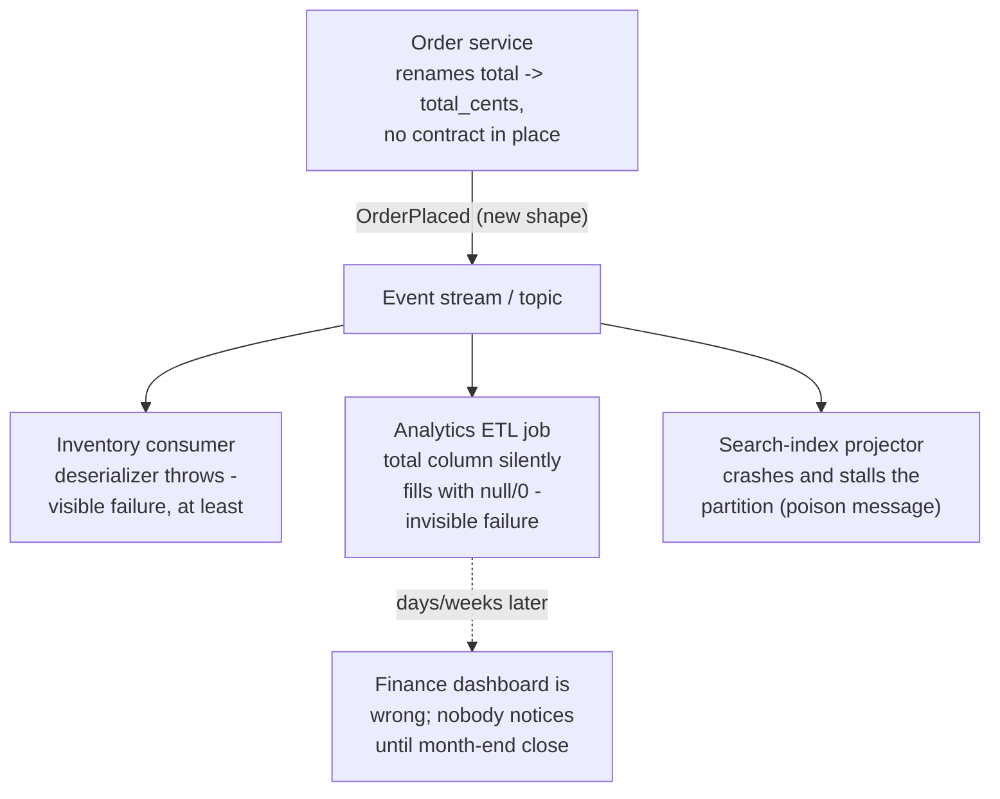
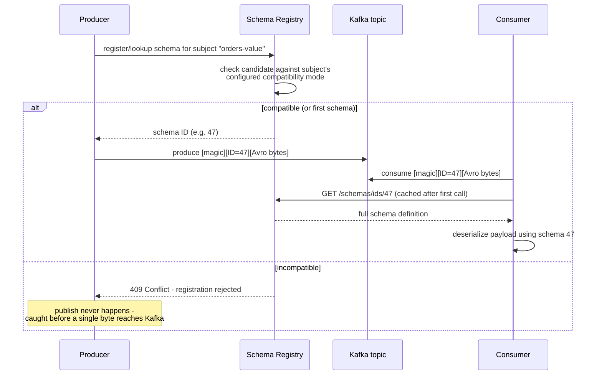
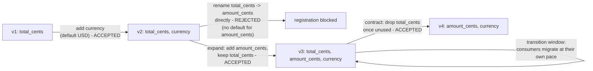

# Data Contracts (Schema-Registry-Enforced)

_[Database branching / serverless databases](14-database-branching-serverless-dbs.md) closed by naming exactly where this topic picks up: "both topics are about the database boundary absorbing responsibility that used to sit entirely with application teams - provisioning/ops [there], schema compatibility enforcement [here]." Every other topic in this level has assumed that once a producer emits an `OrderPlaced` event - out of [an outbox table](08-cdc-and-outbox.md#the-transactional-outbox-pattern), an [event store](09-event-sourcing.md#core-mechanics-the-event-store), or a plain service boundary - every consumer downstream agrees on what that event actually looks like. This topic is about what happens the instant that assumption stops holding for free, and the infrastructure - a schema registry, sitting between every producer and every consumer as a mandatory checkpoint - that production systems build specifically to keep it holding as the number of producers and consumers grows past what anyone can track by convention alone._

## Contents

- [What a data contract is](#what-a-data-contract-is)
- [The problem: schema drift and "data downtime"](#the-problem-schema-drift-and-data-downtime)
- [Schema registries: architecture and the wire format](#schema-registries-architecture-and-the-wire-format)
- [Serialization formats: Avro, Protobuf, JSON Schema](#serialization-formats-avro-protobuf-json-schema)
- [Schema evolution and compatibility modes](#schema-evolution-and-compatibility-modes)
- [Where enforcement happens: producer, broker, consumer](#where-enforcement-happens-producer-broker-consumer)
- [Contract testing for request/response APIs: consumer-driven contracts (Pact)](#contract-testing-for-requestresponse-apis-consumer-driven-contracts-pact)
- [Failure modes without contracts](#failure-modes-without-contracts)
- [Worked example: evolving OrderPlaced safely](#worked-example-evolving-orderplaced-safely)
- [Data contracts at rest: dbt contracts and lakehouse schema enforcement](#data-contracts-at-rest-dbt-contracts-and-lakehouse-schema-enforcement)
- [Trade-offs](#trade-offs)
- [Interview weight](#interview-weight)
- [How this connects](#how-this-connects)
- [Real-world & sources](#real-world--sources)
- [Check yourself](#check-yourself)

## What a data contract is

**A data contract is an explicit, versioned agreement between a data producer and its consumer(s) that fixes the structure, semantics, and evolution rules of the data the producer emits - whether that data is a stream of events/messages ("data in motion") or a table/dataset ("data at rest") - so that a consumer can build against the producer's output with the same confidence it would build against a stable function signature.** The word "contract" is doing precise work here, not marketing: like a contract between two parties in any other sense, it specifies what each side can rely on, what happens when one side wants to change something, and who is accountable when the agreement is broken.

A full data contract, as the term is used across the industry, typically bundles together several distinct kinds of guarantee that this topic is careful to keep separate, because they are enforced by entirely different mechanisms:

- **Structural guarantees** - field names, types, nullability, nesting shape. This is the part a **schema** captures precisely, and the part this topic's title ("schema-registry-enforced") is about: a machine-checkable, automatically-enforced subset of the full contract.
- **Semantic guarantees** - what a field actually *means* and what invariants hold across fields: "`amount_cents` is always a non-negative integer," "`total_cents` always equals the sum of `items[].subtotal_cents`," "`status` only ever transitions `placed -> shipped -> delivered`, never backward." A schema registry cannot check any of this - a schema only describes shape, not meaning - so semantic guarantees are enforced, if at all, by a separate layer (application-level invariants, exactly [CQRS's command-handler validation](10-cqrs.md#command-handlers-and-write-model-invariants), or a dedicated data-quality tool such as Great Expectations or dbt tests, `verify` current tooling landscape).
- **Non-functional / SLA guarantees** - freshness ("this table is updated within 5 minutes of the source event"), volume/completeness ("this topic never drops more than 0.01% of expected messages"), ownership (who to page when the contract breaks). These live in documentation, monitoring, and alerting, not in a schema at all.

This topic scopes itself to the first bullet - **structural** data contracts, enforced mechanically by a **schema registry** - because that is the part with a mature, standardized, widely-deployed enforcement mechanism; the other two are named here for precision and to prevent the common mistake of believing "we adopted a schema registry" means "we have a full data contract" in the broader sense the term is increasingly used across the industry.

## The problem: schema drift and "data downtime"

**Schema drift is what happens, by default, in any event-driven or microservices architecture with no contract in place: a producer changes the shape of the data it emits, and every downstream consumer finds out only when something breaks - or, worse, when nothing visibly breaks at all.** Concretely, a producer team ships a change to the `orders` service that renames `total` to `total_cents` (fixing a long-standing units bug), or drops a `discount_code` field nobody on the producer side remembers is used, or widens a field from an integer to a string. None of this looks dangerous from inside the producer's own codebase, its own tests, or its own deploy pipeline - the change compiles, the producer's own service works fine, and the producer team has no reason to know who, if anyone, is reading the events it publishes.

**Why this is structurally different from a normal internal refactor.** Inside one service, a compiler (or a type-checker, or a test suite) catches a breaking change to a function signature before it ships, because every caller is visible in the same codebase. Across a service boundary - and especially across an asynchronous event stream, where a producer often has no idea how many consumer groups exist, let alone what each one depends on - there is no compiler watching every consumer at once. [CDC/outbox's own worked pipeline](08-cdc-and-outbox.md#change-data-capture-cdc) named the shape of this problem directly: one topic, fanning out to "a search index, cache invalidation, an analytics warehouse, another service's own database" - and [CQRS's worked example](10-cqrs.md#worked-example-placing-an-order) put names on two of those consumers, an `OrderSummary` projector and a `FulfillmentView` projector, each independently owned, each deployed on its own schedule, each with zero visibility into the producer's own release calendar. A schema change that looks trivial from the producer's side can silently corrupt every one of those consumers at once, each in its own way, on its own timeline.

**The concrete failure shape, named "data downtime."** The data-observability industry (Monte Carlo, among others, `verify` earliest/canonical attribution) coined **data downtime** for the period during which production data is missing, duplicated, or simply wrong, and nobody yet knows it - the data-layer analogue of application downtime, except frequently far harder to detect, because a corrupted dashboard or a silently-null feature column doesn't throw a 500 the way a crashed service does. A downstream ETL job or ML feature pipeline can keep running, producing plausible-looking but wrong numbers, for days or weeks, before an analyst or a model-quality alert notices the drift - by which point every report, every decision, and every model retrained on that window is now suspect.



**Why this problem only gets worse with scale, not better.** The more successful an event-driven architecture is - the more teams that subscribe to a topic, the more downstream systems that depend on it - the larger the blast radius of any single uncoordinated schema change, and the less realistic it becomes for a producer team to manually track every consumer well enough to ask permission before changing anything. This is precisely the pressure that makes "check compatibility automatically, at write time, against every consumer that has ever registered an interest" a mechanism worth building infrastructure for, rather than a policy worth merely writing down in a wiki page.

## Schema registries: architecture and the wire format

**A schema registry is a centralized service that stores every version of every schema an organization's producers use, assigns each version a unique ID, and - the part that actually enforces anything - checks a proposed new schema against a configured compatibility rule before allowing it to be registered at all.** Confluent Schema Registry (built by Confluent, the company founded by Kafka's original creators at LinkedIn, and open-sourced) is the dominant implementation in the Kafka ecosystem; AWS Glue Schema Registry is AWS's own managed equivalent, integrating with MSK, Kinesis Data Streams, and Lambda.

**The core data model: subjects, versions, and IDs.**

- A **subject** is the registry's unit of schema history - conventionally one per topic-and-part, e.g. `orders-value` for the value portion of the `orders` topic, or `orders-key` for its key. Each subject accumulates an ordered sequence of schema **versions** as it evolves over time.
- Every distinct schema ever registered, across every subject, gets a single, **globally unique schema ID** - a small integer, assigned once at registration time and never reused. Two different subjects that happen to register byte-for-byte identical schemas can, depending on registry configuration, even share the same ID, because the ID identifies the schema itself, not the subject it was registered under.
- The registry exposes this as a small REST API: `POST /subjects/{subject}/versions` to register a new schema (returns its ID, or rejects it if incompatible); `GET /schemas/ids/{id}` to fetch a schema by ID; `POST /compatibility/subjects/{subject}/versions/latest` to test a candidate schema without registering it - the exact endpoint a CI pipeline calls to fail a pull request before merge, covered further below.

**The wire format: how a schema ID actually travels with every single message.** This is the mechanical detail that makes the whole system work without bloating every message with a full schema definition. A Confluent-compatible serializer prepends a small, fixed header to every serialized payload before it is ever handed to the Kafka producer client:

```text
[ 0x00 ] [ 4-byte schema ID, big-endian ] [ Avro/Protobuf/JSON-encoded payload bytes ]
  magic         schema ID                          the actual message
  byte
```

A producer's serializer, on the very first call for a given schema, either looks up an already-registered schema ID matching what it's about to send, or (if configured to auto-register) registers a new one - and from then on, every message it produces carries that 5-byte header ahead of the compact, schema-free payload bytes. A consumer's deserializer reads those first 5 bytes off every message, extracts the schema ID, fetches the corresponding schema (from a local cache after the first lookup - the registry is consulted once per distinct schema ID a consumer process has ever seen, not once per message), and uses it to correctly decode the remaining bytes. This is precisely why Avro in particular needs a registry to function at all in this pattern: an Avro-encoded payload contains no field names or type tags of its own inline - the schema is the only thing that gives the raw bytes any meaning - so a decoder that doesn't know the exact writer schema used to encode a given message literally cannot read it.



**The registry as source of truth, and why that framing matters.** Kafka's brokers themselves are, by default, schema-agnostic - a topic partition is just an append-only log of opaque byte arrays, with no awareness of what any of those bytes mean. The schema registry is what turns "a pile of bytes on a topic" into "a well-defined, versioned data type every producer and consumer can be checked against" - a role structurally similar to a compiler's type system, except enforced across process and team boundaries at publish time rather than at compile time within one codebase.

## Serialization formats: Avro, Protobuf, JSON Schema

Three serialization formats dominate schema-registry-enforced pipelines, and the choice between them is really a choice about how strict, how compact, and how tooling-integrated the contract needs to be:

| | Avro | Protobuf | JSON Schema |
| --- | --- | --- | --- |
| **Schema definition** | A JSON-based IDL (`.avsc`), often generated from or paired with code | `.proto` files, compiled into typed classes/structs per language | JSON Schema documents describing constraints over plain JSON |
| **Wire encoding** | Compact binary, no field names/tags inline - the schema is the *only* thing that gives the bytes meaning | Compact binary, tagged by field number (not name) - self-describing enough to skip unknown fields even without a schema in hand | Plain JSON text - field names repeated in every single message, no binary compaction at all |
| **Needs a registry to decode at all** | Yes, structurally - there is no way to interpret Avro bytes without the exact writer schema | Not strictly - Protobuf's tag-based wire format is self-describing enough that a reader with a *compatible* (not necessarily identical) `.proto` can often decode without a registry lookup | No - JSON is self-describing by construction (field names are in the payload) |
| **Why a registry is still used anyway** | The only viable path to decoding at all | Centralized compatibility *governance* (catch a breaking `.proto` change before it ships) and schema references for shared/nested types, even though decoding itself doesn't strictly require it | Centralized compatibility governance only - the format itself gets no compactness or decoding benefit from a registry |
| **Schema evolution rules** | Formally specified via Avro's own **reader/writer schema resolution** algorithm (below) - mature, precise, decades-old | Governed by Protobuf's own field-number/tag discipline (never reuse a retired field number, only add new optional fields, avoid `required` in proto2) | Looser - JSON Schema has no built-in reader/writer resolution algorithm; a registry's compatibility checker has to define its own structural rules on top |
| **Typical footprint per message** | Smallest - no field names, dictionary-free binary | Small - field tags are compact integers, not names | Largest - every field name spelled out in every message |
| **Origin / ecosystem depth** | Originated at and popularized by LinkedIn/Hadoop-adjacent big-data tooling; deepest, most mature Confluent Schema Registry integration (the registry itself was built Avro-first) | Google-originated, dominant for gRPC and cross-language RPC; strong registry support, slightly newer/thinner tooling than Avro's | Ubiquitous for REST APIs and human-readable configs; weakest formal evolution-checking of the three |

**Why binary formats with an interface-definition language (IDL) are generally preferred for strict contracts, stated plainly.** Three separable reasons, not one: (1) **compactness** - a binary, tag/ID-based encoding with no field names repeated per message meaningfully cuts network and storage cost at high message volume, a real line-item cost at billions of messages/day; (2) **strong, compile-time-checked typing** - both Avro (via generated classes from the `.avsc`) and Protobuf (via generated classes from the `.proto`) let application code work against a real type in its own language, catching a mismatch at compile time rather than discovering a wrong field name only at runtime, unlike a JSON payload where "did I spell the field right" is invisible until deserialization actually runs; (3) **a formally specified evolution algorithm** - Avro's reader/writer schema resolution (below) is precisely defined and has been for years, giving a registry's compatibility checker an unambiguous, well-tested algorithm to implement, where JSON Schema compatibility checking is comparatively ad hoc, implemented differently by different registries because the format itself never defined one.

## Schema evolution and compatibility modes

**Schema evolution is the discipline of changing a schema over time without breaking whoever is already relying on the previous version - and a compatibility mode is the specific rule a schema registry enforces, at registration time, to guarantee a proposed new schema actually satisfies that discipline before it's allowed to exist at all.** Confluent Schema Registry (and AWS Glue Schema Registry's equivalent settings) define the same four core modes, precisely:

- **BACKWARD.** A new schema is backward compatible if **consumers using the new schema can correctly read data that was written using the immediately previous schema.** Concretely: you may **delete a field** (a consumer on the new schema simply ignores whatever extra field shows up in old data) and you may **add a field only if it carries a default value** (a consumer on the new schema needs something to fill in for that field when reading data that predates it). You may **not** add a field without a default (old data has nothing to supply), and renaming a field is, structurally, a delete-plus-add and therefore only safe if the added name carries a sensible default or an explicit **alias** is used to map the old name onto the new one. **Safe rollout order:** upgrade every consumer to understand the new schema *first*, then let producers start emitting it - because once a producer switches, only a consumer already on the new schema is guaranteed to read the result correctly.
- **FORWARD.** The mirror image: a new schema is forward compatible if **consumers using the previous (old) schema can correctly read data written using the new schema.** You may **add a field freely, without a default** (an old-schema consumer simply doesn't know to look for it, and ignores the extra bytes/field), and you may **delete a field only if the old schema had a default value for it** (an old-schema consumer still expects that field to exist and needs its own default to fall back on when it's missing from new data). **Safe rollout order:** upgrade the producer *first*, then consumers, at their own pace - because old consumers are guaranteed to still be able to read whatever the new producer emits.
- **FULL.** Both BACKWARD and FORWARD simultaneously - the strictest mode. In practice this means every field that will ever be added or removed must already carry a default value on both sides, so the change is safe no matter which side (producer or consumer) upgrades first. **Rollout order is unconstrained** - producers and consumers can each upgrade independently, in any order, which is exactly the property that makes FULL the right choice for a topic with many independently-deployed consumer teams who cannot realistically coordinate a rollout order with each other or with the producer.
- **NONE.** No compatibility checking at all - any schema change is accepted, unconditionally. This is an explicit escape hatch, not a default: it hands back full flexibility at the direct cost of every guarantee this topic exists to provide, and is typically reserved for genuinely early-stage subjects with a single known producer and consumer, or for a deliberate, coordinated breaking change carried out with every consumer team already informed and ready out-of-band.

**Transitive variants** (`BACKWARD_TRANSITIVE`, `FORWARD_TRANSITIVE`, `FULL_TRANSITIVE`) check a candidate schema against **every** previously registered version of the subject, not just the immediately preceding one. This matters concretely in any system where consumers don't all upgrade in lockstep: a change that is safely BACKWARD-compatible with version 5 (the latest) can still silently break a consumer that has never gotten past version 3, if version 4 already made a change version 5 built on top of - the transitive modes close exactly that gap, at the cost of a stricter, more conservative bar for what's allowed to be registered at all.

| Mode | Allows adding a field | Allows removing a field | Safe producer/consumer rollout order |
| --- | --- | --- | --- |
| **BACKWARD** | Only with a default | Freely | Consumers upgrade before producers |
| **FORWARD** | Freely | Only if it had a default | Producers upgrade before consumers |
| **FULL** | Only with a default (both directions) | Only with a default (both directions) | Either order, independently |
| **NONE** | Anything goes | Anything goes | No guarantee either way |

**Confluent Schema Registry's documented default for a new subject is BACKWARD** - confirmed directly against Confluent's own current documentation (see Real-world & sources below): "The default compatibility mode is BACKWARD," and Confluent's docs additionally note the default is `BACKWARD`, not `BACKWARD_TRANSITIVE` - a deliberate choice reflecting that "roll consumers forward first, then producers" is judged the more common, lower-risk deployment pattern than the reverse, though any subject's compatibility mode is itself a per-subject configuration a team can tighten to FULL or loosen to NONE as its own risk tolerance and consumer landscape warrants.

## Where enforcement happens: producer, broker, consumer

Three distinct points in the pipeline where a schema violation can, in principle, be caught - and the reason production systems layer more than one of them rather than relying on just one:

- **Producer-side (client library), before a single byte reaches the broker.** The Avro/Protobuf/JSON-Schema serializer bundled with a Kafka producer client calls the registry's compatibility-check-and-register endpoint as part of every send - if the schema the application is trying to emit violates the subject's configured compatibility mode, the registry rejects the registration and the serializer throws before the record is ever produced. This is the earliest, cheapest possible point to catch the problem - the bad data never exists anywhere downstream at all - and it is also where a **CI/CD gate** most commonly lives in practice: many teams run the registry's `/compatibility/subjects/{subject}/versions/latest` check directly inside a pull-request pipeline whenever a producer's schema file changes, failing the build - not just a runtime call - if the proposed change is incompatible, catching the mistake before it's even merged, let alone deployed.
- **Broker-side.** Kafka's own brokers are, by default, schema-agnostic - they store and serve opaque bytes with no awareness of what a schema-registry header even is, which means a producer that bypasses a registry-aware serializer entirely (a misconfigured client, a script writing raw bytes directly) can still put non-conforming data on a topic with the broker's full cooperation. Some Kafka distributions have since added an optional **server-side schema validation** capability (a broker-level interceptor that checks an incoming produce request's embedded schema ID against the registry and rejects the write outright if it's missing or invalid, `verify` exact current product name/availability) specifically to close this gap - moving enforcement from "every producer's client library is trusted to have done the right thing" to "the broker itself refuses a non-conforming write," a strictly stronger guarantee, though not yet the universal default across every Kafka deployment.
- **Consumer-side.** The deserializer's own schema-ID lookup and reader/writer resolution (above) is itself a form of enforcement - a message whose embedded schema ID doesn't resolve to anything the registry knows about, or whose payload doesn't actually match the schema that ID claims, fails to deserialize, surfacing loudly (an exception) rather than silently. A consumer can additionally pin its **own** compatibility expectation independently of the subject's registry-wide mode, refusing to process any schema version it hasn't explicitly been coded to understand - a stricter, per-consumer belt-and-suspenders check layered on top of the registry's own subject-wide gate.

The layering matters because each point closes a gap the others leave open: producer-side enforcement is the cheapest and catches the overwhelming majority of accidental breaks, but only for producers that actually go through a registry-aware client; broker-side validation is the backstop for producers that don't; consumer-side resolution is what actually determines, byte for byte, whether a given message is safe to process, and is the last line of defense regardless of what happened upstream.

## Contract testing for request/response APIs: consumer-driven contracts (Pact)

**A schema registry's entire mechanism depends on a message flowing through a broker with room to embed a schema ID - a shape that simply doesn't exist for synchronous request/response calls (a REST or gRPC call from one service directly to another).** There's no shared, centrally-versioned topic to attach a registry to; each service calls another directly, and the "contract" is implicitly whatever the provider's API currently happens to return. The complementary practice for this shape is **consumer-driven contract testing**, and **Pact** (pact.io) is the canonical open-source implementation of it, originating at realestate.com.au (REA Group) in 2013 (see Real-world & sources below for the verified origin story).

**The mechanism, precisely.** A consumer team writes a test against a mocked version of the provider, asserting exactly the specific fields and response shapes its own code actually depends on - not the provider's entire API surface, only the slice the consumer genuinely uses. Running that test produces a **pact file** (a JSON document recording the expected request/response interaction), which gets published to a **Pact Broker** - a lightweight, centralized store conceptually playing the same "registry" role a schema registry plays for streaming, except it stores per-consumer, per-provider usage contracts rather than a single shared schema. The provider's own CI pipeline then fetches every pact any consumer has published against it and runs **provider verification tests** - replaying each recorded interaction against the provider's real, live implementation - failing the build if the provider's actual current behavior no longer satisfies any consumer's recorded expectation. A **"can-i-deploy"** check, run before either side ships, blocks a deployment until it's proven compatible with every currently-deployed version of the other side.

**The philosophical difference from schema-registry enforcement, stated precisely, because it is easy to conflate the two:**

| | Schema registry (streaming) | Consumer-driven contracts (Pact, request/response) |
| --- | --- | --- |
| **What's checked** | The entire schema's shape, against a fixed compatibility rule (BACKWARD/FORWARD/FULL) | Only the specific fields/interactions a consumer actually asserted on |
| **Consumer-agnostic or consumer-specific** | Consumer-agnostic - any change violating the mode is rejected, whether or not any real consumer depends on the specific field being changed | Consumer-specific - a change only fails the build if a consumer that actually recorded a dependency on that exact behavior exists |
| **Who has to do work for the check to exist** | The producer registers a schema once, per topic; enforcement is then automatic for every future consumer, present or future | Every consumer has to actually write and maintain its own contract tests - there is no free, automatic protection for a consumer that never wrote one |
| **Where it runs** | At publish time, mediated by the registry, against a message stream | In CI, mediated by the Pact Broker, against a live provider implementation |
| **Blast-radius precision** | Coarser but zero-effort per consumer - blocks any structurally incompatible change outright | Finer-grained (only blocks changes that actually matter to a real, documented consumer) but requires every consumer to opt in |

Neither replaces the other - they solve the same underlying problem (don't let a producer silently break a consumer) for two structurally different transport shapes, and a system that uses both event streams and internal REST/gRPC calls between services legitimately needs both mechanisms in place simultaneously.

## Failure modes without contracts

Concrete, compounding consequences of skipping this discipline entirely, tying directly back to failure modes this level has already named for adjacent patterns:

- **Silent type coercion or null-filling, the worse failure than an outright crash.** A consumer's deserializer, faced with an unexpected or missing field, does not always throw - depending on the language and library, it can silently substitute a null, a zero, or a default, producing a plausible-looking but wrong value with no error signal anywhere. A thrown exception is at least visible in a log or a dead-letter queue; a silently wrong number in a downstream aggregate is not, and can sit there uncorrected until someone notices a report doesn't add up.
- **Poison messages, exactly as already named for CDC/outbox.** [CDC/outbox's own failure-modes section](08-cdc-and-outbox.md#failure-modes) named the poison-message problem generically - a malformed message that stalls an entire ordered partition if a consumer crashes or retries on it indefinitely. An uncoordinated, incompatible schema change is one of the single most common real-world *causes* of exactly this failure: a consumer that hasn't been updated for a new field shape can choke on every subsequent message in the same partition, not just the one that changed.
- **Cascading, multi-team blast radius.** Because one topic commonly feeds many independently-owned consumer groups - [CQRS's own worked example](10-cqrs.md#worked-example-placing-an-order) named an `OrderSummary` projector and a `FulfillmentView` projector reading the identical `OrderPlaced` event for two entirely different purposes, owned by two entirely different teams - a single uncoordinated producer-side change can break every one of them simultaneously, each discovering it independently, each paging a different on-call rotation for what is, underneath, the exact same root cause. This is the specific, organization-scale cost a schema registry's write-time enforcement exists to prevent: instead of N teams each discovering the same break on their own, the change simply never ships in the first place.
- **Downstream ETL/analytics corruption with a long, silent fuse.** A CDC pipeline or a Debezium-fed sink connector writing into a warehouse table typically assumes a fixed, known column set; a field rename or a dropped field upstream can silently drop or null a column in the warehouse rather than failing loudly, and because warehouse consumers (dashboards, ML feature pipelines) are often several hops removed from the original producer, the resulting bad data - "data downtime," named above - can go unnoticed for days or weeks, corrupting every report and every model trained on that window before anyone traces it back to a schema change nobody flagged as breaking.

## Worked example: evolving OrderPlaced safely

[Event sourcing's own upcasting section](09-event-sourcing.md#event-schema-evolution-and-upcasting) already walked through a `FundsDeposited.v1 -> v2` change that added a `currency` field with a backfilled default for old events. This example reuses that exact shape for `OrderPlaced` and shows precisely where a schema registry's write-time enforcement would have caught (or correctly permitted) each step, rather than leaving it to an after-the-fact upcaster to paper over.

**v1 (the original schema, subject `orders-value`, mode BACKWARD):**

```json
{"order_id": "ord_501", "customer_id": "cust_44", "total_cents": 9000}
```

**v2: add an optional `currency` field.** The producer proposes adding `currency` with a default of `"USD"`. Under BACKWARD compatibility, adding a field is allowed **specifically because it carries a default** - a v2-aware consumer reading old (v1) data, which has no `currency` field at all, falls back to `"USD"` exactly as the default specifies. The registry accepts the registration; a new schema ID is issued; existing v1 data on the topic is completely unaffected and remains readable by v2 consumers indefinitely.

```json
{"order_id": "ord_501", "customer_id": "cust_44", "total_cents": 9000, "currency": "USD"}
```

**v3, attempted: rename `total_cents` to `amount_cents`.** Structurally, a rename is a delete of the old field plus an add of a new one. The delete half is fine under BACKWARD (deleting a field is always permitted). The add half is the problem: `amount_cents` has no sensible static default - unlike `currency`, there is no single constant value that would be correct to backfill for every historical order's actual total - so the registry's compatibility check rejects the registration outright, exactly as BACKWARD mode is designed to: **before a single message with the new name is ever produced**, not after consumers start failing to find `total_cents` anymore.

**The actual safe path: an expand-contract migration.** Because a true rename has no default-value-based escape hatch under BACKWARD, the standard technique is to **add** the new field alongside the old one, dual-write both for a transition window, migrate every consumer over to reading the new field on their own schedule, and only remove the old field in a later, separately-registered schema version once every consumer has confirmed it no longer reads it:

1. **v3 (expand):** add `amount_cents` (a copy of whatever `total_cents` holds), keep `total_cents` too - both fields present, both populated by the producer, a schema change the registry accepts freely under BACKWARD (a pure addition with a well-defined value at write time, not a static default).
2. **Transition window:** every consumer team migrates its own read path from `total_cents` to `amount_cents`, verified independently, on their own deploy schedule - no coordinated cutover required, because both fields are live simultaneously.
3. **v4 (contract):** once every known consumer has confirmed the migration, the producer registers a schema that finally drops `total_cents` - again a pure deletion, freely allowed under BACKWARD, and by now genuinely safe because nothing still reads it.



This is the same "add a column, backfill, dual-write, drop the old column later" discipline familiar from ordinary relational schema migrations, generalized here to an event stream and made mechanically enforceable at every step rather than relying on every consumer team remembering to check with every other one before a rename ships.

## Data contracts at rest: dbt contracts and lakehouse schema enforcement

Everything above concerns data in motion - events on a topic. The same underlying problem (a producer's output shape drifting out from under its consumers) recurs for data at rest - a table in a warehouse or lakehouse - and the industry has converged on a structurally similar, if less centrally registry-based, answer:

- **dbt contracts.** dbt (a widely used SQL transformation tool) lets a model declare `contract: {enforced: true}` in its configuration, pinning an explicit list of column names, types, and constraints; a `dbt build` then fails outright if the model's actual `SELECT` output doesn't match the declared contract exactly - column-for-column, type-for-type - rather than silently materializing whatever the query happens to produce. This is a **build-time**, per-table analogue of a producer-side registry check: the contract is checked before the table is ever (re)built, not discovered later by whoever queries it.
- **Delta Lake and Apache Iceberg schema enforcement and evolution.** Both lakehouse table formats support **schema enforcement on write** - by default, a write whose schema doesn't match the target table's currently-registered schema is rejected outright, the direct table-format analogue of a BACKWARD-incompatible produce call being rejected - alongside an explicit, opt-in **schema evolution** mode that allows specific, deliberately-permitted changes (adding a new nullable column, widening a type) to be merged into the table's schema going forward, mirroring the same "additive and default-safe changes are fine, anything else needs an explicit, reviewed step" philosophy this topic already established for streaming compatibility modes (`verify` exact current default behavior and configuration flags per engine/version).

The throughline is the same principle applied twice, once for messages in flight and once for tables on disk: **make the shape of the data an explicit, checkable artifact, and refuse a write that violates it, rather than discovering the mismatch only when someone downstream tries to read it.**

## Trade-offs

✅ **What schema-registry-enforced contracts buy:**

- **Fail-fast at write time, not discover-later downstream.** A structurally incompatible change is rejected before a single byte reaches a topic, replacing an unbounded, unpredictable downstream blast radius with a single, visible, immediately-actionable CI or produce-time failure.
- **A single, versioned source of truth for a payload's shape**, usable by every current and future consumer without any of them needing to coordinate with the producer team directly - a new consumer can simply read the registry to know exactly what a topic contains, rather than reverse-engineering it from sample messages or out-of-date documentation.
- **Well-defined, mechanically checked evolution paths.** BACKWARD/FORWARD/FULL give a team a precise, enforceable answer to "is this change safe," rather than a judgment call made informally and inconsistently by whichever engineer happens to review the pull request.
- **Compact wire format, as a direct side effect of the format choice a registry-based pipeline typically pairs with** (Avro/Protobuf) - real bandwidth and storage savings at high message volume compared to repeating field names in every JSON message.

❌ **What it costs:**

- **A new, centralized dependency and a new operational surface.** The registry itself now needs to be highly available - if it's unreachable, producers and consumers that need to register or resolve a schema they haven't already cached can't produce or consume at all, an outage risk that didn't exist before the registry was introduced. In practice this is mitigated by running the registry as a small, cacheable, low-write-throughput HA cluster and by clients caching every schema they've already resolved - but a cold-started consumer, or a genuinely new schema, during a registry outage is still exposed.
- **Real developer friction on legitimately desired breaking changes.** A field rename with no sane default value cannot simply ship - it needs a deliberate, multi-step expand-contract migration (above), coordinated across every consumer team, which is slower than a one-line diff even when everyone agrees the change is correct.
- **Versioning overhead that only ever grows.** Every accepted schema change is a permanently retained, numbered version; a large organization with thousands of topics can accumulate thousands of schema versions, and - much like [event sourcing's own permanent, growing schema-evolution tax](09-event-sourcing.md#trade-offs) - someone has to remain able to explain why each one exists, indefinitely.
- **Zero coverage of semantic or business-rule contract violations.** A schema registry checks *shape* only - field names and types - never meaning. A producer can satisfy every structural compatibility rule while still emitting an order whose `total_cents` doesn't equal the sum of its line items, or a negative amount that should be impossible; catching that requires an entirely separate layer (application invariants, or a dedicated data-quality tool), which a team that has adopted "a schema registry" can mistakenly believe it no longer needs.
- **Doesn't, by itself, stop a producer that bypasses the registry-aware client entirely.** Unless server-side (broker) validation is also enabled, a misconfigured or deliberately-bypassing producer writing raw, non-conforming bytes directly can still land bad data on a topic with no gate catching it at all.

## Interview weight

🟨 Emerging. Data contracts rarely anchor a full system-design prompt on their own, but surface reliably as a strong, senior-signaling follow-up once a candidate has already designed an event-driven or microservices system with multiple independent consumers of the same topic - "how do you stop a producer's schema change from breaking every consumer at once" is a natural next question after CDC/outbox, event sourcing, or CQRS have already come up, and a strong answer names the actual mechanism (a schema registry, a specific compatibility mode, and *why* that mode implies a specific safe rollout order) rather than a vague "we'd version our events." A candidate who can also distinguish a schema registry's consumer-agnostic, shape-based enforcement from Pact-style consumer-driven contract testing's usage-based enforcement - and say plainly which one fits a given transport (streaming vs. request/response) - is demonstrating the kind of precision this topic is built to test for.

## How this connects

- **Back to L4/08 (CDC and outbox)** - the outbox row's `payload` column, and whatever a CDC connector forwards downstream, is exactly the artifact a data contract governs; nothing in the outbox/CDC mechanism itself validates payload shape, which is precisely the gap this topic's registry fills.
- **Back to L4/09 (event sourcing)** - [event sourcing's own upcasting technique](09-event-sourcing.md#event-schema-evolution-and-upcasting) is the read-side answer to a changing event shape over a permanent, immutable log; a registry's write-time compatibility enforcement is the complementary write-side guarantee that every event ever appended was already valid against a known, versioned schema in the first place - which is exactly what lets an upcaster assume a closed, enumerable set of `(type, version)` pairs rather than "anything a producer might ever have sent."
- **Back to L4/10 (CQRS)** - read-model projectors are exactly the class of consumer this topic protects; an uncoordinated schema break on a shared stream can corrupt every projection fed by it simultaneously, the precise multi-team blast-radius failure mode this topic names directly.
- **Back to L4/14 (database branching / serverless DBs)** - the pairing that topic's own forward pointer set up explicitly: both topics are instances of infrastructure absorbing a responsibility that used to sit entirely with application teams - provisioning there, schema-compatibility enforcement here.
- **Back to L2 (relational schema/ACID)** - the expand-contract migration this topic's worked example walks through is the identical discipline behind an "add a column, backfill, dual-write, drop the old column" relational schema migration, generalized here to an event stream and made mechanically enforceable rather than merely conventionally followed.
- **Forward to L6 (messaging and streaming)** - Kafka's own partitioning, consumer-group, and dead-letter-queue mechanics, invoked here only as far as poison-message and enforcement-point discussion needed them, get their own full mechanical treatment in that level.
- **Forward to L9 (security) and L11/L14 (cloud/infrastructure)** - a schema registry is itself a piece of shared infrastructure with its own access-control, availability, and multi-region considerations, which those levels cover as general infrastructure-governance concerns beyond this topic's own scope.

## Real-world & sources

All claims below were checked directly against the live, current source for that claim in this pass. Anything not directly confirmed is still marked `verify` and explained, rather than presented as settled.

- **LinkedIn -> Kafka -> Confluent Schema Registry: the origin chain, and what's confirmed vs. not.** Apache Kafka was created at LinkedIn (its original authors - Jay Kreps, Neha Narkhede, and Jun Rao - were all LinkedIn engineers), and in 2014 that same trio left LinkedIn to found Confluent specifically to commercialize Kafka and the surrounding ecosystem, including Confluent Schema Registry, which became the de facto standard schema-registry implementation across the Kafka world. This chain of custody (LinkedIn -> Kafka's creators -> Confluent -> Schema Registry) is well documented via Confluent's own company history and independent reporting: ["Confluent" - Wikipedia](https://en.wikipedia.org/wiki/Confluent) (accessed 2026-07-24) and ["He Left His High-Paying Job At LinkedIn And Then Built A $4.5 Billion Business" - Forbes](https://www.forbes.com/sites/stevenli1/2020/05/11/confluent-jay-kreps-kafka-4-billion-2020/) (accessed 2026-07-24). `verify`: a direct, dated LinkedIn- or Confluent-authored engineering-blog post specifically narrating "why Avro was chosen and why the registry was built" was not located in this pass (LinkedIn's own `engineering.linkedin.com` Kafka retrospective page returned a 404 when fetched); the origin chain above is confirmed via company-history sources, not a first-party engineering postmortem, so treat the *fact* of the LinkedIn origin as confirmed but the *narrative* of why Avro specifically was picked as `verify`.
- **Confluent Schema Registry compatibility modes - confirmed against current docs.** Fetched directly: ["Schema Evolution & Compatibility Types | Confluent Documentation"](https://docs.confluent.io/platform/current/schema-registry/fundamentals/schema-evolution.html) (accessed 2026-07-24, living/versioned doc, current as of this pass). Confirms BACKWARD, BACKWARD_TRANSITIVE, FORWARD, FORWARD_TRANSITIVE, FULL, FULL_TRANSITIVE, and NONE modes exactly as described above, and confirms **BACKWARD is the documented default** for a new subject - matching this topic's claim precisely. The doc also confirms compatibility is checked via the registry's REST compatibility-check endpoint, consistent with the CI-gate description above (exact CI/CD wiring - e.g., a specific GitHub Actions or Jenkins recipe - is Confluent's suggested best practice rather than a single canonical case study, so treat "many teams gate PRs on this endpoint" as a widely-documented common pattern, not a single fetch-verified company anecdote).
- **AWS Glue Schema Registry - confirmed as a real, managed alternative.** Fetched directly: ["AWS Glue Schema registry" - AWS documentation](https://docs.aws.amazon.com/glue/latest/dg/schema-registry.html) (accessed 2026-07-24). Confirms it is serverless, free to use, supports Avro, JSON Schema, and Protobuf, and integrates with Apache Kafka, Amazon MSK, Kinesis Data Streams, Amazon Managed Service for Apache Flink, and AWS Lambda. Confirms **8 compatibility modes** - NONE, DISABLED, BACKWARD, BACKWARD_ALL, FORWARD, FORWARD_ALL, FULL, FULL_ALL - a superset of Confluent's model (adding the "ALL" = transitive-equivalent variants under different names, plus a DISABLED mode that freezes a schema against any further versions). This confirms the topic's claim that AWS exposes "a broader named set including transitive variants" - correct, though AWS calls them `_ALL` rather than `_TRANSITIVE`.
- **Pact and consumer-driven contract testing - origin confirmed, minor correction.** Fetched directly: ["History" - Pact Docs](https://docs.pact.io/history) (accessed 2026-07-24). Confirms Pact originated in **2013 at realestate.com.au** (REA Group's site) to solve integration-testing pain in a growing Ruby microservices architecture - the year and company match this topic's claim exactly. One correction to the original placeholder text: the project's *initial* author was **Ron Holshausen**, not Beth Skurrie; Beth Skurrie (then at DiUS) joined shortly after, having been influenced by J.B. Rainsberger's "Integration tests are a scam" talk, and it was Skurrie who introduced the "provider states" concept and went on to build the **Pact Broker** and become the discipline's leading public evangelist - both people are genuinely central to Pact's history, but the origin credit belongs to Holshausen first.
- **Stripe - API versioning, the fintech example, confirmed against current docs.** Fetched directly: ["API upgrades" - Stripe Documentation](https://docs.stripe.com/upgrades) (accessed 2026-07-24, current/living doc). Confirms Stripe pins every account to a specific API version on first request, that the `Stripe-Version` request header overrides the account default per-call, that monthly releases are backward-compatible-only while named major releases (e.g., "Acacia") may contain breaking changes, and that Stripe provides a 72-hour rollback window after an upgrade. Backward-compatible-only changes are explicitly scoped to things like adding new optional parameters/resources, adding response fields, and adding new webhook event types - consumers are contractually expected to ignore fields/events they don't recognize, the same "additive changes are safe, anything else needs an explicit step" principle this topic establishes for schema-registry compatibility modes. Background on the mechanism's design (internal "version change modules" applied backward from the current version) comes from Stripe's own 2017 engineering blog post, ["APIs as infrastructure: future-proofing Stripe with versioning"](https://stripe.com/blog/api-versioning) (published 2017-08-05) - flagged here as older than this repo's 4-year freshness bar, so it is cited only for historical mechanism context, not as the primary claim of record; the primary, freshness-qualifying citation for this topic is the current `docs.stripe.com/upgrades` page above.
- **UPI/NPCI - no good verified source found for this specific claim; do not force-fit.** A search for a UPI-specific "schema registry" or compatibility-mode-style governance write-up did not turn up a citable source. The closest verifiable NPCI document found is a real, dated NPCI circular (["NPCI notified regarding the Sun-setting ISO 8583 messaging structure and migration to XML common code platform"](https://www.teamleaseregtech.com/updates/article/21978/npci-notified-regarding-the-sun-setting-iso-8583-messaging-structure-a/), summarizing NPCI Notification No. NPCI/2022-23/AePS/008, dated 2023-02-27, accessed 2026-07-24) describing NPCI mandating that banks migrate from an ISO 8583 message format to an XML-based one - but this circular governs **AePS (Aadhaar-enabled Payment System)**, a *different* NPCI rail from UPI, not UPI itself. UPI's own switch-to-bank/PSP message contract is governed by NPCI's UPI API specification (an XML-based spec, not ISO 8583) under NPCI's certification process for member banks and PSPs, but no specific, dated, NPCI- or bank-authored engineering write-up describing *how* that spec's versioning/compatibility is governed (i.e., anything resembling BACKWARD/FORWARD modes or a registry) was located in this pass. Per this repo's convention, this is flagged openly as **missing research** rather than presented as a confirmed UPI case study - the AePS circular above is included only as an adjacent, genuinely-NPCI, genuinely-dated data point, explicitly labeled as not being about UPI, in case it's useful context for a future pass.

## Check yourself

- A teammate says "we use Avro, so we have a data contract." Explain precisely what this claim covers and what it leaves out - name at least one kind of guarantee a full data contract includes that a schema alone cannot enforce.
- Walk through, precisely, why Avro-encoded bytes cannot be decoded at all without knowing the exact writer schema, and explain why this specific property is what makes the registry's schema-ID-in-the-header wire format necessary rather than optional for Avro specifically.
- A subject is configured with BACKWARD compatibility. A producer wants to add a new required field with no default value. What happens when they try to register the new schema, and why - what would have to change about the request for it to succeed?
- Explain the correct safe rollout order (which side upgrades first) under BACKWARD compatibility versus under FORWARD compatibility, and justify each answer from the underlying reader/writer schema resolution rule, not just from memory.
- A team wants to rename a field with no sensible default value. Why does this fail immediately under BACKWARD compatibility, and what is the standard multi-step alternative that gets there safely?
- Contrast a schema registry's enforcement model with Pact-style consumer-driven contract testing: which one would catch a change that breaks a specific consumer's actual usage but wouldn't structurally violate the schema's compatibility mode - and which one would catch a structurally incompatible change even if no real consumer currently depends on the specific field being broken?
- Name two of the three enforcement points (producer, broker, consumer) this topic describes, and explain a concrete scenario where relying on only one of them would still let bad data reach a consumer.
