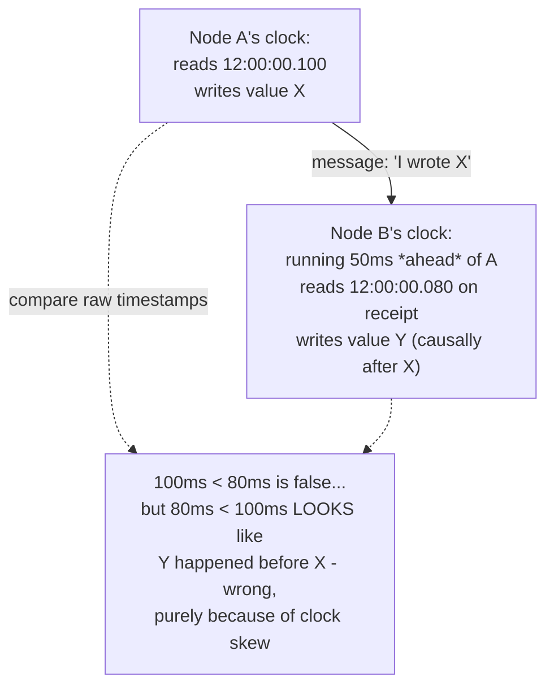
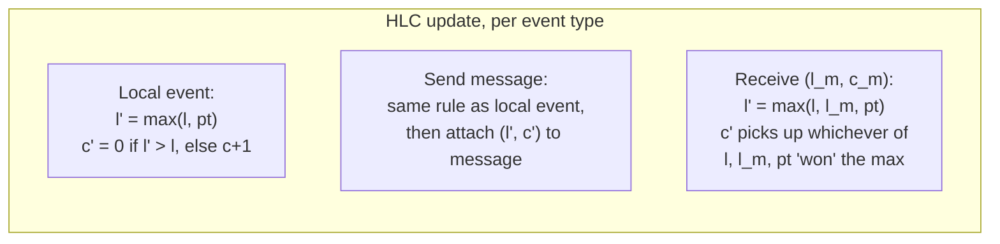
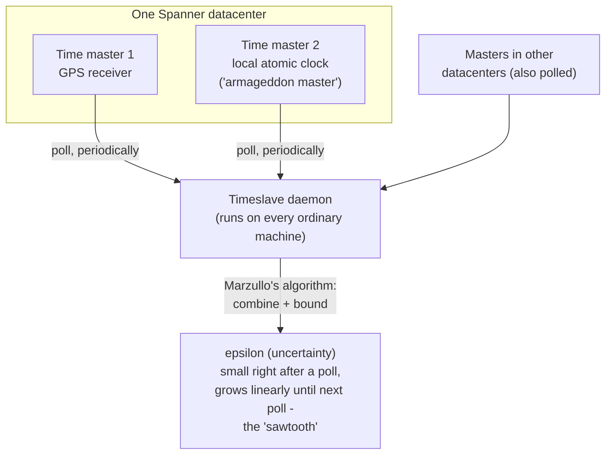

# Hybrid Logical Clocks vs TrueTime

_[Data contracts](15-data-contracts-schema-registry-enforced.md) closed out a run of topics - CDC/outbox, event sourcing, CQRS, data contracts - that all quietly leaned on one unexamined assumption: that "the order events happened in" is a given, something a producer just knows and stamps onto a message. This topic finally asks the question those topics all skipped past - **on what basis does a distributed system decide that event A happened before event B at all**, when A and B occurred on two different machines, each with its own clock, none of them perfectly synchronized with the others or with real time? It is L4's last topic because the answer - a clock that is neither purely physical nor purely logical, but a hybrid of both - is the direct technical prerequisite for L5's treatment of external consistency, linearizability, and consensus: none of those ideas are precisely statable without first having a rigorous notion of "when," across machines, that this topic builds from the ground up._

## Contents

- [The problem: physical clocks aren't good enough](#the-problem-physical-clocks-arent-good-enough)
- [Lamport clocks: a stepping stone](#lamport-clocks-a-stepping-stone)
- [Hybrid Logical Clocks (HLC): physical time with a causality guardrail](#hybrid-logical-clocks-hlc-physical-time-with-a-causality-guardrail)
- [HLC update rules, precisely](#hlc-update-rules-precisely)
- [Worked example: HLC across two nodes](#worked-example-hlc-across-two-nodes)
- [What HLC buys you, and where it's used](#what-hlc-buys-you-and-where-its-used)
- [Google Spanner's TrueTime: the API](#google-spanners-truetime-the-api)
- [How TrueTime is implemented: atomic clocks and GPS](#how-truetime-is-implemented-atomic-clocks-and-gps)
- [Commit wait: turning uncertainty into external consistency](#commit-wait-turning-uncertainty-into-external-consistency)
- [HLC vs TrueTime: trade-offs](#hlc-vs-truetime-trade-offs)
- [How this connects](#how-this-connects)
- [Real-world & sources](#real-world--sources)

## The problem: physical clocks aren't good enough

**Every machine in a distributed system keeps its own physical clock, and no two of them ever agree exactly - the question this topic starts from is what that disagreement actually costs a system that needs to order events across machines.** A physical clock is a quartz oscillator counting ticks; it is cheap, small, and - critically - imprecise in two distinct, compounding ways:

- **Drift.** No two oscillators tick at exactly the same rate, even nominally identical ones, because of manufacturing tolerance, temperature, and age. A typical commodity server clock drifts on the order of tens to a few hundred **microseconds per second** relative to true time (the original Spanner paper's own worst-case bound is 200 microseconds/second, i.e. about 17 seconds of drift per day if left completely uncorrected) - small per second, but unbounded if nothing ever corrects it, because drift compounds continuously between corrections.
- **Skew.** Because every machine drifts independently and at a different rate, the *gap between any two machines' clocks* at a given instant - the skew - is itself uncontrolled and constantly changing, even if each individual clock is periodically resynchronized.

**NTP (Network Time Protocol) is the standard fix, and it is a mitigation, not a cure.** NTP periodically corrects a machine's clock against a reference time source over the network, typically holding datacenter machines within single-digit milliseconds of true time under good conditions - but every correction is itself bounded by network round-trip variance, reference-server load, and the fact that a correction only fixes drift accumulated *since the last sync*, not drift happening continuously in between. Two consequences that matter directly for ordering events:

1. **NTP corrections can move a clock backward.** If a machine's clock has drifted ahead, an NTP "step" correction can yank it backward in time - which means a clock read at time T1, then read again later, can return a value *earlier* than T1, violating the one property ("time only ever moves forward on this machine") that any ordering scheme built on physical timestamps needs to hold.
2. **Cross-machine skew is never provably zero.** Even with NTP running everywhere, there is no way, from a single timestamp read on one machine, to know how far off that reading might be from another machine's simultaneous reading - the skew is real, it is bounded only loosely in the best case, and in a datacenter with a misconfigured or unreachable NTP source it can silently balloon to seconds or more with no local signal that anything is wrong.

**Why this breaks naive "just compare timestamps" ordering.** Suppose node A's clock reads 12:00:00.100 when it writes a value, and node B's clock - running 50 ms behind A's, entirely plausible under ordinary NTP-bounded skew - reads 12:00:00.130 when it writes a *causally later* value (say, B received a message from A and then wrote something in response). A's timestamp (100 ms) is smaller than B's (130 ms), so by luck the naive ordering happens to come out right here - but flip the skew direction (B running 50 ms *ahead* instead of behind) and B's write could easily be timestamped *earlier* than A's, even though B's write genuinely, causally happened after A's. **A system that orders events purely by comparing physical-clock timestamps across machines can silently get causality backward, with no error, no warning, and no way to tell from the timestamps alone that anything went wrong** - this is the exact failure mode that every mechanism in this topic exists to close off.



## Lamport clocks: a stepping stone

**Lamport clocks (Leslie Lamport, 1978) solve exactly the failure just described by throwing physical time away entirely and replacing it with a logical counter that only ever moves forward, incremented specifically to track causality rather than elapsed time.** The rule is simple: every process keeps a single integer counter, starting at 0.

- **On any local event** (a write, a computation step), increment the counter.
- **On sending a message**, increment the counter and attach its current value to the message.
- **On receiving a message** carrying counter value `t`, set the local counter to `max(local counter, t) + 1`.

This guarantees the one property that matters: **if event A causally precedes event B (A "happened-before" B, in Lamport's own terms - either they occurred on the same process in that order, or a message chain connects A to B), then A's Lamport timestamp is strictly less than B's.** The counter never needs to know what time it "really" is; it only needs to be certain that receiving a message never leaves the receiver's counter behind the sender's, which the `max(...) + 1` rule enforces directly - a receiver's next event is always ordered after whatever it just learned about.

**Where Lamport clocks stop being enough, which is exactly why this topic needs to go further.** Two real limitations, both load-bearing for the rest of this topic:

- **The timestamp is disconnected from wall-clock time, completely.** A Lamport timestamp of 5 versus 105 tells you nothing whatsoever about how much real time elapsed between those two events - it could be a microsecond or a decade; the counter only increments on events and messages, never on the passage of time itself. Any question of the shape "how far apart, in real time, were these two events" - the exact question a database's MVCC visibility rules, a cache TTL, or a human debugging a timeline all eventually need answered - is simply unanswerable from a Lamport timestamp alone.
- **It only gives a partial order, not a full one.** Two genuinely concurrent events (neither causally precedes the other - no message chain connects them) can end up with *any* relative Lamport timestamps, including ties, and the clock gives no way to distinguish "these are ordered by causality" from "these just happened to get these numbers because of how the counters ticked." (Vector clocks - one counter per process, tracked pairwise - close this specific gap by making concurrency itself detectable; that refinement is L5's own topic, not this one's, precisely because detecting concurrency and approximating wall time are two separable problems, and this topic is only chasing the second.)

Lamport clocks are the correct stepping stone here because **Hybrid Logical Clocks keep exactly Lamport's causality-preserving counter, but graft it onto physical time instead of discarding physical time altogether** - which is precisely the next section.

## Hybrid Logical Clocks (HLC): physical time with a causality guardrail

**A Hybrid Logical Clock is a timestamp with two components - a physical-time component and a logical counter - updated by a rule that keeps the physical component always within a small, bounded distance of a legitimate real-clock reading somewhere in the system, while still using the logical counter to preserve Lamport's causality guarantee whenever physical time alone can't tell two events apart or gets momentarily out of order.** (The scheme was formalized by Kulkarni, Demirbas, Madappa, Avva, and Leenders in "Logical Physical Clocks and Consistent Snapshots in Globally Distributed Databases," 2014; it is now the mechanism underlying MVCC-timestamp assignment in several production distributed databases, named below.)

Concretely, an HLC timestamp is a pair `(l, c)`:

- **`l`** - the physical-time component: a value drawn from (and kept close to) the node's own physical clock, but never allowed to run backward relative to any HLC timestamp the node has already produced or observed.
- **`c`** - a logical counter, reset to 0 whenever `l` genuinely advances past every previously-seen value, and incremented (exactly like a Lamport counter) whenever a new event's physical time doesn't strictly exceed the highest `l` already seen - which is precisely how HLC absorbs clock skew or a stalled physical clock without ever violating causality.

**The property this buys, stated precisely, is the entire point of the design:** an HLC timestamp `(l, c)` is always within a system-wide bounded distance of *some* node's real physical clock reading at the moment the event occurred - unlike a pure Lamport counter, which can drift arbitrarily far from real elapsed time with no bound at all - while simultaneously guaranteeing that if event A happened-before event B, A's HLC timestamp is strictly less than B's, exactly as a Lamport clock guarantees. HLC is, deliberately, "the best of both": close enough to wall-clock time to be useful for humans, TTLs, and time-range queries, while still safe enough for causal ordering to be trusted absolutely.

## HLC update rules, precisely

Every node keeps its own running `(l, c)` state. Three events update it, mirroring the three Lamport-clock rules exactly, with physical time spliced in:

- **Local event.** Read the node's physical clock, `pt`. Set `l' = max(l, pt)`. If `l'` strictly exceeds the previous `l` (i.e., the physical clock has genuinely moved past the last recorded value), reset `c' = 0`; otherwise (physical time hasn't caught up - it's stalled, running slow, or this is the second event within the same physical-clock tick) keep `l' = l` and increment `c' = c + 1`.
- **Send a message.** Identical rule to a local event - update `(l, c)` the same way, then attach the resulting `(l, c)` to the outgoing message.
- **Receive a message** carrying the sender's timestamp `(l_m, c_m)`. Set `l' = max(l, l_m, pt)`. Then: if `l'` equals both `l` and `l_m` (all three - old local, message, and new physical reading - tie at the same value), set `c' = max(c, c_m) + 1`; else if `l'` equals only the old local `l` (physical time hasn't caught up to either the old local value or the message's), set `c' = c + 1`; else if `l'` equals only the message's `l_m` (the message's physical time is the largest, and the local physical clock hasn't caught up to it either), set `c' = c_m + 1`; otherwise (the fresh physical reading `pt` is the largest of the three - the normal case when the local clock is healthy and ahead of everything it has seen so far) reset `c' = 0`.

The receive rule is the one doing new work relative to Lamport: it takes the **maximum of three inputs** (local state, the incoming message's timestamp, and a fresh physical-clock read) rather than just two, which is exactly what lets HLC track real time closely under normal operation while still falling back to pure logical-counter behavior - bumping `c` instead of `l` - the moment physical time alone isn't sufficient to keep events strictly ordered.



## Worked example: HLC across two nodes

Toy units (milliseconds), two nodes A and B, both starting at `(0, 0)`:

1. **A: local event e1.** A's physical clock reads `pt = 100`. Since `100 > 0` (A's old `l`), A's new state is `l' = 100, c' = 0`. **e1's HLC timestamp: `(100, 0)`.**
2. **A sends a message to B, attaching `(100, 0)`.** In flight, real time passes - but B's physical clock happens to be running slightly *behind* A's (ordinary, bounded skew): when B receives the message, B's own physical clock reads only `pt = 98`.
3. **B: receive e2, with `(l_m, c_m) = (100, 0)` and local state `(l, c) = (0, 0)`.** Compute `l' = max(0, 100, 98) = 100`. This ties with the message's `l_m = 100` and exceeds both B's old `l` (0) and B's fresh physical reading (98) - so per the receive rule, `c' = max(c, c_m) + 1 = max(0, 0) + 1 = 1`. **e2's HLC timestamp: `(100, 1)`** - strictly greater than e1's `(100, 0)`, exactly as causality requires, *even though B's own physical clock says the current time is only 98* - the logical counter is what absorbs that 2ms of skew without ever letting the receive event appear to happen before the send.
4. **B: local event e3**, sometime later, physical clock now reads `pt = 101` (B's clock has caught back up and moved past 100). Compute `l' = max(100, 101) = 101`, and since this genuinely exceeds B's prior `l` of 100, `c'` resets to `0`. **e3's HLC timestamp: `(101, 0)`** - the counter drops back to 0 the moment real physical time is trustworthy again, which is exactly the "bounded drift" property: the logical component never accumulates an unbounded backlog the way a pure Lamport counter would, because HLC discards it the instant physical time is sufficient on its own.

```mermaid
sequenceDiagram
    participant A as Node A (clock: 100)
    participant B as Node B (clock: 98, running behind)

    A->>A: local event e1<br/>l=max(0,100)=100, c=0 -> (100, 0)
    A->>B: send message, attach (100, 0)
    B->>B: receive e2<br/>l'=max(0, 100, 98)=100 (ties l_m)<br/>c'=max(0,0)+1=1 -> (100, 1)
    Note over B: e2 &gt; e1 preserved,<br/>despite B's raw clock reading only 98
    B->>B: local event e3, pt=101<br/>l'=max(100,101)=101 -> (101, 0)
    Note over B: counter resets to 0 -<br/>drift is absorbed, not accumulated
```

## What HLC buys you, and where it's used

**HLC gives a distributed system a single timestamp type that is simultaneously (a) safe to use for causal ordering, exactly like a Lamport clock, and (b) close enough to wall-clock time to double as an actual "when" for humans, TTLs, and range queries - which a pure Lamport counter can never be, and a raw physical-clock reading can never safely be either, given skew.** Two concrete consumers this level has already built the vocabulary for:

- **MVCC timestamps in a distributed database.** [L2's own MVCC treatment](../L2/) assumed a single node with one authoritative, monotonically increasing counter (or a single-node physical clock) to stamp each transaction's snapshot version - trivial to keep monotonic on one machine. The moment MVCC has to span multiple nodes (a partitioned/sharded database where a transaction's read set or write set crosses shards, or a multi-region deployment), something has to assign a globally meaningful, causally-consistent version number across machines whose clocks don't agree - exactly the gap HLC fills, giving each transaction a commit timestamp that is both causally correct (later transactions get later timestamps whenever a causal link exists) and close enough to real time to be useful for time-bounded reads ("read the database as of 5 seconds ago") and TTL-style expiry.
- **Conflict resolution and causal ordering across replicas.** [Replication's leaderless/multi-leader modes](02-replication.md) and [quorums](07-quorums.md) both left open the question of what breaks a tie when two writes to the same key genuinely race - a raw wall-clock "last write wins" (as several leaderless stores have historically used) is exactly the naive-timestamp-comparison scheme this topic opened by showing can get causality backward under skew. An HLC-stamped write instead carries a timestamp that already accounts for any causal link between the two writes (if one write's node had actually seen the other's timestamp via a prior message, the later one is guaranteed to compare greater), collapsing back to genuine physical-time comparison only for truly concurrent, causally-unrelated writes - a strictly safer tie-breaker than comparing raw NTP-synced clocks directly.

**Production systems that use this design, by name (the specific implementation choices are each database's own, this topic states only the shared underlying idea):** **CockroachDB** uses hybrid-logical-clock-style timestamps for its MVCC versioning and combines them with an explicit uncertainty interval per transaction (conceptually a software-only echo of TrueTime's own uncertainty interval, covered next, but without dedicated hardware - a transaction that reads a value whose timestamp falls inside its own uncertainty window is forced to retry at a later timestamp rather than risk reading a causally-ambiguous value). **MongoDB** uses hybrid logical clocks (MongoDB calls its specific mechanism "cluster time") to order operations consistently across a replica set and sharded cluster without requiring specialized clock hardware. **YugabyteDB**, built explicitly in the Spanner lineage, likewise uses hybrid logical clocks as its default clock implementation, offering a hardware-clock-synchronization-based mode only as an optional alternative for deployments that have invested in tightly bounded physical clock sync. (Exact version-by-version implementation detail for each of these is deferred to a later, web-verified sourcing pass - the point recorded here is the shared architectural choice: HLC as the software-only, no-special-hardware answer to distributed timestamp assignment.)

## Google Spanner's TrueTime: the API

**TrueTime is Google Spanner's own answer to the identical underlying problem - "give every node a timestamp that's safe to compare across machines" - but it takes the opposite design stance from HLC: instead of accepting that physical clocks are uncertain and building a logical counter to route around that uncertainty, TrueTime measures the uncertainty explicitly, bounds it tightly using dedicated hardware, and hands the bound itself to the application as a first-class value.**

The API is deliberately small, three calls:

- **`TT.now()`** - returns not a single timestamp, but an **interval `[earliest, latest]`**, guaranteed to contain the true, absolute time at the instant the call was made. The width of that interval, `latest - earliest`, is the **uncertainty bound**, conventionally called **epsilon (ε)** - typically kept to single-digit milliseconds in Google's own reported measurements, though the exact figure depends on hardware, network conditions, and time since the last synchronization (specific published numbers are a fact worth verifying against the primary Spanner paper in a later sourcing pass rather than asserted here as settled).
- **`TT.after(t)`** - returns true only once the caller can be *certain* that true time has passed `t` - i.e., only once `TT.now().earliest > t`. This is the predicate the commit-wait mechanism below is built directly on top of.
- **`TT.before(t)`** - the mirror image: true only if true time is certainly still before `t`.

**Why an interval, not a single number, is the entire design insight.** Every other clock this topic has discussed - a raw physical clock, a Lamport counter, an HLC pair - returns one value and asks the rest of the system to trust it. TrueTime instead makes the honest admission explicit: *no clock read is ever perfectly precise, so don't pretend it is - hand back the range within which the true value is guaranteed to fall, and let calling code reason about the width of that range directly.* This is what makes the commit-wait technique below possible at all: it needs to know not just "what time is it," but "what is the largest amount of uncertainty I might currently be wrong by."

## How TrueTime is implemented: atomic clocks and GPS

**TrueTime's tight uncertainty bound is bought with real, dedicated hardware in every Google datacenter, not with a smarter algorithm running on commodity clocks - this is the load-bearing difference from HLC, which achieves its guarantees entirely in software.** Each datacenter runs a set of **time master** machines, each equipped with either a **GPS receiver** (which derives time from GPS satellites' own atomic clocks) or a **local atomic clock** (an armageddon master, kept as a hedge specifically against GPS-related failures - jamming, antenna damage, a satellite outage, or correlated GPS-derived errors across every GPS-equipped master at once). Using two physically different reference technologies is deliberate: a GPS receiver and an atomic clock fail for different, largely uncorrelated reasons, so a datacenter with both kinds of masters retains a working time reference even if one entire class fails simultaneously.

Every ordinary machine in the fleet runs a lightweight **timeslave daemon** that polls several time masters (deliberately including masters in more than one datacenter, again to bound correlated failure) at a regular interval, and combines their answers using **Marzullo's algorithm** - a method for taking several time sources, each already reporting its own bounded uncertainty interval, and computing the smallest interval consistent with the largest subset of them, discarding any source whose reported interval doesn't overlap with the consensus. Between polls, the daemon widens its own reported uncertainty bound continuously, at a conservative, worst-case-modeled clock-drift rate, precisely because it cannot know how much the local physical clock has actually drifted since the last poll - only bound the worst case. This produces the well-known **sawtooth pattern** in ε over time: uncertainty resets to a small value immediately after each successful poll, then grows linearly until the next one, then resets again.



## Commit wait: turning uncertainty into external consistency

**Commit wait is the mechanism that spends TrueTime's explicit uncertainty bound to buy a guarantee HLC cannot provide on its own: that Spanner's assigned commit timestamps are guaranteed to match the true, real-world order in which transactions actually committed - "external consistency," Spanner's own term for linearizability extended to distributed transactions.** ([Linearizability itself, and why it's the strongest ordinary consistency guarantee, is L5's own topic](#how-this-connects) - this section only needs the specific mechanism that gets a distributed database there.)

The problem commit wait exists to solve: suppose transaction T1 commits, and *afterward*, in absolute real time, a client observes T1's effect and starts transaction T2. Any correct system must guarantee T2's commit timestamp is greater than T1's - otherwise a read of "the latest state" could legitimately miss T1's own effect, a direct causality violation visible to real users, not just an internal bookkeeping problem. But T1's and T2's commit timestamps might be assigned on different Spanner nodes, whose physical clocks are never known to agree exactly - only known to agree within TrueTime's own uncertainty bound. Commit wait closes exactly that gap:

1. When a transaction is ready to commit, Spanner assigns it a commit timestamp `s = TT.now().latest` - deliberately the **upper** end of the current uncertainty interval, the most conservative (latest-possible) reading available.
2. Before actually **releasing** the commit's effects - making the transaction's writes visible to anyone else - Spanner waits until `TT.after(s)` returns true, i.e., until `TT.now().earliest` has itself advanced past `s`. This wait is the **commit wait** the mechanism is named for.
3. Because true absolute time is guaranteed to have passed `s` by the time the commit is released, **any transaction that starts after this one is released is guaranteed, by construction, to be assigned a commit timestamp greater than `s`** - there is no way for a causally-later transaction to be given an equal or smaller timestamp, because true time itself has already moved past `s` before anyone else could have observed this transaction's effects at all.

```mermaid
sequenceDiagram
    participant T1 as Transaction T1
    participant Clock as TrueTime
    participant T2 as Transaction T2 (starts after T1's effects are visible)

    T1->>Clock: TT.now() -> [e1, l1]
    T1->>T1: assign commit timestamp s = l1 (the latest bound)
    T1->>Clock: wait until TT.after(s) is true<br/>(i.e. until TT.now().earliest &gt; s)
    Note over T1,Clock: commit wait - typically on the<br/>order of 2*epsilon, a few ms
    T1->>T1: release commit - writes now visible
    T2->>Clock: TT.now() -> guaranteed earliest &gt; s already
    T2->>T2: assigned commit timestamp is guaranteed &gt; s
```

**The cost, named plainly.** Commit wait adds real, unavoidable latency to every write transaction - typically on the order of **twice the current uncertainty bound (roughly `2ε`)**, since the wait has to cover the full width of the interval the timestamp was drawn from. At single-digit-millisecond ε, this is a single-digit-to-low-double-digit millisecond tax on every write commit - genuinely paid, on every single write, in exchange for a guarantee ("commit timestamps match real-world order, globally, with no coordinator or consensus round needed to enforce it directly") that would otherwise require an explicit cross-node coordination protocol. This is the direct, concrete trade-off TrueTime makes: spend dedicated hardware to get a *small, bounded* ε, then spend a small, bounded amount of *latency* on every write to convert that bound into an absolute ordering guarantee.

## HLC vs TrueTime: trade-offs

Both mechanisms exist to answer the same question - "can I compare timestamps from two different nodes and trust the comparison" - but they make opposite bets about where to spend cost, and the right choice depends entirely on what guarantee a system actually needs versus what it's willing to pay for.

| | Hybrid Logical Clocks (HLC) | TrueTime |
| --- | --- | --- |
| **Hardware requirement** | None - runs entirely in software on ordinary machine clocks plus NTP | Dedicated GPS receivers and/or atomic clocks in every datacenter, plus a custom time-distribution daemon fleet-wide |
| **Portability** | Runs anywhere - any cloud, any datacenter, no special provisioning | Effectively tied to an operator that controls its own datacenter hardware (Google's own infrastructure); not something an ordinary cloud tenant can provision directly |
| **What's returned** | A single `(l, c)` pair | An explicit interval `[earliest, latest]` with a stated uncertainty width |
| **Causality guarantee** | Guaranteed: happened-before implies strictly smaller timestamp, always | Guaranteed via commit wait, but only because the application explicitly waits out the interval - the raw `TT.now()` call alone gives you the bound, not the ordering guarantee for free |
| **Global total ordering across *all* events** | Not guaranteed for concurrent, causally-unrelated events - two truly concurrent writes on different nodes can still tie or compare either way | Guaranteed, system-wide, for anything that goes through commit wait - this is precisely Spanner's "external consistency" claim |
| **Added write latency** | None inherent to the clock itself - HLC computation is a handful of comparisons and arithmetic operations, effectively free | A real, deliberate wait on every commit, roughly `2ε` (single-digit-to-low-double-digit milliseconds under normal published conditions) |
| **Failure mode if clock sync degrades** | Gracefully absorbed - the logical counter simply grows to compensate for a clock that has stalled or drifted, causality is never lost, only the wall-clock-closeness property weakens | Uncertainty (ε) widens (the sawtooth grows further before its next reset), directly increasing commit-wait latency; if synchronization fails outright, Spanner is documented to prefer unavailability over risking an incorrect ordering - correctness is protected at the cost of availability, not silently degraded |
| **Who uses it (named above/below)** | CockroachDB, MongoDB (cluster time), YugabyteDB (default mode) | Google Spanner (and Google-internal systems built on the same infrastructure); YugabyteDB offers it only as an optional, hardware-dependent alternative to its HLC default |

**The trade-off, stated as a single sentence each way:** HLC buys causal-consistency-plus-approximate-wall-time everywhere, for free, in software, at the cost of never quite promising a true global total order for concurrent events; TrueTime buys a genuine, provable global total order (external consistency) everywhere Spanner's own commit-wait logic runs, at the cost of specialized per-datacenter hardware and a real, paid-on-every-write latency tax. Neither is strictly better - a system that doesn't actually need cross-region external consistency (most systems, honestly) gets everything it needs from HLC's free causal ordering and never pays TrueTime's latency tax at all; a system that specifically needs to guarantee "if you observed this write, any later transaction anywhere in the world sees it too, with no exceptions, ever" is the narrow case TrueTime's extra cost is actually buying something HLC structurally cannot promise on its own.

## How this connects

- **Forward to L5 (external consistency and linearizability)** - "external consistency," used above as Spanner's own term, *is* linearizability extended across a distributed transaction boundary; L5 gives that guarantee its full formal treatment (what it precisely promises, how it differs from mere serializability) with commit wait as the working example of one concrete mechanism that achieves it.
- **Forward to L5 (consensus - Paxos, Raft, ZAB)** - clocks and consensus solve different halves of the same larger problem and are frequently paired, not substitutes for each other: a consensus protocol decides *what* the agreed sequence of operations is (surviving node failures and network partitions), while HLC or TrueTime decides what *timestamp* to attach to each operation once ordered - CockroachDB, for instance, runs Raft for per-range consensus and HLC for the timestamps assigned to the transactions that consensus orders.
- **Forward to L5 (logical and vector clocks, and hybrid logical clocks)** - this topic's Lamport-clock recap and HLC mechanics are the direct on-ramp to L5's own, fuller treatment: vector clocks generalize Lamport's single counter into one counter per process specifically to make true concurrency detectable (something this topic named as a real limitation and deliberately deferred), and L5 revisits HLC itself with the broader theoretical vocabulary (consistency models, the happened-before relation formalized) this topic intentionally kept lighter to stay focused on the database-facing motivation.
- **Back to L4/02 (replication) and L4/07 (quorums)** - both topics left "what breaks a tie between two racing writes" open; this topic supplies the safer answer (an HLC-stamped or TrueTime-ordered timestamp) to the naive raw-wall-clock "last write wins" tie-breaker that a leaderless store comparing unsynchronized physical clocks directly would otherwise be exposed to exactly the skew failure this topic opened with.
- **Back to L4/09 (event sourcing)** - a single aggregate's own event stream already has a trivial, free total order (its own strictly increasing version number); the moment a system needs to reason about ordering *across* multiple aggregates' or services' streams - which of two events, from two different streams, happened first in any meaningfully global sense - is exactly where a per-stream version number stops being sufficient and a cross-node timestamp scheme like HLC becomes necessary.
- **Back to L2 (MVCC)** - L2's own MVCC treatment assigned transaction snapshot versions using a single-node, trivially-monotonic counter or clock; this topic is the direct generalization of that exact idea to a setting where "monotonic" can no longer be taken for granted because no single clock is authoritative across every participating node.

## Real-world & sources

**Google Spanner (TrueTime, the canonical case).** Spanner is the system this whole topic's TrueTime section is describing: every Spanner server calls `TT.now()` to get an `[earliest, latest]` interval bounded by dedicated GPS receivers and atomic clocks in each datacenter, and every commit pays the commit-wait tax (`s = TT.now().latest`, then wait until `TT.after(s)`) specifically to make commit timestamps match real-world commit order - Spanner's own "external consistency" guarantee. Google's current Cloud documentation still describes TrueTime in exactly these terms - "a highly available, distributed clock" producing "monotonically increasing timestamps" used to make Spanner externally consistent - confirming the mechanism described above is still the live, current design, not a retired one. The original OSDI 2012 paper remains the primary source for the ε figures and the GPS/atomic-clock hardware detail (reported ε typically under ~10ms, often single-digit milliseconds, in Google's own infrastructure).

**CockroachDB (HLC, the hardware-free alternative).** CockroachDB's current architecture documentation confirms it uses HLC "to optimize for performance" instead of relying purely on Raft consensus for every read, assigning each transaction a timestamp via HLC that combines a physical component (kept close to node wall time via NTP) with a logical counter for tie-breaking - explicitly the same mechanism this topic describes, deployed with no special hardware. The docs also confirm CockroachDB's own TrueTime-inspired but hardware-free twist: each transaction carries an uncertainty interval (bounded by a configurable `max_offset`, default 500ms), and a read that lands inside that window forces a transaction restart at a higher timestamp rather than risk an ambiguous causal order - CockroachDB's own docs and glossary describe this as trading Spanner's dedicated-hardware-bounded epsilon for a much wider, NTP-bounded uncertainty window, paid for with occasional transaction restarts instead of per-commit hardware-bounded waits. Nodes that detect their own clock has drifted past a threshold of `max_offset` relative to peers shut themselves down rather than risk silently violating consistency.

**MongoDB (cluster time, the causal-consistency angle).** MongoDB's current server manual describes "cluster time," a logical clock maintained cluster-wide across a replica set or sharded cluster, that clients track per-session and can pass between sessions (`advanceClusterTime`/`advanceOperationTime`) to preserve causal guarantees - read-your-writes, monotonic reads, monotonic writes, and writes-follow-reads - across operations that would otherwise have no way to agree on ordering. Cluster time is implemented internally as a hybrid logical clock (a 64-bit value combining a physical-time component with a logical counter), the same core design as CockroachDB's HLC, applied here specifically to guarantee causal consistency for causally-consistent sessions rather than to MVCC versioning directly; this design was first published by MongoDB engineers at SIGMOD 2019 ("Implementation of Cluster-wide Logical Clock and Causal Consistency in MongoDB"). A fintech-specific example using clock synchronization for distributed transaction ordering was searched for but not found meeting this sweep's 4-year-recency bar with a verifiable primary source - flagging that gap openly rather than including an unverified claim.

**Sources**

- [Spanner: TrueTime and external consistency - Google Cloud Documentation](https://docs.cloud.google.com/spanner/docs/true-time-external-consistency) (accessed 2026-07-24; page shows "Last updated 2026-07-22 UTC")
- [Spanner: Google's Globally-Distributed Database - OSDI 2012 paper (Corbett et al.)](https://www.usenix.org/system/files/conference/osdi12/osdi12-final-16.pdf) (accessed 2026-07-24; primary source for TrueTime epsilon figures, GPS/atomic-clock hardware, and commit-wait mechanics - foundational paper, cited here for the original design rather than as a "current trend")
- [CockroachDB Architecture: Transaction Layer](https://www.cockroachlabs.com/docs/stable/architecture/transaction-layer) (accessed 2026-07-24; continuously-updated stable docs)
- [CockroachDB Glossary: Hybrid Logical Clock (HLC) Timestamps](https://www.cockroachlabs.com/glossary/distributed-db/hybrid-logical-clock-hlc-timestamps/) (accessed 2026-07-24)
- [MongoDB Manual: Read Isolation, Consistency, and Recency](https://www.mongodb.com/docs/manual/core/read-isolation-consistency-recency/) (accessed 2026-07-24; continuously-updated official docs, describes cluster time and causally consistent sessions)
- [Implementation of Cluster-wide Logical Clock and Causal Consistency in MongoDB, SIGMOD 2019 (Tyulenev, Schwerin, et al.)](https://dl.acm.org/doi/10.1145/3299869.3314049) (accessed 2026-07-24; primary source for MongoDB's HLC-based cluster time design)
