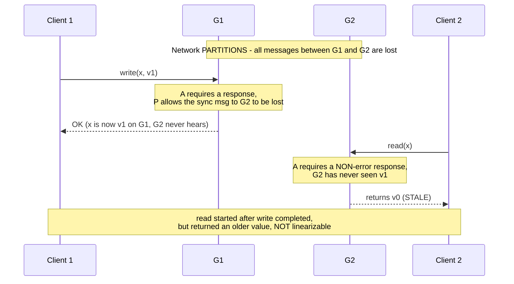

# CAP and PACELC

_[L4 spent a whole level building the machinery of data at scale](../L4/README.md) - [replication](../L4/02-replication.md), [partitioning](../L4/03-partitioning-and-sharding.md), [quorums (R+W>N)](../L4/07-quorums.md), [consistent hashing](../L4/05-consistent-hashing.md), and finally [the clocks (HLC, TrueTime) that let a system reason about "when" across machines](../L4/16-hybrid-logical-clocks-vs-truetime.md) - and at every turn it ran into the same fork: keep the copies in lockstep (pay coordination) or let them drift (risk staleness). [Quorums](../L4/07-quorums.md#quorum-consistency-vs-strong-consistency) named the fork informally ("R+W>N makes staleness detectable, not impossible"); [sloppy quorums](../L4/07-quorums.md#strict-quorums-vs-sloppy-quorums) made a specific trade ("availability bought with a temporary hole in consistency") without ever stating the general law. This topic states the law. CAP is the theorem that says the fork is **unavoidable** - not a design smell to be engineered away, but a mathematical fact about any system that keeps more than one copy of data across a network that can fail. PACELC is the correction that says CAP only describes half the picture. Together they are the coordinate system every later L5 topic - [consistency models](02-consistency-models.md), [linearizability](03-linearizability-vs-serializability.md), [consensus](04-consensus-paxos-raft-zab.md) - is plotted on._

## Contents

- [The setup: why a distributed system forces the question](#the-setup-why-a-distributed-system-forces-the-question)
- [CAP: the three properties, defined precisely](#cap-the-three-properties-defined-precisely)
- [Why P is not a choice](#why-p-is-not-a-choice)
- [Why it is a theorem, not a slogan: the Gilbert-Lynch proof sketch](#why-it-is-a-theorem-not-a-slogan-the-gilbert-lynch-proof-sketch)
- [Common misreadings to kill on sight](#common-misreadings-to-kill-on-sight)
- [CP vs AP in practice](#cp-vs-ap-in-practice)
- [Why CAP is incomplete: the else case](#why-cap-is-incomplete-the-else-case)
- [PACELC: the full trade-off](#pacelc-the-full-trade-off)
- [Classifying real systems on both axes](#classifying-real-systems-on-both-axes)
- [Trade-offs](#trade-offs)
- [How this connects](#how-this-connects)
- [Check yourself](#check-yourself)
- [Real-world & sources](#real-world--sources)

## The setup: why a distributed system forces the question

**The whole subject exists because of one decision made a level ago: keep more than one copy of the data.** A single-node database never faces CAP - there is exactly one copy, reads and writes hit it in some order, and "consistency" is free because there is nothing to disagree with. The moment [replication](../L4/02-replication.md) puts the same key on `N` physical nodes (for durability, for read throughput, for locality), those copies live on different machines connected by a network - and networks, unlike function calls, **lose messages, delay them arbitrarily, and split into disconnected groups**. CAP is precisely the study of what a multi-copy system can and cannot promise when that network misbehaves.

Fix a concrete mental model for the rest of this topic - it is the one Gilbert and Lynch use in their proof:

- A single logical data item `x`, replicated on two nodes `G1` and `G2` (two is enough to prove everything; more copies only add cases).
- Clients can send a read or write of `x` to *either* node.
- `G1` and `G2` normally exchange messages to keep their copies in sync.
- At some moment the network **partitions**: every message between `G1` and `G2` is lost, but each node can still talk to its own clients.

Everything below is about what happens to a request that arrives *during* that partition.

## CAP: the three properties, defined precisely

CAP (Eric Brewer's 2000 conjecture, formalized by Seth Gilbert and Nancy Lynch in 2002) is a statement about three properties of a replicated system. The single most common source of confusion is imprecise definitions, so pin each one down exactly - **especially the C, which is not the C of ACID.**

- **C - Consistency, meaning *linearizability* (Gilbert-Lynch call it "atomic" / a "single up-to-date copy").** There must exist a single total order on all operations such that each operation appears to take effect instantaneously at one point in time, consistent with real-time ordering: **a read must return the value of the most recent completed write (or a later one), as if there were only one copy of the data.** This is a statement about ordering and recency across the whole system, and it is exactly the guarantee [quorums explicitly said R+W>N does *not* provide](../L4/07-quorums.md#quorum-consistency-vs-strong-consistency). [L5's linearizability topic](03-linearizability-vs-serializability.md) defines it with full rigor; for now hold the plain version: **every reader sees the latest write, no staleness, ever.**

  > This is **not** ACID's "C" (Consistency), which means "a transaction preserves application invariants / database constraints" - a completely different, database-transaction notion. CAP's C is purely about replica agreement and recency. Conflating the two is the single most common CAP error; guard against it every time you read "consistency."

- **A - Availability.** *Every request that reaches a non-failing node must eventually return a non-error response* - no "try again later," no timeout, no error. Note the bar precisely: it is not "the system is up"; it is "**a live node must answer, with real data, every time**." A node that responds "I can't be sure I'm current, so I refuse to answer" is, by this definition, **not available**, even though the process is running and healthy.

- **P - Partition tolerance.** *The system continues to operate despite the network arbitrarily dropping or delaying messages between nodes* - i.e., despite the network splitting the nodes into groups that cannot talk to each other. A partition-tolerant system does not require the network to deliver messages to keep functioning at all.

With the definitions this sharp, the theorem is almost forced: during a partition, `G1` and `G2` cannot exchange messages, so a write accepted by `G1` cannot reach `G2`; a subsequent read at `G2` therefore either **refuses to answer** (sacrificing A to protect C) or **answers with its stale copy** (sacrificing C to protect A). There is no third option, and the next sections make that precise.

## Why P is not a choice

The framing "pick 2 of the 3" quietly implies all three are optional ingredients you select from. They are not: **P is not a property you design in or out - it is a property of the physical world your system runs on.**

- Networks partition. Cables get cut, switches reboot, a top-of-rack switch fails, a cross-region link saturates, a GC pause or a misconfigured firewall makes a healthy node look unreachable. Over a fleet of thousands of machines this is not an edge case; it is a **routine, expected event**. You cannot buy a network that never partitions any more than you can buy a disk that never fails.
- Therefore, for any system whose data spans more than one machine, **partitions *will* happen whether or not you planned for them.** The only question is how the system *behaves* when one does.

So "sacrificing P" is not a real design point - it would mean "assume the network never fails," and a system built on that assumption doesn't gain C+A, it just **corrupts data or hangs** the moment reality violates the assumption. The genuine, forced choice is the remaining one:

> **When (not if) a partition happens, do you sacrifice C or sacrifice A?** That is the entire content of CAP. "CA" is not a system you can build across a network; it is only "a single machine, where partitions are impossible by construction."

This is why the honest phrasing of CAP is **"during a partition, choose C or A,"** never "pick 2 of 3."

## Why it is a theorem, not a slogan: the Gilbert-Lynch proof sketch

Brewer *conjectured* CAP; Gilbert and Lynch *proved* it, which is what makes it load-bearing rather than folklore. The proof is short enough to hold in your head, and holding it is what makes the trade-off feel inevitable instead of arbitrary.

**Claim.** In an asynchronous network (no shared clock, messages can be delayed or lost arbitrarily), no implementation of a read/write register can provide all three of Consistency (linearizable), Availability, and Partition tolerance.

**Proof by contradiction.** Suppose some algorithm `A` provides all three. Consider two nodes `G1`, `G2`, both holding item `x` with initial value `v0`. Construct one specific execution:

1. Partition the network so no message crosses between `G1` and `G2`.
2. A client writes `v1` to `x` at `G1`. By **Availability**, `G1` must respond (say, "OK") - it cannot wait forever for `G2`, and by **Partition tolerance** the sync message to `G2` may be lost. So the write completes with `G1` holding `v1` and `G2` still holding `v0`.
3. *After* that write completes, a client reads `x` from `G2`. By **Availability**, `G2` must return a non-error response. `G2` has never heard about `v1`, so it returns `v0`.
4. But the read began strictly after the write completed, so **Consistency (linearizability)** demands it return `v1` (or newer), never the older `v0`. The response `v0` violates linearizability.

Contradiction: no algorithm can honor all three in this execution. Since the execution is one any real network permits, **no such algorithm exists.** QED (sketch).

**The subtle, important part - the model matters.** The clean impossibility above is for the *fully asynchronous* model (no clocks at all). Gilbert and Lynch also treat the *partially synchronous* model (nodes have clocks / bounded delays most of the time), and there the result is nearly as strong: you still cannot have all three, but you *can* build a system that is consistent-and-available when the network is well-behaved and degrades gracefully otherwise - which is exactly what real systems do. The theorem does not say "always broken"; it says **"you cannot escape the C-vs-A choice for requests issued during an actual partition."**

## Common misreadings to kill on sight

CAP is probably the most-misquoted result in the field. Three corrections that a rigorous treatment must make explicit:

- **"Pick 2 of 3" is misleading.** As [above](#why-p-is-not-a-choice), P is not optional for a networked system, so the real menu is a 1-of-2 choice (C or A) *conditional on a partition*, not a free 2-of-3 selection. "CA" describes a single node, not a distributed system.
- **CAP is not a permanent, system-wide label.** The choice only binds **during an actual partition.** When the network is healthy, a well-built system can be both consistent and available at once - CAP says nothing against that. Calling a database "a CP system" or "an AP system" is shorthand for *"this is what it does when a partition occurs,"* not a claim about its steady-state behavior. (This gap - what happens when there is *no* partition - is exactly what PACELC exists to fill.)
- **The choice can be per-operation, per-key, or per-request, not one global switch.** [Quorums showed R and W are tunable per operation](../L4/07-quorums.md#tunable-consistency-choosing-r-and-w); the same store can answer one query CP-style (`QUORUM`/`ALL`) and another AP-style (`ONE`) during the same partition. Real systems live on a **spectrum**, and often expose the knob to the application.
- **C is linearizability, not "eventual consistency is a lie."** An AP system sacrificing C during a partition is not "inconsistent forever" - it typically converges once the partition heals ([read repair, anti-entropy, hinted handoff](../L4/07-quorums.md#read-repair-and-how-it-rides-along-on-a-quorum-read)). It sacrifices *linearizability during the partition*, which is a precise, bounded claim, not "the data is garbage."

## CP vs AP in practice

Strip away the theory and CAP becomes a very operational question: **when a node cannot confirm it is current, does it block/refuse, or does it answer anyway?** That single behavior is what "CP-leaning" and "AP-leaning" name.

**CP-leaning: sacrifice availability to protect consistency.** When a partition prevents a node from being sure it holds the latest value, it **refuses to serve** - it errors, blocks, or steps down - rather than risk returning stale data or accepting a conflicting write.

- Mechanism, tied back to L4: a **leader-based / consensus-replicated** shard requires a write to be committed to a **majority quorum** before acknowledging ([the same majority arithmetic quorums derived](../L4/07-quorums.md#the-quorum-condition-r--w--n-proved-in-general)). If a partition puts the leader in the minority side, it **cannot reach a majority, so it stops accepting writes** (and often stops serving linearizable reads) - it *sacrifices availability on the minority side* precisely to guarantee no two sides ever accept divergent writes. This is also the direct mechanism that prevents [split-brain](02-consistency-models.md) (a later L5 topic): only the majority partition can make progress.
- Concrete shape: ZooKeeper/etcd, HBase, Spanner, a MongoDB replica set with `majority` writes, any Raft/Paxos-backed store. On the minority side of a partition, clients get errors or timeouts, not stale answers.
- When to choose it: **correctness-critical data where a stale read or a lost/conflicting write is worse than an outage** - account balances, inventory counts, configuration/leadership, anything money-moving or coordinating. A payments ledger would rather reject a transaction than double-spend.

**AP-leaning: sacrifice consistency to protect availability.** When a partition isolates a node, it **keeps serving** from whatever copy it has, accepting that reads may be stale and writes on different sides may conflict, and reconciles later.

- Mechanism, tied back to L4: a **leaderless (Dynamo-style) or multi-leader** store with low `R`/`W` (e.g. `R=W=ONE`) lets any reachable replica answer reads and accept writes. [Sloppy quorums with hinted handoff](../L4/07-quorums.md#strict-quorums-vs-sloppy-quorums) are the archetype: *the write always succeeds if any `W` nodes anywhere are reachable*, at the cost of a temporary consistency hole healed later. Concurrent writes on different sides produce siblings/conflicts resolved by [LWW or version vectors](../L4/02-replication.md#conflict-detection-and-resolution).
- Concrete shape: Cassandra/Riak at low consistency levels, DynamoDB eventually-consistent reads, DNS, shopping carts, social feeds, presence.
- When to choose it: **availability-critical data where a stale answer is tolerable and conflicts are mergeable** - "always take the order / always show *a* feed," reconcile later. Amazon's canonical example: the shopping cart must always accept "add to cart" even during a partition; a briefly-resurrected deleted item is a far cheaper failure than a rejected purchase.

**The one-line contrast to remember:** *CP blocks so it never lies; AP answers so it never blocks.*

## Why CAP is incomplete: the else case

Here is the gap CAP leaves wide open, and it is a big one: **CAP only tells you anything during a partition.** Partitions are (thankfully) rare - the network is healthy the overwhelming majority of the time. CAP is completely silent about that common case. And yet, *even with a perfectly healthy network*, the same fundamental tension shows up, for a different reason:

> To keep replicas consistent, a write must be propagated to (and acknowledged by) other replicas *before* it is considered done. That propagation costs **round-trip latency.** So even with no partition at all, a system still chooses: **wait for the replicas (higher latency, stronger consistency) or answer from one copy now (lower latency, weaker consistency).**

Concretely, the same L4 mechanisms make this vivid with no partition anywhere:

- A **synchronous replication / majority-commit** write ([quorums with high `W`](../L4/07-quorums.md#tunable-consistency-choosing-r-and-w)) must wait for a majority of replicas - possibly across regions - to acknowledge before returning. Strong consistency, but every write pays a cross-node (often cross-region) round trip.
- An **asynchronous replication** write ([leader-follower async](../L4/02-replication.md#failover-detecting-and-handling-leader-failure)) returns as soon as one node has it and ships to followers in the background. Fast, but a read served by a lagging follower is stale.
- **Spanner's commit-wait** ([TrueTime](../L4/16-hybrid-logical-clocks-vs-truetime.md#commit-wait-turning-uncertainty-into-external-consistency)) is the purest illustration: to guarantee external consistency, every commit *deliberately waits out the clock-uncertainty bound* (`~2 * epsilon`) before releasing - it **pays latency for consistency on every single write, partition or not.**

So consistency has a price that is charged **all the time**, not just during partitions - and CAP, by construction, never mentions it. That is the hole PACELC fills.

## PACELC: the full trade-off

PACELC (Daniel Abadi, 2010/2012) extends CAP to cover the normal case CAP ignores. Read it as an if/else:

> **if there is a Partition (P), trade between Availability (A) and Consistency (C); Else (E), trade between Latency (L) and Consistency (C).**

Two independent trade-off decisions, one for each regime:

- **The P side (`P -> A / C`) is exactly CAP:** when partitioned, favor availability or consistency.
- **The E side (`E -> L / C`) is the new part:** when running normally, favor lower latency or stronger consistency - because, as the previous section showed, keeping replicas in sync costs round trips.

A system's PACELC classification is written as two letters after each keyword, e.g. **PA/EL** ("on Partition choose Availability; Else choose Latency") or **PC/EC** ("on Partition choose Consistency; Else choose Consistency").

**Why this framing is strictly better than CAP alone:**

- It exposes the trade-off that dominates *real operating life*, since partitions are rare and normal operation is ~always. Two databases can be identical under CAP ("both CP") yet behave completely differently day-to-day - one paying latency for strong reads always (EC), the other serving fast stale reads normally and only tightening up on demand (EL). CAP cannot tell them apart; PACELC can.
- It makes clear the two choices are **independent.** A system can be **PC/EL** - strongly consistent when partitioned, but favoring low latency (allowing staleness) in normal operation (Yahoo's PNUTS is the classic example). The four combinations PA/EL, PA/EC, PC/EL, PC/EC are all real, buildable points.
- Note there is no "P.../E-A" - **availability is not the normal-operation axis**, because with no partition a healthy node can always respond; the only question when healthy is *how fast* (latency) versus *how fresh* (consistency).

## Classifying real systems on both axes

Placing well-known systems on both axes (defaults; most are tunable, so read these as *"where the default sits"* - the [tunable-consistency spectrum from L4](../L4/07-quorums.md#tunable-consistency-choosing-r-and-w) applies here directly):

- **Dynamo-style: Cassandra, Riak, DynamoDB (default) -> PA/EL.** On partition, stay available and serve/accept from reachable replicas (sacrifice C). Normally, favor low latency with small `R`/`W` (sacrifice C for speed). This is the leaderless/quorum machinery of L4 read through PACELC. *Tunable:* raising `R`/`W` to `QUORUM`/`ALL` pushes an individual operation toward EC/PC.
- **Spanner, VoltDB/H-Store, and fully-ACID / consensus-replicated stores -> PC/EC.** On partition, the minority side refuses (sacrifice A) to keep linearizability; normally, pay coordination/commit-wait latency for consistency (sacrifice L). Spanner's [commit-wait](../L4/16-hybrid-logical-clocks-vs-truetime.md#commit-wait-turning-uncertainty-into-external-consistency) is the EC choice made literal.
- **HBase / BigTable, ZooKeeper, etcd -> PC/EC (leaning).** Single-writer-per-range / consensus core: on partition the unreachable side stops serving; normally reads go to the authoritative copy. Consistency prioritized in both regimes.
- **PNUTS (Yahoo) -> PC/EL.** The canonical "mixed" system: per-record master gives up availability under partition to stay consistent (PC), but in normal operation reads a local, possibly-stale replica for low latency rather than routing to the master (EL). This one is impossible to describe in CAP terms alone - which is Abadi's whole point.
- **MongoDB (default replica set) -> PA/EC (as Abadi classifies it).** With the default read/write concerns it leans toward consistency in normal operation (reads from primary, majority-write available), while its partition-time behavior is characterized as favoring availability. *Heavily tunable* via read/write concerns and read preferences - `w:majority` + primary reads push toward PC/EC; reading from secondaries pushes toward EL. Treat the letters as "default posture," and note MongoDB's exact classification is debated precisely *because* it is so tunable (`verify` against the specific version's defaults).
- **Traditional single-leader SQL with synchronous replication -> PC/EC**; with async replicas serving reads -> **PC/EL** (fast, possibly-stale replica reads normally; still consistency-first under partition via the single writer).

The pattern: **AP-under-partition almost always pairs with EL (the same "answer now" instinct in both regimes); CP-under-partition pairs with EC or EL depending on whether it *also* wants fast normal-operation reads.**

## Trade-offs

PACELC classifications for the major system archetypes, with the operational meaning and when to pick each:

| Archetype (examples) | PACELC | On partition | Normal operation | Choose when |
| --- | --- | --- | --- | --- |
| Dynamo-style leaderless (Cassandra, Riak, DynamoDB default) | **PA/EL** | Stay available, serve/accept stale, reconcile later | Low latency, small R/W, staleness OK | Availability + low latency dominate; conflicts are mergeable (carts, feeds, presence, telemetry) |
| Consensus / ACID (Spanner, VoltDB, CockroachDB) | **PC/EC** | Minority side refuses; only majority progresses | Pay coordination/commit-wait latency for linearizability | Correctness is non-negotiable; a stale read or lost write is worse than an outage (ledgers, inventory, config) |
| Single-writer log stores (HBase, BigTable, ZooKeeper, etcd) | **PC/EC** | Unreachable range/side stops serving | Reads hit authoritative copy | Coordination, metadata, leadership, ordered writes |
| Per-record master with local reads (PNUTS) | **PC/EL** | Master side consistent, other side unavailable | Local possibly-stale reads for low latency | Want strong writes but cheap, fast, geo-local reads |
| Document store, default (MongoDB `verify`) | **PA/EC** | Favor availability | Consistency-leaning (primary reads, majority writes) | General-purpose; tune per-operation as needs shift |
| Single-leader SQL + async read replicas | **PC/EL** | Single writer keeps writes consistent | Fast reads from lagging replicas | Read-heavy relational workload tolerant of replica lag |

**The meta-trade-off:** the two PACELC letters are independent knobs, and most modern stores make *both* tunable per-operation ([the L4 R/W spectrum](../L4/07-quorums.md#tunable-consistency-choosing-r-and-w)), so "what PACELC class is X?" is really "what is X's *default*, and how far can I move each knob?" Design decision, stated as a rule: **default to the weakest consistency the correctness of each specific operation actually tolerates, and pay for strong consistency (EC / PC) only on the operations that genuinely need it** - because you pay the latency cost of EC on *every* such operation, forever, not just during the rare partition.

## How this connects

- **Back to L4 - these are the mechanisms that *implement* a chosen point.** [Replication](../L4/02-replication.md) (sync vs async) is the EL-vs-EC dial; [quorums (R+W>N and tunable R/W)](../L4/07-quorums.md) are how a single store slides between CP/AP and EL/EC per operation; [sloppy quorums / hinted handoff](../L4/07-quorums.md#strict-quorums-vs-sloppy-quorums) are the AP/EL choice made concrete; [HLC and TrueTime](../L4/16-hybrid-logical-clocks-vs-truetime.md) are what let a PC/EC system (Spanner) actually *deliver* linearizability across shards, with [commit-wait](../L4/16-hybrid-logical-clocks-vs-truetime.md#commit-wait-turning-uncertainty-into-external-consistency) being the EC latency price paid in full view. CAP/PACELC is the *law*; L4 is the *toolbox* for landing anywhere on it.
- **Forward to consistency models** - [the next L5 topic](02-consistency-models.md) explodes CAP's single binary "C or not-C" into a whole hierarchy (strong, causal, read-your-writes, eventual). "AP" is not one thing: it is a *family* of weaker-than-linearizable guarantees, and consistency models are the precise vocabulary for which one you actually get.
- **Forward to linearizability vs serializability** - [that topic](03-linearizability-vs-serializability.md) defines CAP's "C" with full rigor (and separates it cleanly from ACID's transactional "C" and from serializability), turning the plain-language "sees the latest write" used here into a formal correctness condition.
- **Forward to consensus** - [Paxos/Raft/ZAB](04-consensus-paxos-raft-zab.md) are precisely *how a CP system stays consistent during a partition*: the majority-quorum, single-elected-leader, ordered-log machinery that lets only one side make progress (and thereby prevents [split-brain](02-consistency-models.md)) is the constructive answer to "okay, you chose C over A - now how?" It is also the machinery [quorums pointed at](../L4/07-quorums.md#quorum-consistency-vs-strong-consistency) as what upgrades bare quorum overlap into linearizability.
- **Forward to L5's Quorums (revisited)** - the majority arithmetic that decides *which* partition side is allowed to serve (CP's "minority refuses") is the same `⌊N/2⌋+1` from [L4 quorums](../L4/07-quorums.md), reused inside consensus for leader election and log commitment rather than for direct data reads.

## Check yourself

- Someone says "we built a CA system - it's consistent and available, we just don't handle partitions." Explain precisely why this sentence describes either a single-node system or a system that will corrupt/hang, and never a real distributed one.
- State the Gilbert-Lynch construction from memory: two nodes, one partition, what the write does, what the read does, and exactly which property each of C and A would force at the read - and why they can't both hold.
- Two databases are both "CP" under CAP but one is PC/EC and the other is PC/EL. Describe a day in the life of each (no partition all day) and how a user would *feel* the difference, even though CAP says they're identical.
- Explain why the E-side of PACELC has no "availability" option - why is the normal-operation trade-off latency-vs-consistency and not availability-vs-consistency?
- A payments ledger and a social-media "who's online" indicator run on the same Cassandra cluster. Using the tunable R/W knob, describe how you'd place each operation at a *different* PACELC point on the same store, and justify each choice against the cost of being wrong.
- Why is "eventual consistency" a claim about the E and post-partition behavior, and not a violation of CAP? What does an AP system actually give up, stated precisely, and what does it get back once the partition heals?

## Real-world & sources

Three verified perspectives on the same C-vs-A / L-vs-C fork, from a canonical AP system, a canonical PC/EC system, and a live fintech example of the same choice made in a real-money system today.

- **Amazon Dynamo / DynamoDB - the canonical PA/EL system.** Amazon's original Dynamo paper (SOSP 2007) explicitly rejects a strict quorum in favor of a **sloppy quorum**: writes and reads use the first `N` *healthy* nodes on a key's preference list rather than the fixed `N` "home" nodes, so a write always succeeds if *any* `N` reachable nodes exist anywhere, even if the key's rightful owners are partitioned away. Unreachable-owner writes are stashed on a stand-in node as a **hinted handoff** ("this belongs to node X, hand it back when X returns") and replayed once the partition heals - the explicit design trade of "sacrifice C, keep A" that founded the whole Dynamo lineage (Cassandra, Riak, DynamoDB). Today's DynamoDB exposes this same fork as a first-class, per-request knob: **eventually consistent reads** (default, may not reflect the latest completed write) versus **strongly consistent reads** (`ConsistentRead=true`, always reflects all prior successful writes, only available on tables/LSIs, not GSIs/streams) - the PA/EL default with an escape hatch to pay for consistency exactly on the operations that need it. Its multi-Region global tables extend the same choice regionally: **multi-Region eventual consistency (MREC)**, the default, versus **multi-Region strong consistency (MRSC)**, which synchronously replicates before a write returns.
  Sources: [Dynamo: Amazon's Highly Available Key-value Store (SOSP 2007)](https://www.cs.cornell.edu/courses/cs5414/2017fa/papers/dynamo.pdf) (foundational paper, cited for the sloppy-quorum/hinted-handoff design, not as a claim about current practice); [Amazon DynamoDB Developer Guide - DynamoDB read consistency](https://docs.aws.amazon.com/amazondynamodb/latest/developerguide/HowItWorks.ReadConsistency.html) (accessed 2026-07-24).

- **Google Spanner - the canonical PC/EC system.** Spanner's headline guarantee is **external consistency**: if transaction `T1`'s commit returns before `T2`'s commit call begins, `T2`'s commit timestamp is strictly greater than `T1`'s - i.e., the transaction order matches real (wall-clock) time globally, not just per-shard. It buys this with **TrueTime** (GPS + atomic clocks bounding clock uncertainty to sub-millisecond at the 99th percentile) and a **commit-wait** step: before releasing a commit, Spanner waits until `TT.now().earliest` has passed the chosen commit timestamp, guaranteeing no client can observe the transaction before its timestamp is safely in the past. This is EC made literal - every write pays a real (if small) latency tax for a global-ordering guarantee that Dynamo-style systems don't attempt; under partition, Spanner's Paxos groups require a majority to commit, so a minority-side shard stops serving (the PC half). This is the same TrueTime/commit-wait mechanism [already covered in L4's HLC-vs-TrueTime topic](../L4/16-hybrid-logical-clocks-vs-truetime.md#commit-wait-turning-uncertainty-into-external-consistency).
  Source: [Strict Serializability and External Consistency in Spanner - Google Cloud Blog](https://cloud.google.com/blog/products/databases/strict-serializability-and-external-consistency-in-spanner) (published April 8, 2023; accessed 2026-07-24).

- **Fintech: India's UPI/NPCI - an AP-leaning choice made explicit in a real-money system, plus Stripe's retry-safety layer.** NPCI's own operating circular on **"Deemed Approval" / "Deemed Acceptance" (DA) status** documents, in a live, currently-effective rule (Circular UPI/OC/39A/2025-26, issued 26 May 2025, effective 30 June 2025), a genuine CAP-style trade: for a class of P2M transactions, when NPCI cannot get timely confirmation from the merchant's bank, it does **not** block the transaction waiting for certainty - it marks the transaction status **"SUCCESS" online** (favoring availability/continuity for the merchant, who has already released goods/services) and pushes reconciliation, chargeback, and adjustment rules to run afterward through the existing back-office settlement process - an explicit "answer now, reconcile the ledger later" (AP-style) choice at the payment-status layer, distinct from the underlying account-balance ledger itself, which remains strongly consistent. Stripe's complementary answer to the same retries-under-uncertainty problem sits one layer up the stack: its **idempotency keys** let a client safely retry a payment request after a timeout/network failure without risking a duplicate charge - the server stores and replays the *first* request's result for a given key, so a client can keep retrying (an availability-preserving move) while the server guarantees exactly-once effect (protecting correctness) rather than making the client choose between "maybe double-charged" and "maybe silently dropped."
  Sources: [NPCI Circular UPI/OC/39A/2025-26 - Handling of Deemed Approval (Deemed Acceptance) status in UPI for P2M transactions](https://www.npci.org.in/PDF/npci/upi/circular/2025/UPI-OC-No.-39-A-FY-2025-26-Handling-of-Deemed-Approval-Deemed-Acceptance-or-DA-status-in-UPI-for-P2M-transaction-where-Acquiring-PSP-and-Merchant-Bank-are-the-same.pdf) (summarized via [TeamLease RegTech coverage](https://www.teamleaseregtech.com/updates/article/42989/npci-issued-a-circular-regarding-the-handling-of-deemed-approval-deeme/), circular dated 26 May 2025, effective 30 June 2025; accessed 2026-07-24 - the NPCI PDF itself returned an access-blocked response when fetched directly, so this claim rests on the secondary summary and should be treated as `verify` against the primary PDF if precision on exact wording matters); [Stripe API Reference - Idempotent requests](https://docs.stripe.com/api/idempotent_requests) (live documentation, accessed 2026-07-24).

### Sources

- [Dynamo: Amazon's Highly Available Key-value Store (SOSP 2007)](https://www.cs.cornell.edu/courses/cs5414/2017fa/papers/dynamo.pdf)
- [Amazon DynamoDB Developer Guide - DynamoDB read consistency](https://docs.aws.amazon.com/amazondynamodb/latest/developerguide/HowItWorks.ReadConsistency.html)
- [Strict Serializability and External Consistency in Spanner - Google Cloud Blog (April 8, 2023)](https://cloud.google.com/blog/products/databases/strict-serializability-and-external-consistency-in-spanner)
- [NPCI Circular UPI/OC/39A/2025-26 - Handling of Deemed Approval (Deemed Acceptance) status in UPI for P2M transactions (PDF, 26 May 2025)](https://www.npci.org.in/PDF/npci/upi/circular/2025/UPI-OC-No.-39-A-FY-2025-26-Handling-of-Deemed-Approval-Deemed-Acceptance-or-DA-status-in-UPI-for-P2M-transaction-where-Acquiring-PSP-and-Merchant-Bank-are-the-same.pdf) (secondary summary used: [TeamLease RegTech](https://www.teamleaseregtech.com/updates/article/42989/npci-issued-a-circular-regarding-the-handling-of-deemed-approval-deeme/))
- [Stripe API Reference - Idempotent requests](https://docs.stripe.com/api/idempotent_requests)
